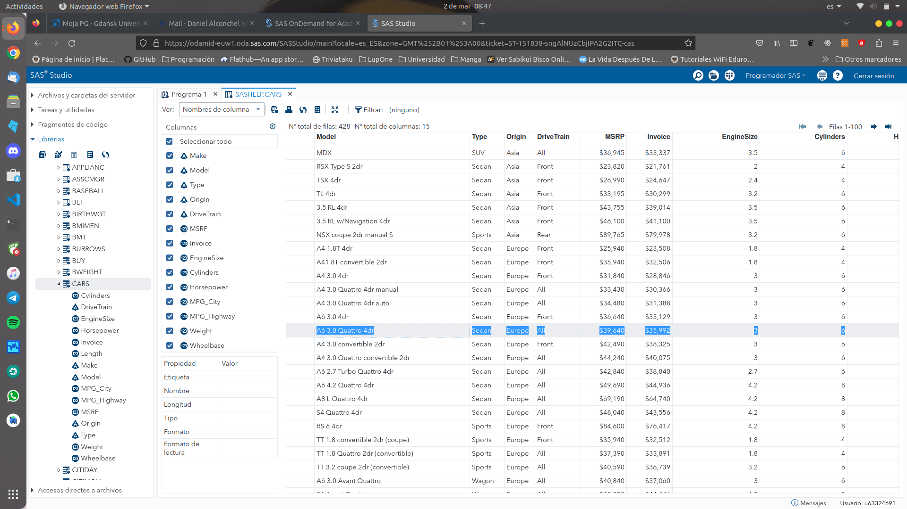
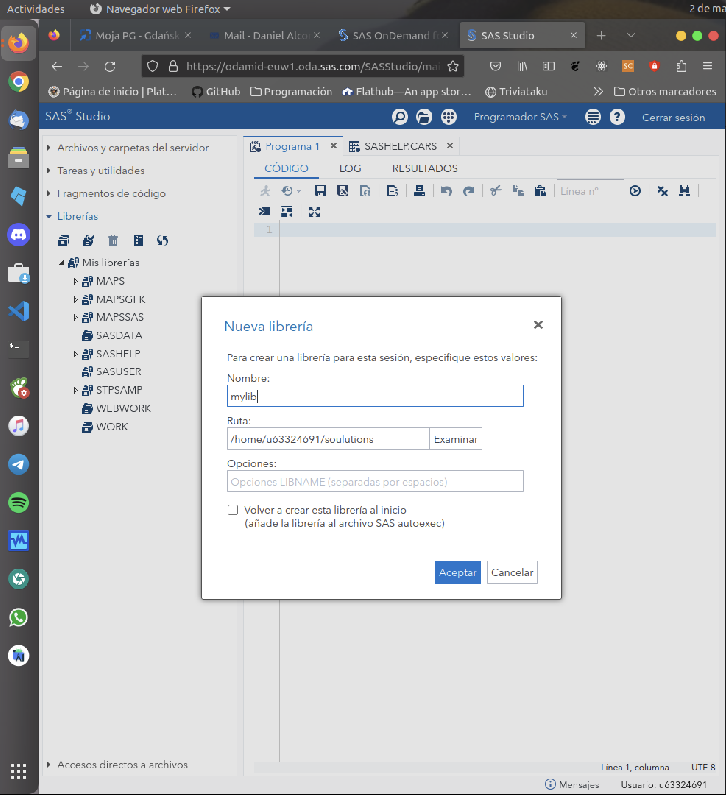
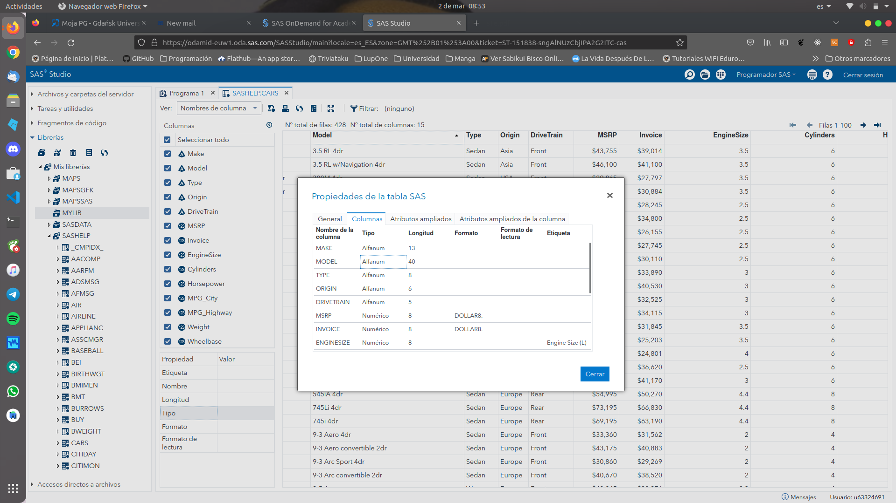
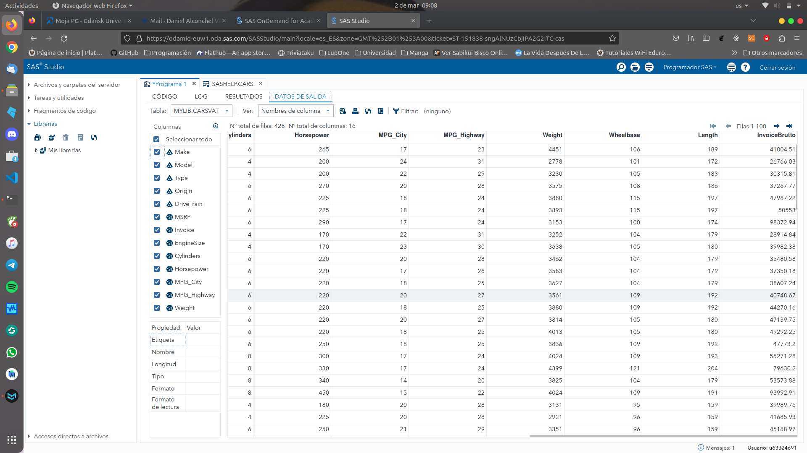
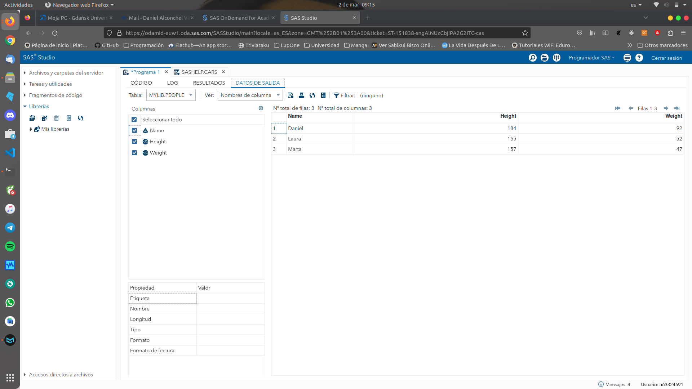
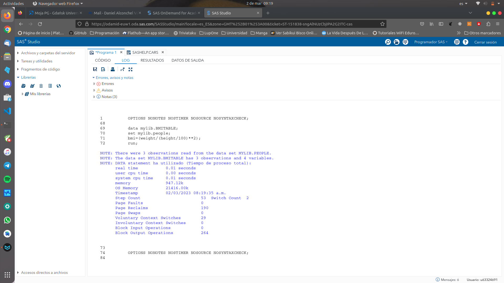
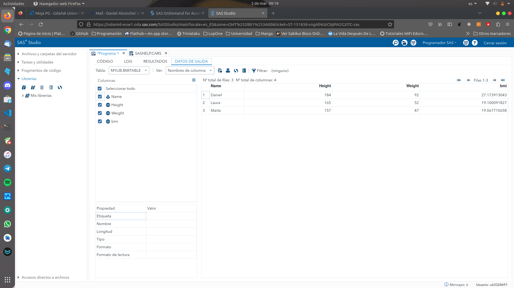

# 1. Intro to Statistical Analytics System

###### Daniel Alconchel Vázquez

---

**Exercise 1.** Find library SASHELP and table CARS. Check what is the engine size of A6 3.0 Quattro 4dr.



**Exercise 2.** Create library mylib assigned to the folder soulutions (create it if it does not exist).




**Exercise 3.** Check attributes of the variable MODEL from SASHELP.CARS.

The type is *alfanum*.



**Exercise 4.** Read table sashelp.cars and create new table CarsVat, which contains variables from sashelp.cars and new variable InvoiceBrutto=1.23*Invoice.

```sas
data mylib.CarsVat;
set sashelp.cars;
InvoiceBrutto=1.23*Invoice;
run;
```



**Exercise 5.** In mylib library create table PEOPLE with variables NAME,  HEIGHT and WEIGHT. Add some example datalines. Then create data set  BMITABLE, which contains variables from table PEOPLE and new variable  BMI (bmi = weight/((height/100) ∗ ∗2);). PUT in log:

- all variables and all observations (PDV vectors) from table BMITABLE.

- variables NAME and BMI

```sas
DATA mylib.PEOPLE;
	INPUT Name$ Height Weight;
	DATALINES;
	Daniel 184 92
	Laura 165 52
	Marta 157 47
run;
```




```sas
data mylib.BMITABLE;
set mylib.people;
bmi=(weight/(height/100)**2);
run;
```






