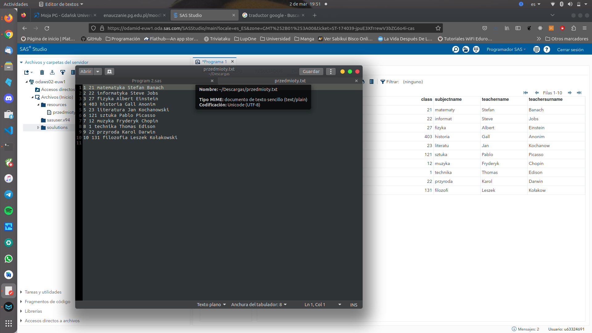
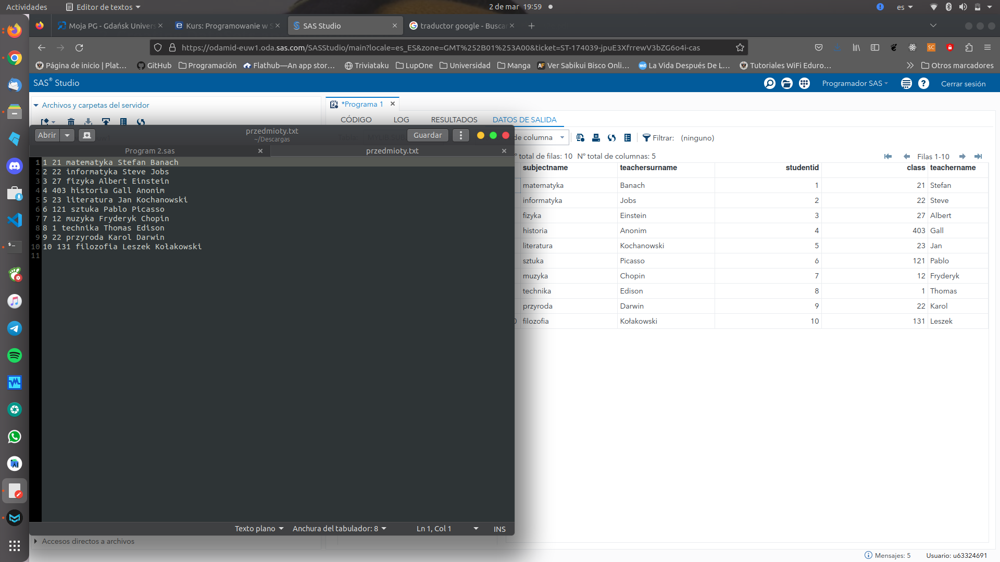
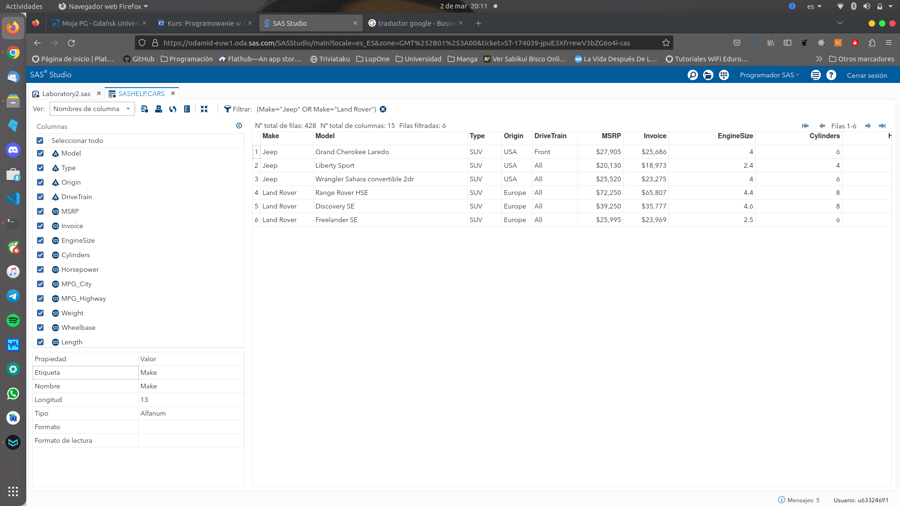
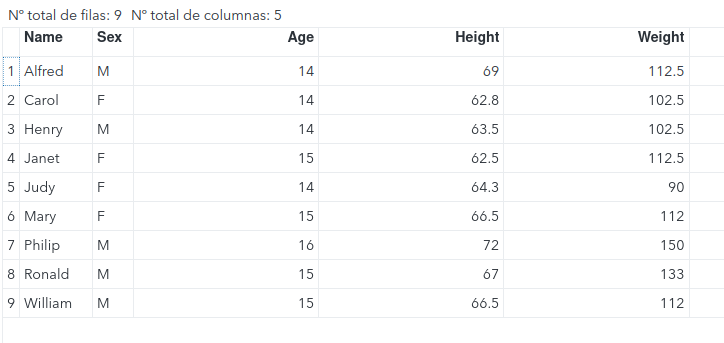
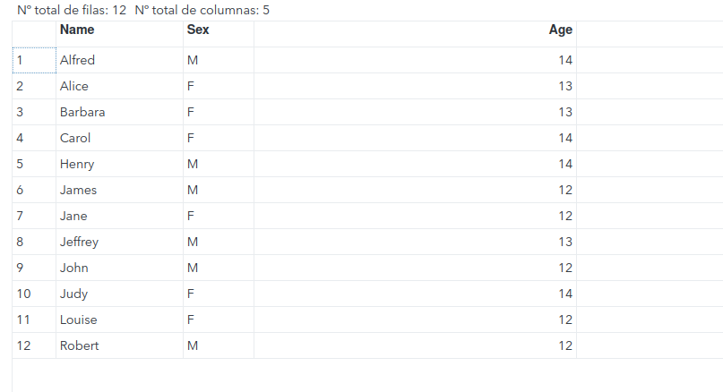
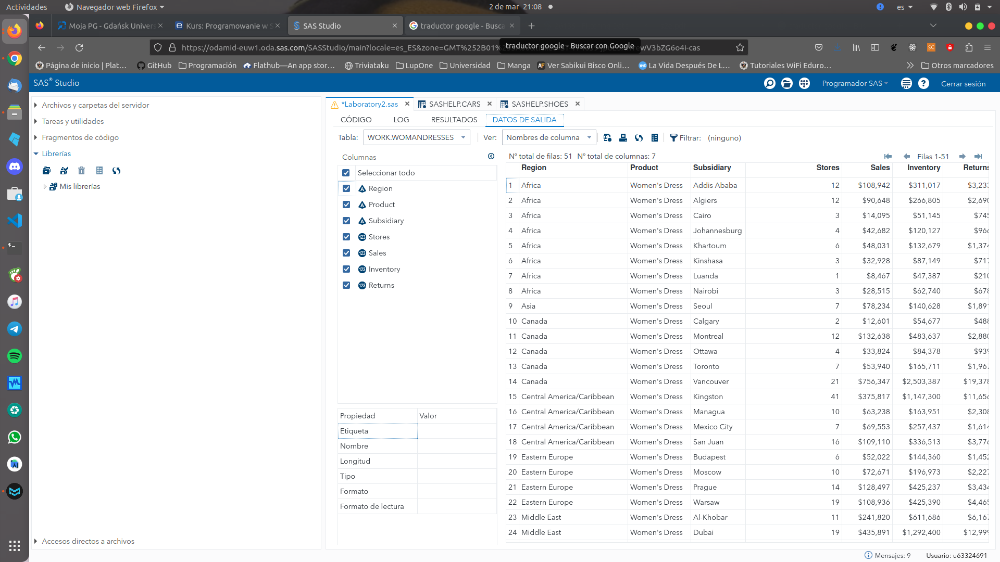
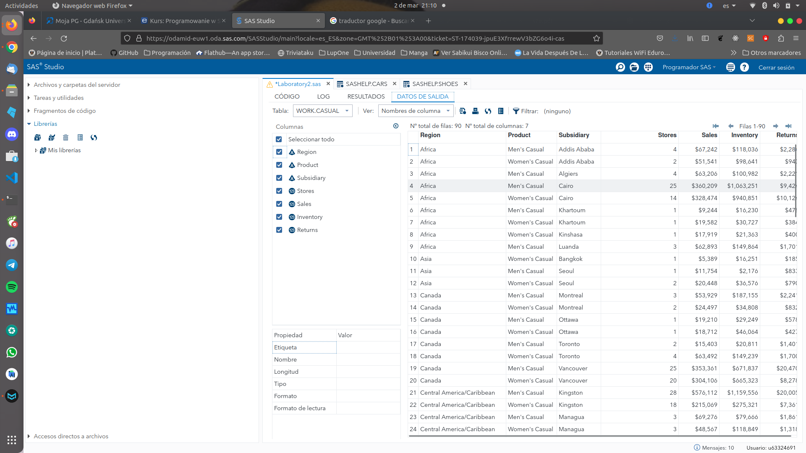
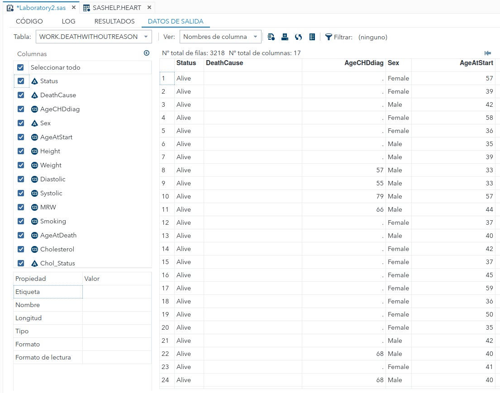

# 2. Creating DataSets and Filtering Data

###### Daniel Alconchel Vázquez

---

**Exercise 1.**  Notice, that we cannot create this data set properly (Straszliwy  is too long). Fix it (use LENGTH).

If we run the next code:

```sas
LIBNAME mylib "/home/u63324691/soulutions";

Filename plik "/home/u63324691/resources/przedmioty.txt";

data mylib.subjects;
	infile plik;
	input studentid class subjectname$ teachername$ teachersurname$;
run;
```

We will see that some datas are "cut or not complete", so we have to change the length of variables.



We can fix this by adding the line:

```sas
data mylib.subjects;
	infile plik;
	Length subjectname$20. teachersurname$20.;
	input studentid class subjectname$ teachername$ teachersurname$;
run;
```



Also, as it is specified in the laboratory document we can use this other method for fixing it:

```sas
data mylib.subjects;
infile plik;
input studentid class subjectname: $20. techarname$ teachersurname :$20.;
run;

/*or*/


data mylib.subjects;
informat subjectname $10. teachersurname $15.;
infile plik;
input studentid class subjectname$ techarname$teachersurname$;
run;
```

**Exercise 2.** Clicking’ choose all Land Rovers and Jeeps from table sashelp.cars. Read and analyse generated code.

We can do this by, in the data table, clicking in the filter option and using the sql notation (without indicate the property WHERE) the option. In our case `MAKE="Jeep" or MAKE=Land Rover`. Another option is to use right click in the atributte on the table, then go to filter and select by hand the values.



The generated code is:

```sas
PROC SQL;
CREATE TABLE WORK.query AS
SELECT Make , Model , 'Type'n , Origin , DriveTrain , MSRP , Invoice , EngineSize , Cylinders , Horsepower , MPG_City , MPG_Highway , Weight , Wheelbase , 'Length'n FROM SASHELP.CARS WHERE (Make="Jeep" OR Make="Land Rover");
RUN;
QUIT;

PROC DATASETS NOLIST NODETAILS;
CONTENTS DATA=WORK.query OUT=WORK.details;
RUN;

PROC PRINT DATA=WORK.details;
RUN;
```

**Exercise 3.** Choose the following observations from *sashelp.class*.

1. where age > 13.

2. where 12 $\leq$ age $\leq$ 14.

```sas
data observations1;
	set sashelp.class;
	where age>13;
run;
```

```sas
data observations1;
	set sashelp.class;
	where age>11 and age<15;
run;
```





**Exercise 4.** Using sashelp.shoes create:

- data set *Women*, which contains products for women,

- data set *WomenDresses*, which contain dresses for women,

- data set *Casual*, which contains casual products.

```sas
data women;
	set sashelp.shoes;
	where product like "%Women%";
run;
```


```sas
data womandresses;
	set sashelp.shoes;
	where product like "%Women%Dress%";
run;
```



```sas
data casual;
	set sashelp.shoes;
	where product like "%Casual%";
run;
```



**Exercise 5.** Using sashelp.heart create table *DeathWithoutReason*, which contains observation with missing values in column *DeathCause*.

```sas
data DeathWithoutReason;
	set sashelp.heart;
	where deathcause is missing;
run;
```




