# 3. Keep, Drop, Rename and Sort

###### Daniel Alconchel Vázquez

---

**Exercise 1.** Using data set sashelp.baseball create data set *mylib.players*, which contains name, team, league, position and salary. Then using *mylib.players* create table *mylib.national* players containing observations about players from national league. drop colum *league*.

For the first part we are going to use the clausule **keep** that specifies the names of the variables to the output data set. Then, we have:

```sas
LIBNAME mylib "/home/u63324691/soulutions";

data mylib.players;
	set sashelp.baseball;
	keep name team league position salary;
run;
```

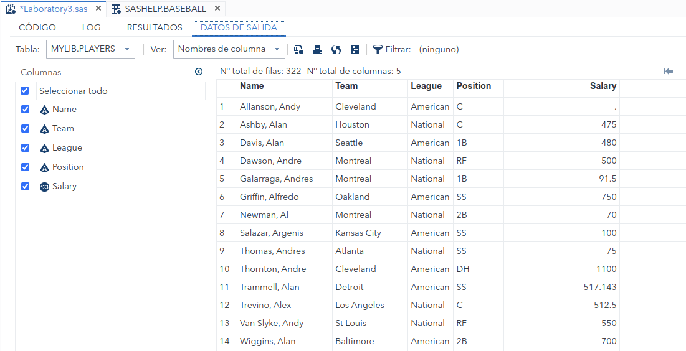

Now, for the second part we are going to search players from the national league and then drop this value using the clausule **drop**. Then:

```sas
data mylib.national_players;
	set mylib.players;
	where league like "National";
	drop league;
run;
```

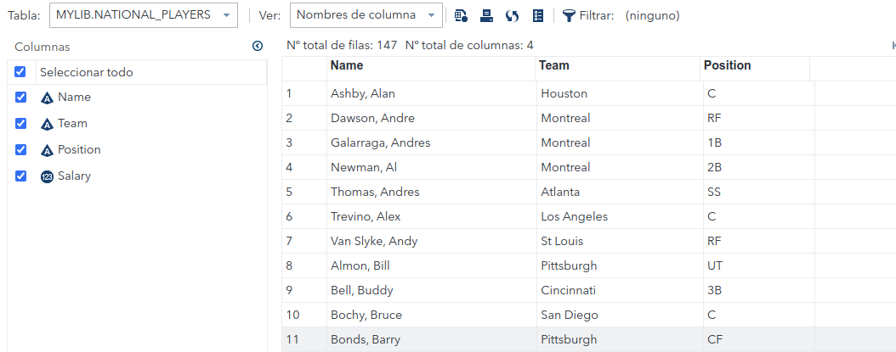

**Exercise 2.** In one data step create two data sets:

- *mylib.players_salaries* containing names and salaries of baseball players from th table *sashelp.baseball*.

- *mylib.players_teams* containing names and teams of baseball players from the table *sashelp.baseball*

```sas
data mylib.players_salaries(keep=name salary) mylib.players_teams(keep=name team);
	set sashelp.baseball;
run;
```

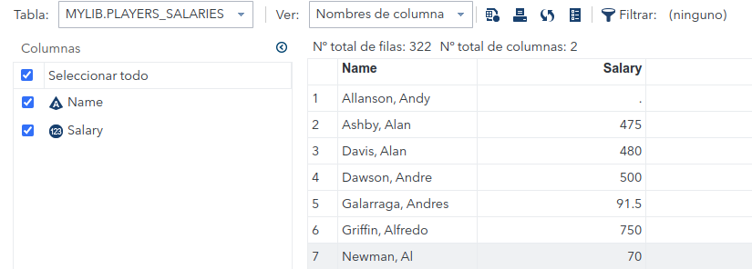

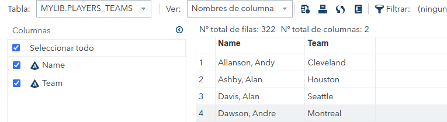

**Exercise 3.** Change names of variables in data set *mylib.players* to spanish.

```sas
data mylib.jugadores;
	set mylib.players;
	rename name=nombre team=equipo league=liga position=posicion salary=salario;
run;
```

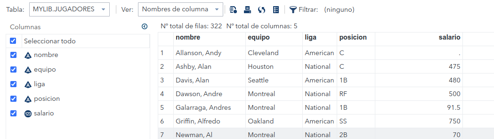

**Exercise 4.**

1. Sort data set *sashelp.baseball* by Salary in ascending (default) order. Store the results in new data set *by_players_asc*. Who has the lowest salary?

```sas
proc sort data=sashelp.baseball out=mylib.by_players_asc;
	by salary;
run;
```

There are many players without salary. The first ont to have it is Robidoux, Billy Jo:

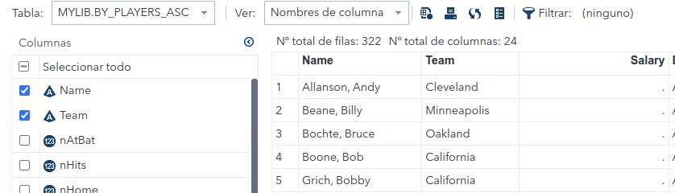

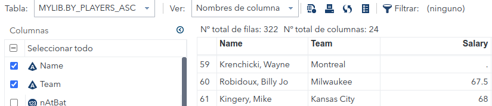

2. Sort data set *sashelp.baseball* by Salary in descending order. Store the results in new data set by_players_dsc. Who has the highest salary?

```sas
proc sort data=sashelp.baseball out=mylib.by_players_dsc;
	by descending salary;
run;
```

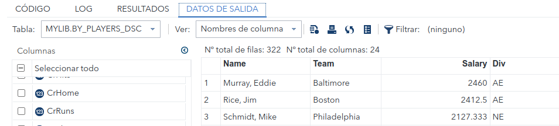

Murray has the highest salary.

**Exercise 5.** See how to use PROC SORT with keep and WHERE (as statement and as option). Using *sashelp.electric* create new data set *sorted_electric*, which will be sorted  ascending by variable *revenue* and descending by variable *customer*. The result should contain only variables *customer* and *revenue* and observations from the year 1999.

```sas
proc sort data=sashelp.electric(where=(year=1999)) out=mylib.sorted_electric(keep= revenue customer);
	by revenue descending customer;
run;
```

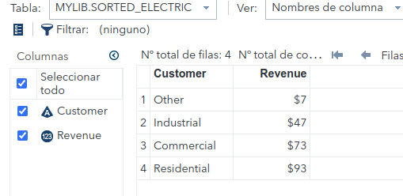

**Exercise 6.** Sort first 10 observations from data set *account* by variable *Town* without reapeating values of variable *Town*. Save results to the set *by_town10*. Save duplicates to the set *town_duplicates*.

```sas
data account;
INPUT Company $ 1-23 Debt 25-30 AccountNumber 33-36 Town $ 39-51;
/*1-22,25-30 etc - columns*/
	dataLINES;
	Paul's Pizza            83.00  1019  Apex
	World Wide Electronics 119.95  1122  Garner
	Strickland Industries  657.22  1675  Morrisville
	Ice Cream Delight      299.98  2310  Holly Springs
	Watson Tabor Travel     37.95  3131  Apex
	Body & Sons Accounting 312.49  4762  Garner
	Bob's Beds             119.95  4998  Morrisville
	Tina's Pet Shop         37.95  5108  Apex
	Elway Piano and Organ   65.79  5217  Garner
	Tim's Burguer Stand    119.95  6335  Holly Springs
	Peter's Auto Parts      65.79  7288  Apex
	Deluxe Hardware        467.12  8941  Garner
	Pauline's Antiques     302.05  9112  Morrisville
	Apex Catering           37.95  9923  Apex
run;
```

```sas
proc sort data=account(FIRSTOBS=1 OBS=10) out=by_town10 dupout=town_duplicates NODUPKEY;
	by town;
run;
```

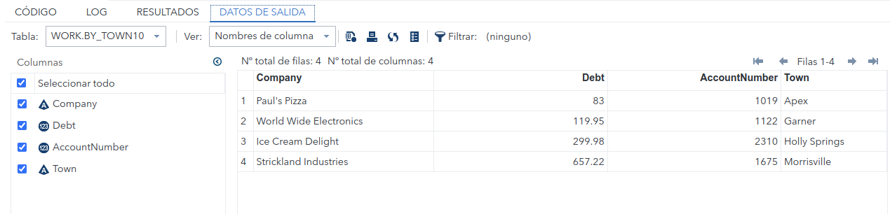

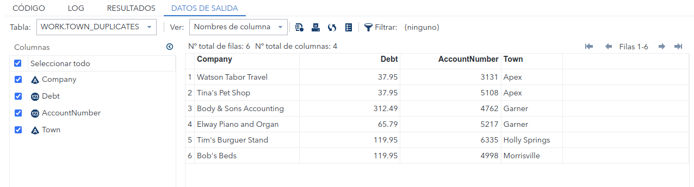


