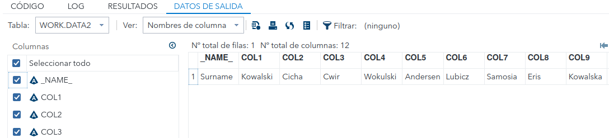

# 5. PROC TRANSPOSE and PROC IMPORT

###### Daniel Alconchel Vázquez

---

**Exercise 1.** Transpose variable Surname from table

```sas
data surnames;
	input stid Surname$;
	datalines;
	100 Kowalski
	101 Cicha
	102 Cwir
	103 Wokulski
	104 Andersen
	110 Lubicz
	111 Samosia
	112 Eris
	113 Kowalska
	114 Losski
	116 Rajska
	;
run;
```

```sas
proc transpose data=surnames;
	var surname;
run;
```



**Exercise 2.** Merge the follwing tables and surnames by variable stid and then transpose the output set by shoesize. Make variable names begin with 'person'.

```sas
data names;
	input stid name$;
	datalines;
	100 Anna
	101 Jan
	102 Karol
	103 Leszek
	104 Jakub
	110 Gosia
	111 Donata
	112 Justyna
	113 Genowefa
	114 Lucyna
	116 Maja
	115 Konstancja
	105 Remek
	;
run;

data shoes;
	input stid shoesize$;
	datalines;
	101 34
	101 65
	102 32
	103 21
	100 43
	110 43
	111 35
	112 44
	113 32
	114 34
	116 25
	115 34
	105 34
	;
run;
```

We do merge first:

```sas
proc sort data=shoes;
	by stid;
run;
proc sort data=surnames;
	by stid;
run;
proc sort data=names;
	by stid;
run;
data exercise2;
	merge names surnames shoes;
	by stid;
run;
```

Now we can:

```sas
proc sort data=exercise2;
	by shoesize;
run;
proc transpose data=exercise2 out=exercise2transposed(rename=(_name_=person)) prefix=person;
	var stid name surname shoesize;
	by shoesize;
run;
```


**Exercise 3.** Create your own PROC TRANSPOSE example using ID.

```sas
data sales;
	input product_id region_id price name$;
	cards;
	1011 1 12 t-shirt
	1012 1 5 socks
	1013 2 15 helmet
	1014 3 20 shoes
	;
run;
proc transpose data=sales out=sales_tr prefix=product_;
id product_id;
run;
```


**Exercise 4.** Find some data to import it to sas.

Let's create in our sas_home directory a csv file called mydata.csv with the following data:

```csv
A,B,C
1,4,76
2,3,49
2,3,85
4,5,88
2,2,90
```

Now:

```sas
proc import out=csvfiledata 
	datafile="/home/u63324691/soulutions/mydata.csv"
	dbms=csv
	replace;
	getnames=yes;
run;
proc print data=csvfiledata;
```


