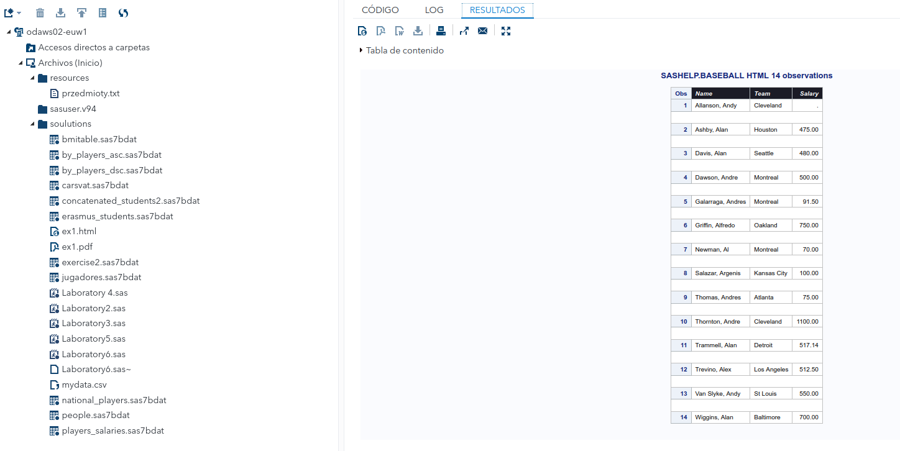
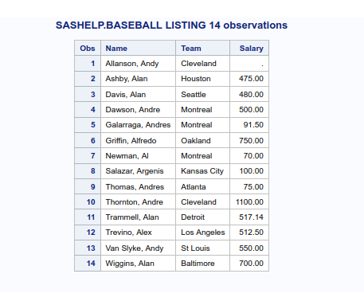
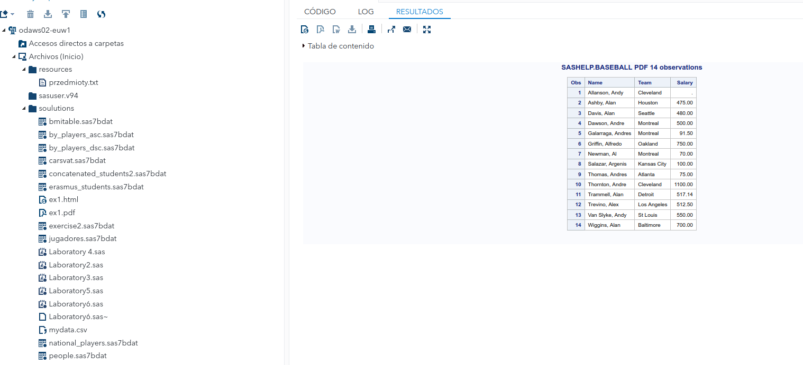
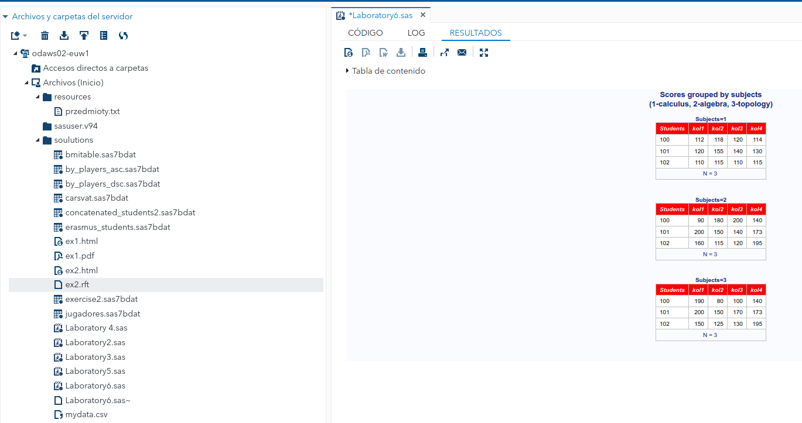
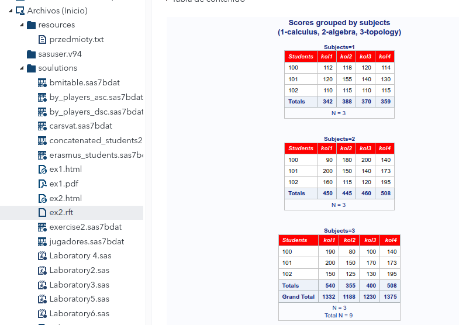
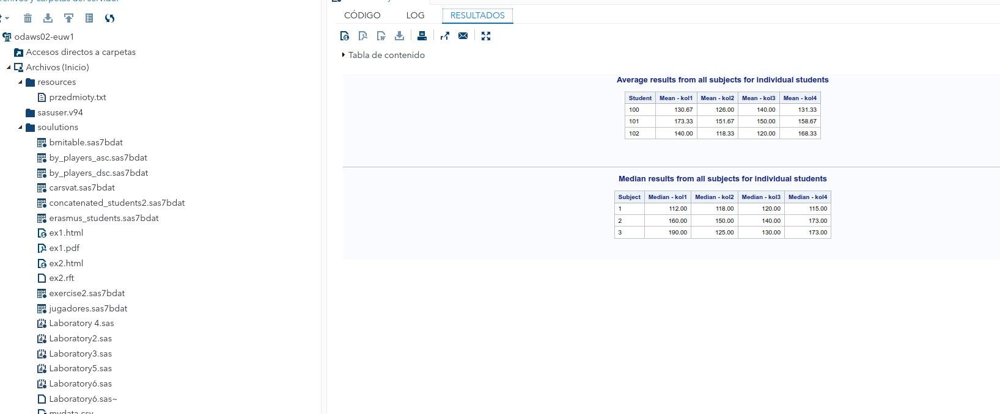
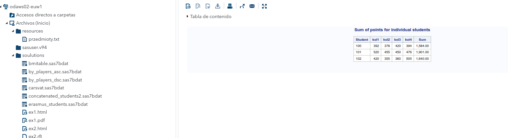
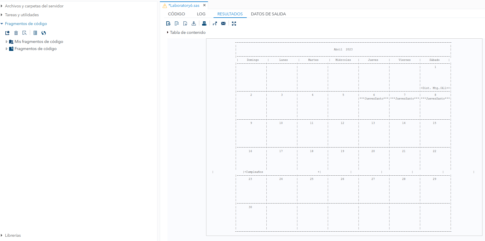

# 6. Reports

###### Daniel Alconchel Vázquez

---

**Exercise 1.** Create html, pdf and listing reports abouts teams and salaries for first 14 players from the table *sashelp.baseball*. Use variable labels as column headings. In your html report:

- set style of column headings: italic font size, white color of font and nice color of background.

- let blank line between observations.

```sas
option obs=14;
ods html file='/home/u63324691/soulutions/ex1.html';
proc print data=sashelp.baseball
    style(header)={fontstyle=italic color=white backgroundcolor=dab}
    blankline=(count= 1);
    var name team salary;
    title 'SASHELP.BASEBALL HTML 14 observations';
run;
```



```sas
options obs=14;
ods html close;
ods listing;
proc print data=sashelp.baseball double;
   var name team salary;
   title 'SASHELP.BASEBALL LISTING 14 observations';
run;
ods listing close;
```



```sas
options obs=14;
ods html close;
ods pdf file='/home/u63324691/soulutions/ex1.pdf';
proc print data=sashelp.baseball;
   var name team salary;
   title 'SASHELP.BASEBALL PDF 14 observations';
run;
ods pdf close;
```



**Exercise 2.** Using the following table create html and rtf reports with scores for each subject. Suppress the printing of observation numbers at the beginning of the rows. Add title: 'Scores grouped by subjects' and second title: ’(1-calculus, 2-algebra, 3-topology)’.  Associate labels ’Students’ and ’Subjects’ with variables students id and sub-  jects id. Use labels as a column headings. Change style of headings kol1, kol2, kol3 and kol4 to have every bacground header in different colour. Print the  number of observations in the last row of your report.

```sas
data scores;
input students_id $ subjects_id $ kol1 kol2 kol3 kol4;
datalines;
100 1 112 118 120 114
101 1 120 155 140 130
102 1 110 115 110 115
100 2 90 180 200 140
101 2 200 150 140 173
102 2 160 115 120 195
100 3 190 80 100 140
101 3 200 150 170 173
102 3 150 125 130 195
;
run;
```

```sas
proc sort data=scores;
by subjects_id;
run;
ods html file='/home/u63324691/soulutions/ex2.html';
proc print data=scores n noobs label
    style(header)={fontstyle=italic backgroundcolor=red color=white};
    by subjects_id; 
    label     students_id='Students'
            subjects_id='Subjects';
    title 'Scores grouped by subjects';
    title2 '(1-calculus, 2-algebra, 3-topology)';
run;
ods html close;
ods html file='/home/u63324691/soulutions/ex2.rft';
proc print data=scores n noobs label
    style(header)={fontstyle=italic backgroundcolor=red color=white};
    by subjects_id; 
    label     students_id='Students'
            subjects_id='Subjects';
    title 'Scores grouped by subjects';
    title2 '(1-calculus, 2-algebra, 3-topology)';
run;
```



**Exercise3.** Change report from exercise 2 adding totals for every test (kol1 kol2  
kol3 kol4). Change sumlabel if needed.

```sas
proc sort data=scores;
by subjects_id;
run;
ods html file='/home/u63324691/soulutions/ex2.html';
proc print data=scores n noobs label
	sumlabel="Totals"
	grandtotal_label="Grand Total"
	style(header)={fontstyle=italic backgroundcolor=red color=white};
	by subjects_id; 
	sum kol1 kol2 kol3 kol4;
	label 	students_id='Students'
			subjects_id='Subjects';
	title 'Scores grouped by subjects';
	title2 '(1-calculus, 2-algebra, 3-topology)';
run;
```



**Exercise 4.** Using table *scores* create the following reports.

```sas
title 'Average results from all subjects for individual students';
proc report data=scores;
column students_id kol1 kol2 kol3 kol4;
define students_id / group "Student";
define kol1 / analysis mean format=6.2 "Mean - kol1";
define kol2 / analysis mean format=6.2 "Mean - kol2";
define kol3 / analysis mean format=6.2 "Mean - kol3";
define kol4 / analysis mean format=6.2 "Mean - kol4";
run;
title 'Median results from all subjects for individual students';
proc report data=scores;
column subjects_id kol1 kol2 kol3 kol4;
define subjects_id / group "Subject";
define kol1 / analysis median format=6.2 "Median - kol1";
define kol2 / analysis median format=6.2 "Median - kol2";
define kol3 / analysis median format=6.2 "Median - kol3";
define kol4 / analysis median format=6.2 "Median - kol4";
run;
```



**Exercise 5.** Using table *scores* create the following report.

```sas
title 'Sum of points for individual students';
proc report data=scores;
column students_id kol1 kol2 kol3 kol4 sum;
define students_id / group "Student";
define kol1 / analysis sum "kol1";
define kol2 / analysis sum "kol2";
define kol3 / analysis sum "kol3";
define kol4 / analysis sum "kol4";
define sum / computed format=COMMA15.2 "Sum";
compute sum;
sum = _c2_+_c3_+_c4_+_c5_;
endcomp;
run;
```



**Exercise 6.**

```sas
data allacty;
   input date : date7. event $ 9-36 who $ 37-48 long;
   datalines;
01APR23 Dist. Mtg.                  All          1
17APR23 Cumpleaños					Dani		 1
25APR23 VueltaPolonia				Dani		 1
;
data cal;
   input date : date7. holiday $ 11-25 holilong @27;
   datalines;
06apr23   JuevesSanto     3
07apr23   ViernesSanto    1
;
run;
proc sort data=allacty;
   by date;
run;
options nodate pageno=1 linesize=132 pagesize=60;
proc calendar data=allacty holidata=cal;
	start date;
	dur long;
	holistart date;
	holivar holiday;
	holidur holilong;
	title1 'MyCalendar';
	title2 'Daniel';
run;
```


