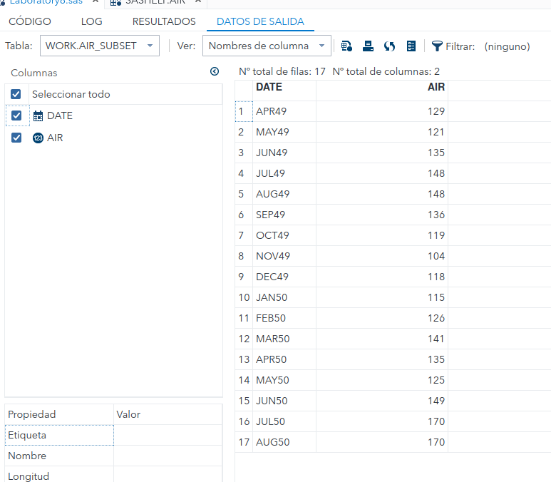
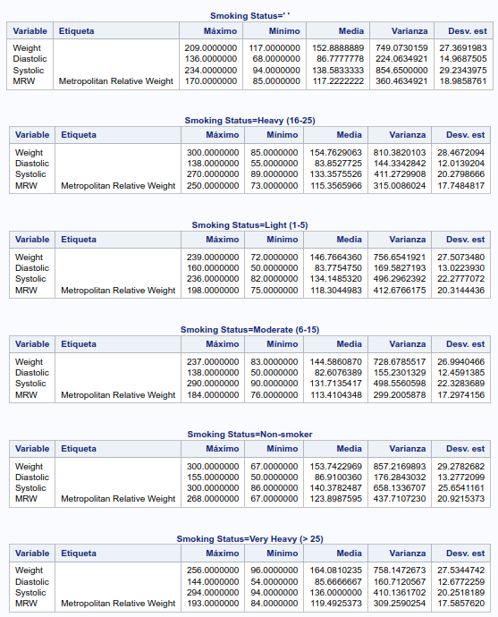
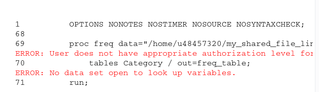
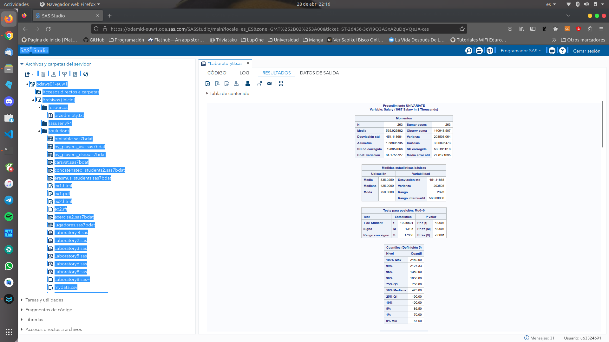
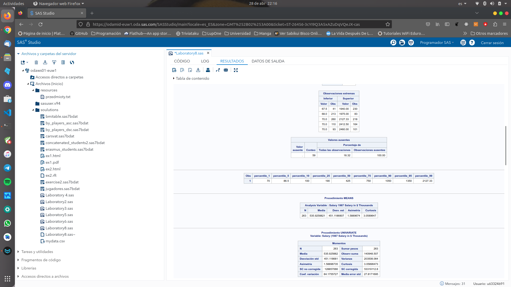
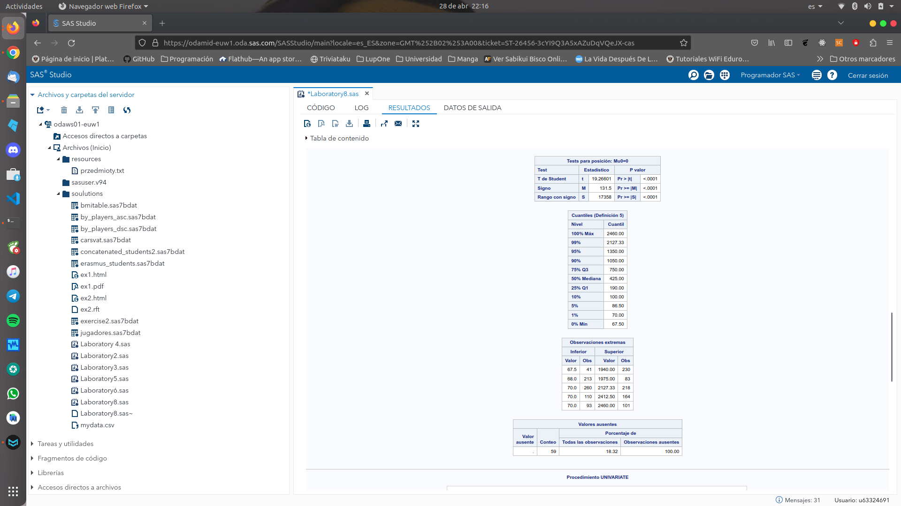
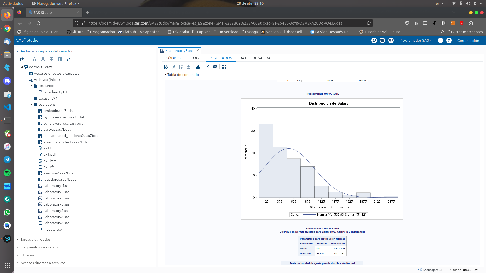
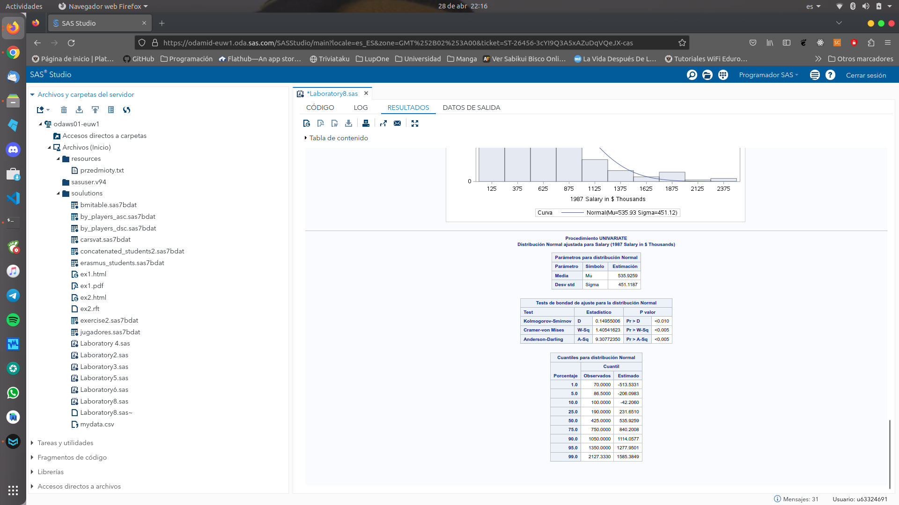
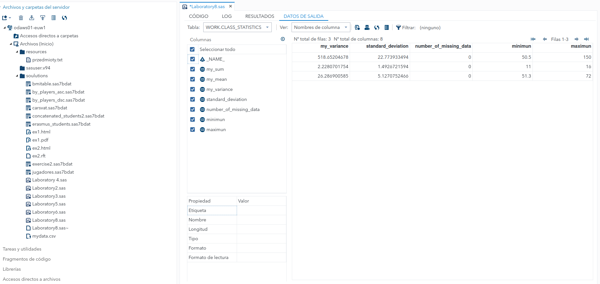

# 

# 8. If and basic statistics procedures

###### Daniel Alconchel Vázquez

---

**Exercise 1.** Create a data set which contains observations 4 i 20 from *sashelp.air*. Use IF, value of variable _N_from PDV-vector and OUTPUT instruction.

```sas
data air_subset;
    set sashelp.air;
    if _N_ >= 4 and _N_ <= 20 then output;
run;
```



The sentence `if *N* >= 4 and *N* <= 20 then output;` checks if the currento bservation number (*N*) is between 4 and 20 (inclusive), and if so, outputs that observation to the new data set.

**Exercise 2.** Print (at least) five different descriptive statistics for groups given by variable SMOKING_STATUS from SASHELP:HEART for variables: WEIGHT, DIASTOLIC, SYSTOLIC, MRW (Use BY in PROC MEANS). Create also an output table containing these statistics.

```sas
proc sort data=sashelp.heart out=heart;
    by smoking_status;
run;
proc means data=heart max min mean var std;
   by smoking_status;
   var weight diastolic systolic mrw;
run;
```

- `proc means data=sashelp.heart max min mean var std;` starts the PROC MEANS procedure and specify the statistics that are going to be observed.

- `by smoking_status;` groups the data by this variable.

- `var weight diastolic systolic mrw;` specifies the variables for which to calculate the descriptive statistics.



**Exercise 3:**

**1.** You have to create one-dimensional table of frequency (using PROC FREQ) for variable Category from the set np_species.sas7bdat (directory /home/u48457320/my_shared_file_links/u48457320/data). Use ORDER to sort data in the report in descending way.

```sas
proc freq data="/home/u48457320/my_shared_file_links/u48457320/data/np_species.sas7bdat" order=freq;
    tables Category / out=freq_table;
run;
```

It seems I do not have authorization:



But in case of having access `order=freq` would sort the frequency table in descending order by frequency count and `tables Category / out=freq_table;` requests a one-dimensional frequency table for the variable "Category" and outputs the results to an output data set called "freq_table".

**2.** Create a crossing-table for variables Category and Nativeness from the previous set np_species.sas7bdat. Do not display cumulative values.

As before, I do not have access to the set, but in case I had the solutions should be:

```sas
proc freq data="/home/u48457320/my_shared_file_links/u48457320/data/np_species.sas7bdat" ;
   tables Category*Nativeness / nocum;
run;
```

The `nocum` option suppress the printing of cumulative counts and `*` operator allows us to create a crossing table.

**Exercise 4.**  Display extreme observations, moments and histogram for variable Salary from sashelp.baseball.

```sas
/* Display extreme observations */
proc univariate data=sashelp.baseball;
    var salary;
    output out=stats pctlpts=1 5 10 25 50 75 90 95 99 pctlpre=percentile_;
run;

proc print data=stats;
    var percentile_:;
run;


/* Calculate moments */
proc means data=sashelp.baseball n mean std skew kurt;
   var salary;
run;

/* Create histogram */
proc univariate data=sashelp.baseball;
   var salary;
   histogram / normal(mu=est sigma=est);
run;


```











**Exercise 5.** From the following code

```sas
proc transpose data=sashelp.class out=class_stat;
    var weight age height;
run;


data class_statistics(drop=col1-col19);
    set class_stat;
    my_sum=sum(of col1-col19);
    my_mean=mean(of col1-col19);
    my_variance=var(of col1-col19);
    standard_deviation=std(of col1-col19);
    number_of_missing_data=nmiss(of col1-col19);
run;
```

Calculate the maximun and minimun for weight age and height.

We can modify the code as follows:

```sas
proc transpose data=sashelp.class out=class_stat;
    var weight age height;
run;

data class_statistics(drop=col1-col19);
    set class_stat;
    my_sum=sum(of col1-col19);
    my_mean=mean(of col1-col19);
    my_variance=var(of col1-col19);
    standard_deviation=std(of col1-col19);
    number_of_missing_data=nmiss(of col1-col19);
    minimun=min(of col1-col19);
    maximun=max(of col1-col19);
run;
```




