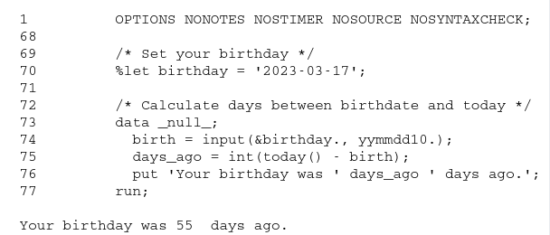
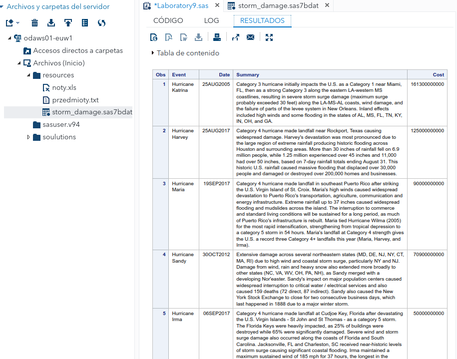
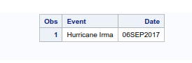
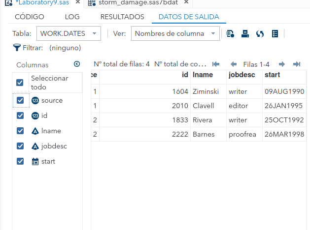
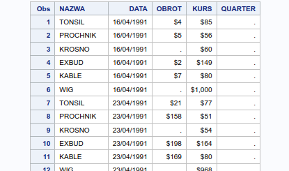

# Laboratory 9. Date and Time in SAS

###### Daniel Alconchel Vázquez

---

**Exercise 1.** How many days ago was your birthday. what day of the week was your bithday?

```sas
/* Set your birthday */
%let birthday = '2023-03-17';

/* Calculate days between birthdate and today */
data _null_;
  birth = input(&birthday., yymmdd10.);
  days_ago = int(today() - birth);
  put 'Your birthday was ' days_ago ' days ago.';
run;
```



```sas
data _null_;
  birth = input(&birthday., yymmdd10.);
  day_of_week = put(weekday(birth), weekday3.);
  put 'Your birthday fell on a ' day_of_week '.';
run;
```

It returned 5 (Friday)

**Exercise 2.** Print raport about hurricanes. Use table *storm_damage* (folder *data* in a shared folder "/my_shared_file_links/u48457320/data") and a proper date format. When was Hurricane Irma?

After import the data:

```sas
LIBNAME mylib "/home/u63324691/resources/";

PROC PRINT DATA=mylib.storm_damage;
   VAR Event Date Summary Cost;
   FORMAT Date DATE9.;
RUN;
```



For the second question we can use:

```sas
LIBNAME mylib "/home/u63324691/resources/";

DATA irma_date;
   SET mylib.storm_damage (WHERE=(Event='Hurricane Irma'));
   FORMAT Date DATE9.;
RUN;

PROC PRINT DATA=irma_date;
   VAR Event Date;
RUN;
```



**Exercise 3.** Improve the following code so that the date is properly formated numeric value variable.

```sas
data dates;
    input source id lname $ jobdesc $ start;
    datalines;
    1 1604 Ziminski writer 09/08/1990
    1 2010 Clavell editor 26/01/1995
    2 1833 Rivera writer 10/25/1992
    2 2222 Barnes proofreader 3/26/98
    ;
run;
```

We can write the code as:

```sas
data dates;
   input source id lname $ jobdesc $ start :ddmmyy10.;
   format start DATE9.;
   datalines;
   1 1604 Ziminski   writer         09/08/1990
   1 2010 Clavell    editor         26/01/1995
   2 1833 Rivera     writer         25/10/1992
   2 2222 Barnes     proofreader    26/03/1998
;
run;
```

We have to express the 2 last dates as day-month-year in the proper format. 

1. The `:ddmmyy10.` informat is used to inform SAS about the expected date format in the input data. It indicates that the date is in the format `dd/mm/yyyy`.
2. The `FORMAT` statement is added to specify the desired format for the `start` variable. In this case, `DATE9.` is used to format the variable as a numeric value representing the date in the format 'ddMONyyyy' (e.g., 01JAN2021).



**Exercise 4.** Import `noty.xls` and create a new table Notyformat containing new variable QUARTER with number of quarter (use the appropriate format). Use format DOLLAR to display variables kurs and obrot. Variable data show as DD-MM-YY.

```sas
/* First we create the table*/
PROC IMPORT OUT=Notyformat
            DATAFILE='/home/u63324691/resources/noty.xls'
            DBMS=XLS REPLACE;
            GETNAMES=YES;
RUN;

PROC PRINT DATA=Notyformat;
RUN;

/*We change the format and add the new variable*/

DATA Notyformat;
   SET Notyformat;
   QUARTER = intck('quarter', input(DATA, DDMMYY10.), '31DEC2099');
   FORMAT QUARTER 2. OBROT KURS DOLLAR8. DATA DDMMYY10.;
RUN;

PROC PRINT DATA=Notyformat;
RUN;
```



**Exercise 5.** Analyze first example,and create your own format on currency swisscurrency, which you can use to print the values for the variable Salary in the data set proclib.staff in swiss francs (prefix CHF). Use proper mulliplication. Use dot (.) to separate thousands. Display table proclib.staff using new format with new label ’Salary in Swiss francs .


