# PRÁCTICA SISTEMAS OPERATIVOS

###### DANIEL ALCONCHEL VÁZQUEZ

------

## <u>MÓDULO 1</u>

## <u>Sesión 1</u>

Convertirse en administrador del sistema implica entrar al mismo como usuario **root**.

```bash
$ whoami	# pido a la shell el nombre del usuario actual
Daniel

$su			# solicito el cambio de usuario a modo root
Password:	# el sistema solicita la contraseña de root

$ whoami	# suele  cambiar el prompt del sistema
root
```


### 4.2 Usuarios

Un usuario es una "persona" que trabaja en el sistema mediante una cuenta de usuario. En Linux, se caracteriza por disponer de:

- Nombre de usuario (*username*)

- Un identificador de usuario (**UID**), que es un número entero que le asigna el sistema, internamente, a cada usuario y que lo representa.

- El grupo o grupos a los que pertenece (**GID**). Todo usuario tiene asignado un **grupo principal**, que aparece en el archivo ***/etc/passwd***, pero puede pertenecer a más de un grupo, loscuales se llaman **grupos suplementarios**, que se encuentra en ***/etc/group***.

  

##### 4.2.1 Creación de cuentas

Para añadir un usuario al sistema se realizan los siguientes pasos:

1. Decidir el nombre de usuario y los grupos a los que va a pertenecer
2. Introducir los datos en los archivos */etc/passwd* y */etc/group*
3. Asignar un password a la nueva cuenta
4. Establecer parámetros de envejecimiento
5. Crear directorio de inicio del nuevo usuario */home*
6. Copiar los archivos de inicialización (.bash_profile, .bashrc,...)
7. Establecer otras facilidades: quotas, mail, permisos para imprimir, etc.
8. Ejecutar cualquier tarea de inicialización propia del sistema.
9. Probar la nueva cuenta


Para crear nuevas cuentas utilizaremos las siguientes órdenes, las cuales se encargan de todo, a excepción del paso 7:

```bash
$ useradd

$ adduser
```

Se   creará   el   usuario   y   su   grupo   principal,   así   como   las   entradas   correspondientes   en/etc/passwd,  /etc/shadow  y  /etc/group.   También   se   creará   el   directorio   de   inicio,normalmente en /home, y los archivos de configuración particulares para cada usuario que seubican dentro de este directorio y que se detallan más adelante. 


Probemos a crear un usuario, para ello:

```bash
$useradd nombreusuario #En mi caso usaré Pablo
$vi /etc/passwd
root::0:0:root:/root:/bin/bash
bin:x:1:1:bin:/bin:/sbin/nologin
...
Pablo:x:500:500::/home/Pablo:/bin/bash
$vi /etc/group
root:x:0:root
bin:x:1:root,bin,daemon
...
Pablo:x:500:

```


Disponemos también de algunas órdenes para gestión de cuentas de usuario:

| Órdenes             | Función                                                      |
| ------------------- | ------------------------------------------------------------ |
| usermod             | Modifica una cuenta ya existente                             |
| userdel             | Elimina una cuenta de usuario (Por defecto no elimina Home)  |
| newusers            | Crea cuentas de usuario utilizando datos de un archivo de texto, que ha de tener el formato de */etc/passwd* |
| system-config-users | Herramienta modo gráfico                                     |

En el directorio **/etc/skel** se guardan los archivos de configuración del shell, los cuales se copian en el HOME del usuario para su uso. Dependen de los siguientes intérpretes de orden:


| .bash_profile    | Se ejecuta al hacer login y en él podremos indicar alias, variables, etc... que deseamos al inicio de la sesión |
| ---------------- | ------------------------------------------------------------ |
| **.bashrc**      | **Se ejecuta cada vez que se ejecuta una shell**             |
| **.bash_logout** | **Se ejecuta al salir del usuario del sistema y le podremos indicar acciones que deseamos ejecutar al salir del sistema** |


Hagamos un pequeño ejercicio. Creemos tres usuarios:

```bash
$ useradd Ximo
$ useradd Pablo
$ useradd Alejandro

# Esto ha creado tres usuarios. Probemos a eliminar uno

$ userdel Ximo

# Esto provia que desaparezca de los archivos /etc/group /etc/passwd ..., pero su carpeta home localicada en /home sigue existiendo
```


Podemos asignar o cambiar las contraseñas de los usuarios mediante la siguiente orden:

```bash
$ passwd <nombreusuario>
```

Si se ejecuta la orden con un usuario normal, este solo podrá cambiar su contraseña, pero si se ejecuta como administrador del sistema, se podrá cambiar las contraseñas de todos los usuraios.


También, podemos cambiar la shell de un usuario mediante la orden **chsh**. Todas las shells permitidas se encuentran en el archivo ***/etc/shells***. Si se desea que el usuario no pueda entrar al sistema se le puede asignar al campo de la shell el archivo ***/bin/false*** o ***/sbin/nologin***.


Como hemos comentado anteriormente,  podemos establecer restricciones de envejecimiento que se guardan en el archivo ***/etc/shadow***. Estos son los valores posibles:

| Ordenes  | Descripción                                                  |
| -------- | ------------------------------------------------------------ |
| minfile  | Número de días que han de pasar para poder cambiar la contraseña |
| maxlife  | Número de días máximo que puede estar con la misma contraseña sin cambiarla |
| warn     | Cuántos días antes de la que contraseña expire (**maxfile**) será informado sobre ello, indicándole que tiene que cambiarla |
| inactive | Número de días después de que la contraseña de que la contraseña expire que la cuenta se deshabilitará de forma automática si no ha sido cambiada |
| expired  | Fecha en la que la cuenta expira y se deshabilita de forma automática |
| changed  | Fecha del último cambio de contraseña                        |


Los valores los establece el administrador con las órdenes **chage** o con **passwd**. Recordemos que el archivo **/etc/login.defs** tiene los valores por defecto.

Veamos ahora algunas opciones de la orden change:

| Opciones                   | Descripción                                                  |
| -------------------------- | ------------------------------------------------------------ |
| chage -d ult_dia usuario   | Fecha del último cambio de password                          |
| chage -m min_dias usuario  | Nº días que han de pasar para cambiar la contraseña          |
| chage -M max_dias usuario  | Nº días máximo que puede estar la misma contraseña sin cambiarla |
| chage -W warn_dias usuario | Nº días antes de que la contraseña expire                    |
| chage -I inac_dias usuario | Nº de días después de que la contraseña expire               |
| chage -E exp_dias usuario  | Fecha  en la cuenta expira y se deshabilita automáticamente  |


### 4.3 Gestión de grupos

Un grupo es un conjunto de usuarios que comparten recursos o archivos del sistema. Un grupo se caracteriza por:

- Nombre del grupo, o **groupname**
- Identificador del grupo (**GID**), que es un número que permite al sistema identificar al grupo
- Archivo de configuración **/etc/group**, que tiene el formato **nombre: x: gid:lista de usuarios**

Algunas ódenes relacionadas con la gestión de grupos es:

| Comandos              | Descripción                                                  |
| --------------------- | ------------------------------------------------------------ |
| groupadd grupo        | Crea un nuevo grupo                                          |
| groupmod grupo        | Modifica el grupo existente                                  |
| groupdel grupo        | Elimina un grupo                                             |
| newgrp grupo          | Cambia el grupo activo                                       |
| gpasswd grupo         | Asigna una contraseña a un grupo                             |
| gpasswd -a user grupo | Añade usuario a un grupo                                     |
| groups [usuario]      | Informa de los grupos a los que pertenece un usuario         |
| id [usuario]          | Lista el identificador del usuario y los grupos a los que pertenece |
| grpck                 | Comprueba la consistencia del archivo de grupos              |


```bash
$ groupadd Grupo1 
$ usermod -g Grupo1 Pablo
$ su Pablo
$ id
uid=500(Pablo) gid=503(Grupo1)
```


### 4.4 Usuarios y grupos especiales

Los usuarios especiales son aquellos que no estan asociados a personas fíicas.

| Usuarios                            | Descripción                               |
| ----------------------------------- | ----------------------------------------- |
| root                                | Usuario administrador                     |
| bin, daemon, lp, sync, shutdown,... | Para poseer archivos y ejecutar servicios |
| mail, news, ftp, ...                | Asociados a herramientas                  |
| postgres, mysql, xfs, ...           | Para administrar y ejecutar servicios     |
| nobody ó nfsnobody                  | Usado por NFS                             |


### 5. Organización del sistema de archivos y gestión básica de archivos

(La primera parte es repaso de FS, por lo cual prescindiré de resumirla. Podeis encontrar los apuntes en la parte dedicada a primero dentro de este mismo git. Es interesante mirar los apuntes del profesor, ya que prescindo también de la parte puramente teórica, donde habla del  FHS o Filesystem Hierarchy Standard, la cual sirve para ponernos en contexto sobre lo que vamos a trabajar a continuación)

##### 5.2.1 Acceso a información del SO relativa al sistema de archivos

Para obtener información de los sistemas de archivos debemos acceder a ***/etc/fstab*** y ***/etc/mtab***.

La información que se muestra en ***/etc/fstab*** es muy útil para comprender las opciones de montaje que se han realizado para cada uno de los sistemas de archivos que tenemos accesibles en nuestro sistema. Algunas de las opciones que refleja son:

- Modo de acceso a los archivos: **{rw|ro}** (lectura/escritura o solo lectura)
- Modo de acceso SUID: **{suid|nosuid}**
- Montaje automático: **{auto|noauto}**
- Ejecución de archivos: **{exec|noexec}**
- Cuotas de usuario y de grupo: **usrquota, grpquota**
- Valores por defecto de montaje **(defaults):  rw, suid, dev, exec, auto, nouser,async**
- Permitir a los usuarios montar un sistema de ficheros : **user, users, owner.*
- Propietario y grupo propietario de los ficheros del SA : **uid=500, gid=100**


Otro directorio muy útil para obtener información es el **/proc**, el cual soporta el sistemas de archivos virtual **proc**. Este directorio contiene archivos de texto que permiten acceder a la información de estado del sistema. Los archivos mas interesantes que podemos encontrar son:

- **/proc/filesystems**: Enumera todo los tipos de sistemas de archivos disponibles
- **/proc/mounts**: Muestra los sistemas de archivos montados actualmente


## <u>Sesión 2</u>

Comencemos recordando algunos de los tipos  de archivos que encontramos en el SO:

- **Archivos regulares**: Archivos de programas y datos.
- **Directorios**: Archivos diseñados para soportar la estructura jerárquica.
- **Enlances simbólicos**: Permite referenciar a otros archivos desde distintas ubicaciones.
- **Archivos especiales de dispositivos**: Estos archivos representan dispositivos y permitenal usuario del lenguaje de órdenes del shell y a los programadores de aplicacionestrabajar sobre los dispositivos como si se tratase de un archivo normal. 
- Archivos para comunicaciones **FIFO **.
- Archivos para comunicaciones **Socket**.

### 

### 3. Partición de dispositivos de almacenamiento secundario

Para poder utilizar un dispositivo de almacenamiento secundario (drive), como puede ser un disco duro o una memoria flash, en un SO es necesario, en primer lugar, establecer secciones (**particiones**) dentro del dispositivo físico, que sean identificables, y que permitan alojar un SA concreto. Al proceso de establecer e identificar estas particiones en el dispositivo se le denomina comúnmente  **partición de disco**.

Una partición está constituida por un conjunto de sectores que van a formar lo que podemos denominar un *disco lógico*. Es necesario asociarle una etiqueta que indica el tipo de SA que va a alojar cuando posteriormente se formatee.

El número de particiones que podemos establecer en un dispositivo bajo una arquitectura Intel está limitado debido a la *“compatibilidad hacia atrás”*. La primera ***tabla de particiones*** se almacenaba como parte del ***sector de arranque maestro (master boot record, MBR)*** y solamente tenía espacio para almacenar cuatro entradas, conocidas como **particiones primarias**.

#### 3.1 ¿Cuántas particiones hago en mi dispositivo?

Dependiendo si el dispositivo actua como ***dispositivo de arranque (Boot drive)*** o no, será necesario establecer una distribución de particiones u otra. Un dispositivo de arraque va a ser el dispositivo que utilice en primer lugar la BIOS de nuestra arquitectura para cargar en memoria el programa SO.

Si queremos que nuestro SO arranque desde el dispositivo donde vamos a realizar las particiones necesitamos establecer la siguiente configuración:

- Partición primaria
- Una o más particiones **swap**
- Tantas particiones primarias o lógicas como uno desee

En caso de que no actue como dispositivo de arranque, se usará la siguiente configuración:

- Una o más particiones primarias o lógicas
- Ninguna o las que quieras particiones swap.

#### 3.2 ¿Qué directorios de primer nivel del estándar FHS deberían estar soportados por una partición independiente?

Toda la estructura del FHS puede estar soportada por una única partición, pero es conveniente establecer particiones independientes, que soporten la información que se almacena en determinados directorios de la estructura.

| Directorio | Descripción                                                  |
| ---------- | ------------------------------------------------------------ |
| **/home**  | Almacena los directorios de inicio de los usuarios. Podemos establecer una partición independiente y, de esta forma, limitar de esta forma el espacio de almacenamiento permitido para los mismos. Además, de cara a instalar nuevas versiones, si el **/home** está soportado en una partición independiente no tendremos probleas con nuestra partición raiz y podremos formatearla y en ella instalar la nueva versión del SO |
| **/usr**   | Almmacena la mayoría de los ejecutables binarios del sistema |
| **/var**   | Contiene los directorios de SPOOL                            |


#### Actividad: Partición de un dispositivo

Para esta actividad vamos a usar un dispositivo simulado mediante un archivo **/dev/loop?**, que permite crear un dispositivo de almacenamiento virtual, cuyo espacio de almacenamiento viene soportado por un archivo asociado. Para crearlos:

```bash
#Creamos dos /dev/loop

$ mknod /dev/loop0 b 7 0
$ mknod /dev/loop1 b 7 1

#Creamos un archivo de 20 MB y otro de 30 MB:

$ dd if=/dev/zero of=/root/archivo_SA20 bs=2k count=10000
$ dd if=/dev/zero of=/root/archivo_SA30 bs=3k count=10000

# Asociamos los archivos de dispositivo loop a los archivos que acabamos de crear

$ losetup /dev/loop0 /root/archivo_SA20
$ losetup /dev/loop1 /root/archivo_SA30

# Comprobamos la configuración 

$ fdisk -l /dev/loop0 /dev/loop1

Disk /dev/loop0: 20 MB, 20480000 bytes
255 heads, 63 sectors/track, 2 cylinders, total 40000 sectors
Units = sectors of 1 * 512 = 512 bytes
Sector size (logical/physical): 512 bytes / 512 bytes
I/O size (minimum/optimal): 512 bytes / 512 bytes
Disk identifier: 0x00000000

Disk /dev/loop0 doesn't contain a valid partition table

Disk /dev/loop1: 30 MB, 30720000 bytes
255 heads, 63 sectors/track, 3 cylinders, total 60000 sectors
Units = sectors of 1 * 512 = 512 bytes
Sector size (logical/physical): 512 bytes / 512 bytes
I/O size (minimum/optimal): 512 bytes / 512 bytes
Disk identifier: 0x00000000

Disk /dev/loop1 doesn't contain a valid partition table

```

Si vas a usar un dispositivo físico, como un pen drive, conectalo al puerto correspondiente y desmonta el dispositivo.

A continuación, procedemos a crear la tabla de particiones mediante **fdisk**. Una vez acabado, vemos si las particiones son correctas:

```bash
$ fdisk /dev/loop0
Command (m for help): m
	a   toggle a bootable flag
   	b   edit bsd disklabel
    c   toggle the dos compatibility flag
    d   delete a partition
    l   list known partition types
    m   print this menu
    n   add a new partition
    o   create a new empty DOS partition table
    p   print the partition table
    q   quit without saving changes
    s   create a new empty Sun disklabel
    t   change a partition's system id
    u   change display/entry units
    v   verify the partition table
    w   write table to disk and exit
    x   extra functionality (experts only)

Command: n
Command action
   e   extended
   p   primary partition (1-4)
p
# Le damos a Enter para que se haga automático
Partition number (1-4, default 1): 
Using default value 1
First sector (2048-39999, default 2048): 
Using default value 2048
Last sector, +sectors or +size{K,M,G} (2048-39999, default 39999): 
Using default value 39999
Command: w

$ fdisk -l /dev/loop0
Disk /dev/loop0: 20 MB, 20480000 bytes
125 heads, 58 sectors/track, 5 cylinders, total 40000 sectors
Units = sectors of 1 * 512 = 512 bytes
Sector size (logical/physical): 512 bytes / 512 bytes
I/O size (minimum/optimal): 512 bytes / 512 bytes
Disk identifier: 0xd5a06c53

      Device Boot      Start         End      Blocks   Id  System
/dev/loop0p1            2048       39999       18976   83  Linux

# Análogo para el segundo
```


### 4. Asignación de un Sistema de Archivos a una partición (formateo lógico)

Una vez que disponemos de las particiones en nuestro dispositivo de almacenamiento secundario, debemos proceder a asignar el sistema de archivos adecuado a cada una de las particiones. En Linux, a parte del SA específico para las particiones especialmente dedicadas a intercambio (**swap**), se utilizan, normalmente, tres sistemas de archivos: **ext2, ext3 y ext4**.

- **ext2**: Sistema de archivos de disco de alto rendimiento usado para discos duros, memorias flash y medios extraibles, ofreciendo el mejor rendimiento en velocidad de transferencia de E/S y uso de CPU.
- **ext3**: Versión del *ext2* que incluye ***journaling***, mecanismo por el cual un sistema informático puede implementar *transacciones*. Se basa en llevar un regisro diario en el que se almacena la información necesaria para restablecer datos afectados por la transacción, en caso de que esta falle.
- **ext4**: El estándar actual. Es similar al *ext3*, pero presenta las siguientes mejoras:
  - **Extensiones**: Permiten describir un conjunto de bloques de disco contiguos, mejorando de esta forma el rendimieno E/S al trabajar con archivos de gran tamaño y reduciendo la fragmentación de disco.
  - **Asignación retardada de espacio en disco**: Permite postergar en el tiempo la asignación de bloques de disco hasta el momento real en el que va a realizar la escritura.


#### Actividad: Creación de sistemas de archivos

Volviendo a la actividad anterior, el objetivo de esta actividad es formatear las particiones creadas con anterioridad de forma consistente con el tipo SA que vayamos a alojar.

La orden que nos permite hacer dicha acción es **mke2fs**.

```bash
$ mke2fs -t ext? /dev/loop? #Build a fylesystem on a specific device
$ mke2fs -L LABEL_ext? /dev/loop? # Set a Volume Label for Partition
```


```bash
$ mke2fs -t ext3 /dev/loop0
mke2fs 1.41.12 (17-May-2010)
Filesystem label=
OS type: Linux
Block size=1024 (log=0)
Fragment size=1024 (log=0)
Stride=0 blocks, Stripe width=0 blocks
5016 inodes, 20000 blocks
1000 blocks (5.00%) reserved for the super user
First data block=1
Maximum filesystem blocks=20709376
3 block groups
8192 blocks per group, 8192 fragments per group
1672 inodes per group
Superblock backups stored on blocks: 
	8193

Writing inode tables: done                            
Creating journal (1024 blocks): done
Writing superblocks and filesystem accounting information: done

$ mke2fs -L LABEL_ext3 /dev/loop0
mke2fs 1.41.12 (17-May-2010)
Filesystem label=LABEL_ext3
OS type: Linux
Block size=1024 (log=0)
Fragment size=1024 (log=0)
Stride=0 blocks, Stripe width=0 blocks
5016 inodes, 20000 blocks
1000 blocks (5.00%) reserved for the super user
First data block=1
Maximum filesystem blocks=20709376
3 block groups
8192 blocks per group, 8192 fragments per group
1672 inodes per group
Superblock backups stored on blocks: 
	8193

Writing inode tables: done                            
Writing superblocks and filesystem accounting information: done

This filesystem will be automatically checked every 23 mounts or
180 days, whichever comes first.  Use tune2fs -c or -i to override.

$ fdisk -l /dev/loop0
Disk /dev/loop0: 20 MB, 20480000 bytes
255 heads, 63 sectors/track, 2 cylinders, total 40000 sectors
Units = sectors of 1 * 512 = 512 bytes
Sector size (logical/physical): 512 bytes / 512 bytes
I/O size (minimum/optimal): 512 bytes / 512 bytes
Disk identifier: 0x00000000
```


### 5. Ajustes de parámetros configurables de un SA y comprobación de errores

Una vez listo los sistemas de archivos, podemos usar la orden **tune2fs**, que nos permite ajustar determinados parámetros de los mismos. Algunas funciones son:

| Etiqueta                          | Descripción                                                  |
| --------------------------------- | ------------------------------------------------------------ |
| -l  *dispositivo*                 | Muestra por pantalla el contenido del superbloque del SA     |
| -c max-mount-counts *dispositivo* | Establece el número máximo de montajes que se puede llegar a realizar sin que se realice una comprobación de la consistencia del SA |
| -L label *dispositivo*            | Poner una etiqueta al SA                                     |


Con el tiempo, las estructuras del SA pueden llegar a corromperse. Esta situación podría provocar la  degradación en el rendimiento del sistema e incluso situaciones de pérdida de información. Para solucionarlo, Linux automatiza el proceso de comprobación, pero pueden ocurrir situaciones en las que sea necesario que el administrador ejecute manualmente las comprobaciones. Para ello se usa la herramienta **fsck**.


#### Actividad: Personalización de los metadatos del SA

Consultando el manual en línea para la orden **tune2fs** responde a las siguientes preguntas:

a) ¿Cómo podrías conseguir que en el siguiente arranque del sistema se ejecutara automáticamente **e2fsck** sin que se haya alcanzado el máximo número de montajes?

```bash
#Pendiente
```

b) ¿Cómo podrías conseguir reservar para uso exclusivo de un usuario username un número de bloques del sistema de archivos?

```bash
#Pendiente
```


### 6. Montaje y desmontaje del Sistema de Archivos

Una vez que disponemos de nuestros sistemas de archivos, ya solo queda ponerlos a disposición del usuario, haciendo que puedan ser accesibles dentro de la jerarquía de directorios. Para ello utilizaremos la orden **mount** (Para desmontarlo se utiliza **umount**).

Hablamos *de montaje de un sistema de archivos*, en el sentido de añadir una nueva rama al espacio de nombres. Para montar un sistea de archivos es necesario solamente indicar en qué directorio se montará.


Como vimos anteriormente, el archivo **/etc/fstab** es el archivo de configuración que contiene la información sobre todos los sistemas de archivos que se pueden montar y de las zonas de intercambio a activar. Utiliza el siguiente formato:

​					**< file system > < mount point > < type > < options > < dump > < pass >**

- **< file system > **, es el número que identifica el archivo especial de lo bloques
- **< mount point >** , esel directorio que actua como punto de montaje.
- **< type >**, tipo de sistema de archivos.
- **< options >**, son las opciones que se utilizarán en el proceso de ensamblado.
  - **rw**: Lectura y escritura.
  - **ro**: Sólo lectura.
  - **suid/nosuid**: Permitido el acceso en modo SUID o no permitido.
  - **auto/noauto**: Montar automáticamente o no montar automáticamente.
  - **exec/noexec**: Permitir la ejecución de ficheros o no.
  - **usrquota, grpquota**: Cuotas de usuario y de grupo.
  - **defaults = rw, suid, dev, exec, auto, nouser, async**
  - **user, users, owner**. Permitir a los usuarios montar un sistema de archivos.
  - **uid=500, gid=100**: Propietario y grupo propietario de los archivos del SA.
  - **umask**: Máscara para aplicar los permisos a los archivos.
- **< dump >**, frecuencia con la que se realiza una copia de seguridad.
- **< pass >**, durante el arranque del sistema, especifica el orden en el que fsck realizará las comprobaciones sobre los SAs.


#### Actividad: Montaje de sistemas  de archivos

Utiliza el manual para descubrir la forma de montar nuestros SAs de manera que cumpla:

1) El SA etiquetado como LABEL_ext3 debe estar montado en el directorio /mnt/SA_ext3 y en modo de solo lectura.

```bash
$ vi /etc/fstab

#Añadimos la siguiente línea
LABEL=LABEL_ext3        /mnt    ext3    ro      0       0

$ mount -L LABEL_ext3
/dev/loop0             19M  170K   18M   1% /mnt
```

2)  El SA etiquetado como LABEL_ext4 debe estar montado en el directorio /mnt/LABEL_ext4 y debe tener sincronizadas sus operaciones de E/S de modificación de directorios.

```bash
$ vi /etc/fstab

#Añadimos la siguiente línea
LABEL=LABEL_ext4        /mnt    ext4    defaults      0       0

$ mount -L LABEL_ext4

$ df -h | grep /dev/loop1
/dev/loop1             29M  365K   27M   2% /mnt
```


### 7. Administración de software

El software a instalar en sistemas Linux se estructura en paquetes. Un **paquete de software** es un archivo que contiene un conjunto de programas complementarios, y, en la mayoría de los casos, tienen dependencia con otros paquetes. Los paquetes pueden incluir archivos con programas en código binario, o bien en formato de código fuente junto con las instrucciones para generar el código binario,

Las herrmientas para la gestión de estos paquetes se conocen como **gestores de paquetes**. 

La forma más simplede instalar y actualizar software en un sistema es mediante el uso de los gestores que proporciona el propio SO. Por ejemplo, los Linux basados en Debian se identifican por tener la extensión **".deb"** en el nombre del archivo del paquete. Otros, como los basados en Red Hat, usan **".rpm"**. Estos son los dos con los que trabajaremos en esta asignatura, ya que el primero corresponde al que usamos en Ubuntu y el segundo a Fedora.


|                   | Formato .deb            | Formato .rpm                 |
| ----------------- | ----------------------- | ---------------------------- |
| **Modo Terminal** | dpkg, apt-get, aptitude | rpm, YUM, apt-get            |
| **Modo Gráfico**  | Synaptic, Adept...      | Synaptic, yumex, Kpackage... |


Dentro de los gestores de paquetes de línea están:

- Los de alto nivel, como apt-get o YUM.  Permiten realizar atualizaciones automáticas, incluyen análisis de dependencias, procesamiento de paquetes obsoletos...
- Los de bajo nivel como dpkg y rpm. Suelen ser más precisos y potentes


#### 7.2.1 APT y YUM

Algunas órdenes útiles de YUM son:

| Órdenes de YUM      | Descripción                                                  |
| ------------------- | ------------------------------------------------------------ |
| yum list            | Lista de paquetes disponibles en los repositorios para instalar |
| yum list installed  | Lista de paquetes instalados                                 |
| yum list updates    | Lista de paquetes con actualizaciones disponibles en los repositorios |
| yum install paquete | Instala el paquete especificado                              |
| yum update          | Actualiza los paquetes instalados                            |
| yum remove paquete  | Elimina el paquete especificado                              |


#### Actividad: Trabajo con el gestor de paquetes YUM

Encuentra los archivos de configuración de YUM y explora las distintas órdenes disponibles en YUM ejecutándose. En concreto, lista todos los paquetes instalados y disponibles, elimina alguno de los paquetes instalado haciendo uso de los paquetes que se encuentran disponibles en **/fenix/depar/lsi/so/paquetes**. 

```bash
$ mount none /mnt/ -t hostfs -o /tmp/paquetes #Para montar los paquetes
#rpm -i para ir instalando los paquetes

$ yum list installed
python-iniparse.noarch      0.4-2.fc14                  @febootstrap/$releasever
$yum remove yum.noarch
$yum install yum.noarch
```


#### 7.2.2 RPM

RPM comprueba dependencias eincluye opciones como la verificación de la revisión y las firmas de seguridad de privacidad de GNU que permite que los paquetes se distribuyan con seguridad.

La bases de datos en nuestra computadora registran las versiones de los paquetes Linux, véase directorio /var/lib/rpm que es el que utiliza RPM.

```bash
$ rpm <opciones><nombres-paquetes>
```

- **rpm -i < nombre-archivo-paquete >**: Instala paquetes. Si la operación tiene éxito no se mostrará ningún mensaje
- **rpm -e < nombre-paquete >**: Elimina paquetes. Si la operación tiene éxito no se mostrará ningún mensaje
- **rmp -U < nombre-archivo-paquete >**: Actualización de descargas de paquetes. Con la opción -U incluye la eliminación automática de la versión de paquete previamente instalada
- **rpm -F < nombre-servidor-HTTP/FTP >**: Se busca el paquete en el servidor designado en Internet y se preparará la correspondiente actualización
- **rpm -qa | grep < parte-nombre-paquete-buscado > | sort**: Esta línea de órdenes puede utilizarse para buscar paquetes instalados por su nombre
- **rpm -qi < nombre-paquete >**: Muestra información precisa del paquete instalado
- **rpm -V < nombre-paquete >**: Consulta en la base de datos paraverificar la instalación de unpaquete recientemente instalado.


#### Actividad: Trabajo con el gestor de paquetes rpm

```bash
#Mostrar información general de un paquete ya instalado
$ rpm -qi libselinux-utils-2.0.96-6.fc14.1.i686 

#Mostrar solo los archivos de configuración
$rpm -qc libselinux-utils-2.0.96-6.fc14.1.i686 
/etc/ssh/moduli

#Mostrar paquetes requeridos por un paquete determinado del sistema
$rpm -q libselinux-utils-2.0.96-6.fc14.1.i686 --whatrequires
no package requires libselinux-utils-2.0.96-6.fc14.1.i686

#Instalar paquete quota
$rpm -q quota-3.17-13.fc14.i686.rpm --whatrequires
no package requires quota-3.17-13.fc14.i686.rpm
$rpm -i quota-3.17-13.fc14.i686.rpm

#Instalar y desinstalar el paquete sysstat
$rpm -q sysstat-9.0.6-3.fc13.i686.rpm  --whatrequires
no package requires sysstat-9.0.6-3.fc13.i686.rpm
$rpm -i sysstat-9.0.6-3.fc13.i686.rpm 
warning: sysstat-9.0.6-3.fc13.i686.rpm: Header V3 RSA/SHA256 Signature, key ID e8e40fde: NOKEY
	package sysstat-9.0.6-3.fc13.i686 is already installed
$ rpm -e sysstat-9.0.6-3.fc13.i686.rpm


```


### 8. Administración de quotas

Existe una forma flexible de limitar el uso de disco por parte de los usuarios del sistema. Este control se lleva a cabo mediante un sistema de **cuotas**. Las cuotas de disco permien limitar el número de recursos de un SA que va a poder utilizar el usuario. Estos recursos son los bloques de disco y los i-nodos.

Para poder trabajar con el sistema de cuotas en Linux es necesario tener instalado el paquete **quota**.

El sistema de cuotas permite establecer límites para usuarios y/o grupos o para bloques y/o i-nodos:

- **Límite hard**: El usuario no puede sobrepasarlo. Si llegara a sobrepasarlo, el sistema no le permitirá usar más bloques, por lo que no pordrá ampliar el tamaño de sus archivos ya creados, ni tampoco i-nodos, por lo que no podrá crear nuevos archivos.
- **Límite soft**: Debe configurarse como un número de recursos inferior al límite hard y se puede sobrepasar durante cierto tiempo, pero sin llegar a superar el límite hard. Una vez pasado el tiempo se comporta como si hubiera superado el límite hard.


#### Actividad: Sistema de cuotas para el sistema de archivos tipo ext4

```bash
# Editar /etc/fstab y activarel sistema de cuotas para el usuario ext4 (usrquota)

# Volver a montar el dispositivo
$ mount -o remount /mnt/

# Crear el archivo que permite llevar el control de cuotas de usuario para el SA. El nombre de este archivo es aquota.user
$ quotacheck -nm /mnt/
$ ls /mnt/
aquota.user    

# Procedemos a activar el sistema de control de cuotas de usuario
$ quotaon -a

# Ahora solo falta editar la cuota para cada usuario del sistema mediante la siguiente orden. Puede ser buena idea inspeccionar /etc/passwd para localizar los nombres:
$ edquota username # Por ejemplo smmsp
$ edquota smmsp
Disk quotas for user smmsp (uid 51):
  Filesystem                   blocks       soft       hard     inodes     soft
   hard
  /dev/loop1                       56          0          0         14        0 
      0


# Para finalizar el periodo de gracia para el límite soft
$ edquota -t
  Filesystem             Block grace period     Inode grace period
  /dev/loop1                    7days                  7days

```


Algunas órdenes útiles para trabajar con cuotas son:

- **quota username**: Asigna las cuotas para un usuario
- **repquota < SA >**: Estadística de las cuotas para todos los usuarios.


## <u>Sesión 3</u>

### 3. Control y gestión de CPU

En este punto veremos algunas órdenes para comprobar el estado del siste,a y su rendimiento


#### 3.1. Orden *uptime*

Muestra en una línea la siguiente información:

**< hora actual >< tiempo que lleva el sistema en marcha >< nº usuarios conectados >< carga media del sistema en los últimos 1, 5, 15 minutos >**

La órden **w** muestra la misma información y, además, lo que está haciendo cada usuario conectado.

```bash
$ uptime
 14:10:13 up 8 min,  1 user,  load average: 0.00, 0.00, 0.00
$ w
 14:10:27 up 8 min,  1 user,  load average: 0.00, 0.00, 0.00
USER     TTY      FROM              LOGIN@   IDLE   JCPU   PCPU WHAT
root     tty0     -                14:01    0.00s  0.00s  0.00s w
```


#### Actividad: Consulta de estadísticas del sistema

Responde a las siguientes cuestiones y especifica, para cada una, la opción que has utilizado:

a) ¿Cuánto tiempo lleva en marcha el sistema?

```bash
# Usamos uptime y nos fijamos en la información de después del up
$ uptime
 14:10:13 up 8 min,  1 user,  load average: 0.00, 0.00, 0.00 # up 8 min
```

b) ¿Cuántos usuarios hay trabajando?

```bash
# Usamos uptime y nos fijamos en el número que acompaña a la palabra user
$ uptime
 14:10:13 up 8 min,  1 user,  load average: 0.00, 0.00, 0.00 # 1 user
```

c) ¿Cuál es la carga media del sistema en los últimos 15 minutos?

```bash
# Usamos uptime y nos fijamos en el último número
$ uptime
 14:10:13 up 8 min,  1 user,  load average: 0.00, 0.00, 0.00 # 0.00
```


#### 3.2. Orden *time*

Mide el tiempo de ejecución de un programa y muestra un resumen del uso de los recursos del sistema. Muestra el tiempo en el siguiente formato:

​		**< tiempo real > < tiempo en modo usuario > < tiempo en modo supervisor (sys) >**

Para calcular el tiempo de espera de un proceso: **T.espera = real - user - sys**

```bash
$ time ps
  PID TTY          TIME CMD
 1180 tty0     00:00:00 bash
 1210 tty0     00:00:00 ps

real	0m0.058s
user	0m0.000s
sys	0m0.000s
```


#### 3.3. Órdenes *nice* y  *renice*

Linux realiza una planificación por prioridades. Por defecto, un proceso hereda la prioridad de un proceso padre.

- **nice**: Permite establecer un valor de prioridad a un proceso, distinto del que traía por defecto. El rango de valores que permite establecer es [-20,19].

  Asignar un valor negativo aumenta la posibilidad de ejecución de un proceso y solo lo puede hacer **root**. Los usuarios sin privilegios de administración solo pueden usar valores positivos.

  ```bash
  $ nice -5 konqueror # Aumenta en 5 el valor de prioridad de la ejecución dekonqueror
  $nice −−10 konqueror # Decrementa en 10 el valor de prioridad (sólo usuario root)
  ```

- **renice**: Permite alterar la prioridad de uno o más procesos de ejecución

  ```bash
  $ renice 14 890 # Aumenta en 14 la prioridad del proceso 890
  ```


#### Actividad: Prioridad de los procesos

a) Crear una script que realice un ciclo de un número variable de iteraciones en el que se hagan dos cosas: una operación aritmética y el incremento de una variable. Cuando terminen las iteraciones escribirá un mensaje en pantalla  indicando el valor actual de la variable.

```bash
$ touch prueba_procesos
$ vi prueba_procesos

#!/bin/bash

i=0;
for (( ; i < $1 ; i++ )); do
        i=$(( $i + 1 ));
        x=$(( $i + 10 ));
done;

echo $i;

$ chmod +x prueba_procesos
$ ./prueba procesos 10
10
```

b) Ejecuta el guión anterior varias veces en background y comprueba su prioridad inicial. Cambia la prioridad de dos de ellos, a uno lo aumentas y a otro se la disminuyes, ¿cómo se comporta el sistema para estos procesos?

```bash
$ nice --adjustment=3 ./prueba_procesos 100001 &
$ nice --adjustment=-3 ./prueba_procesos 100002 &
100002
100001

# Ejecuta antes el de prioridad negativa (probabilidad más favorable de que se ejecute)
```

c) Obtén los tiempos de finalización de cada uno de los guiones del apartado anterior

```bash
$ time nice --adjustment=3 ./prueba_procesos 100001
$ time nice --adjustment=-3 ./prueba_procesos 100002
10001
real	0m0.214s
user	0m0.200s
sys	0m0.050s

10002
real	0m0.187s
user	0m0.180s
sys	0m0.000s

```


#### 3.4. Orden *pstree*

Permite visualizar un árbol de procesos de ejecución. Algunas opciones que trae son:

| Opciones | Descripción                                                  |
| -------- | ------------------------------------------------------------ |
| **-a**   | Muestra argumentos de la línea de ódenes                     |
| **-A**   | Usa caracteres ASCII para dibujar el árbol                   |
| **-G**   | Uso de caracteres de VT100                                   |
| **-h**   | Resalta el proceso actual y sus antepasados                  |
| **-H**   | Igual que el anterior, pero para el proceso que se especifique |
| **-l**   | Usa formato largo                                            |
| **-n**   | Ordena los procesos por el PID  de su antecesor              |
| **-p**   | Desactiva el mostrar los PID entre paréntesis después del nombre de cada proceso |
| **-u**   | Si el uid de un proceso es diferente del de su padre, el nuevo uid se pone entre paréntesis |
| **-V**   | Información sobre la versión                                 |
| **-Z**   | Muestra el contexto de seguridad de cada proceso             |

```bash
$ pstree
init-+-auditd---{auditd}
     |-crond
     |-login---bash---pstree
     |-rsyslogd---2*[{rsyslogd}]
     |-sendmail
     `-sshd
```

#### 

#### 3.5. Orden *ps*

Esta orden se implementa usando el psudo-sistema de archivos **/proc**. Muestra la siguiente información de los procesos en ejecución:

- **USER**: Usuario que lanzó el programa
- **PID**: Identificador de un proceso
- **PPID**: Identificador del proceso padre
- **%CPU**: Porcentaje entre el tiempo usado realmente y el que lleva en ejecución
- **%MEM**: Fraxción de memoria consumida
- **VSZ**: Tamaño virtual del proceso en KB
- **RSS**: Memoria real usado en KB
- **TTY**: Terminal asociada al proceso
- **STAT**: Estado del proceso, que puede ser:
  - **R**: En ejecución o listo
  - **S**: Durmiendo
  - **T**: Parado
  - **Z**: Proceso Zombie
  - **D**: Durmiendo ininterrumplibemente
  - **N**: Prioridad baja (>0)
  - **<**: Prioridad alta (<0)
  - **s**: Lider de sesión
  - **l**: Tiene multi-thread
  - **+**: Proceso foreground
  - **L**: Páginas bloqueadas en memoria

Esta órden se suele ejecutar con la opción **-ef**, donde la *e* significa procesos que están en el sistema y *f* para que muestre la información completa. Sin argumentos muestra los procesos lanzados por el usuario que ejecuta esta orden.


#### Actividad: Jerarquía e información de procesos

a) La orden **pstree** muestra el árbol de procesos que hay en ejecución. Comprueba que la jerarquía mostrada es correcta mediante la orden **ps**.

```bash
$ pstree
init-+-auditd---{auditd}
     |-crond
     |-login---bash---pstree
     |-rsyslogd---2*[{rsyslogd}]
     |-sendmail
     `-sshd
$ ps
  PID TTY          TIME CMD
 1180 tty0     00:00:00 bash
 1201 tty0     00:00:00 ps
 
 # Es correcta
```

b) Ejecuta la orden **ps** con la opción **-A**, ¿ qué significa que un proceso tenga un carácter **"?"** en la comuna etiquetada como **TTY**?

```bash
$ ps -A
  PID TTY          TIME CMD
    1 ?        00:00:00 init
    2 ?        00:00:00 kthreadd
    3 ?        00:00:00 ksoftirqd/0
    4 ?        00:00:00 kworker/0:0
    5 ?        00:00:00 kworker/u:0
    6 ?        00:00:00 rcu_kthread
    7 ?        00:00:00 watchdog/0
    8 ?        00:00:00 cpuset
    9 ?        00:00:00 khelper
   10 ?        00:00:00 kworker/u:1
  115 ?        00:00:00 sync_supers
  117 ?        00:00:00 bdi-default
  118 ?        00:00:00 kblockd
  134 ?        00:00:00 rpciod

# Significa unkonw value, es decir, no hay una terminal asociada al proceso
```


#### 3.6. Orden *top*

Esta orden proporciona una visión continuada de la actividad de un rpoceso en tiempo real, muestra lastareas que más uso hacen de la CPU. Las 5 primeras líneas muestran información general del sistema:

- Estadística de la orden **uptime** 
- Estadísticas sobre los procesos del sistema (número de procesos, procesos enejecución, durmiendo, parados o zombies)
- Estado actual de la CPU  (porcentaje en uso por usuarios, por el sistema, porprocesos con valor nice positivo, por procesos esperando E/S, CPU desocupada,tratando interrupciones hardware o software, en espera involuntaria porvirtualización)
- Memoria (memoria total disponible, usada, libre, cantidad usada en buffers y enmemoria caché de página)
- Espacio del swap (swap total disponible, usada y libre)

Los datos de la parte de abajo son parecidos a **ps**, excepto SHR, que muestra la cantidad de memoria compartida.

Esta orden permite, también, realizar una serie de acciones sobre los rpocesos de forma interactiva:

- **r**: Cambiar prioridad de un proceso
- **k**: Matar o enviar una señal
- **N**: Ordenarlos por PID
- **P**: Ordenarlos por CPU
- **n**: Cambiar el número de procesos que se muestran
- **q**: Para salir

```bash
$ top
11:49:35 up 37 min,  1 user,  load average: 0.00, 0.00, 0.00
Tasks:  36 total,   1 running,  35 sleeping,   0 stopped,   0 zombie
Cpu(s):  0.0%us,  0.0%sy,  0.0%ni,100.0%id,  0.0%wa,  0.0%hi,  0.0%si,  0.0%st
Mem:   1019252k total,    38416k used,   980836k free,     3468k buffers
Swap:        0k total,        0k used,        0k free,    17516k cached

  PID USER      PR  NI  VIRT  RES  SHR S %CPU %MEM    TIME+  COMMAND            
    1 root      20   0  2884 1316 1152 S  0.0  0.1   0:00.02 init               
    2 root      20   0     0    0    0 S  0.0  0.0   0:00.00 kthreadd           
    3 root      20   0     0    0    0 S  0.0  0.0   0:00.63 ksoftirqd/0        
    4 root      20   0     0    0    0 S  0.0  0.0   0:00.00 kworker/0:0        
    5 root      20   0     0    0    0 S  0.0  0.0   0:00.00 kworker
```


#### 3.7. Orden *mpstat*

Muestra estadísticas del procesador del sistema junto con la media gloal de todos los datos mostrados. La información de lacabezera hace referencia a:

- **CPU**: Número del procesador
- **%user**: Porcentaje de uso de la CPU con tareas a nivel de usuario
- **%nice:** Porcentaje de uso de la CPU con tareas a nivel de usuario con prioridad “nice” (>0)
- **%sys:** Porcentaje de uso de la CPU para tareas del sistema (no incluye el tratamiento de interrupciones) 
- **%iowait:** Porcentaje de tiempo que la CPU estaba “desocupada” mientras que el sistematenía pendientes peticiones de E/S
- **%irq:** Porcentaje de tiempo que la CPU gasta con interrupciones hardware
- **%soft:** Porcentaje de tiempo que la CPU gasta con interrupciones software (la mayoríason llamadas al sistema)
- **%idle:** Porcentaje de tiempo que la CPU estaba “desocupada” y el sistema no tienepeticiones de disco pendientes
- **intr/s:** Número de interrupciones por segundo recibidas por el procesador

La sistaxis de la orden es **mpstat [intervalo] [número] **, donde el intervalo es cada cuántos segundos debe mostrar datos y cuántos muestra

```bash
$ mpstat 
Linux 3.0.4 (localhost) 	10/10/20 	_i686_	(1 CPU)

12:00:19     CPU    %usr   %nice    %sys %iowait    %irq   %soft  %steal  %guest   %idle
12:00:19     all    0.02    0.00    0.00    0.10    0.00    0.00    0.00    0.00   99.88

```


#### Actividad: Estadística de recursos del sistema

Responde a las siguientes cuestiones y especifíca,para cada una, la orden que has utilizado:

a) ¿Qué porcentaje de tiempo de CPU se ha usado para atender a las interrupciones de hardware?

b) ¿Y en iterrupciones de software?

c) ¿Cuánto espacio de swap está libre y cuánto está ocupado?

```bash
# Para las tres usamos la orden top y nos fijamos en la línea correspondiente
$ top
Tasks:  38 total,   1 running,  37 sleeping,   0 stopped,   0 zombie
Cpu(s):  0.0%us,  0.0%sy,  0.0%ni,100.0%id,  0.0%wa,  0.0%hi,  0.0%si,  0.0%st
Mem:   1019252k total,    74592k used,   944660k free,     4904k buffers
Swap:        0k total,        0k used,        0k free,    50692k cached
```


### 4. Control y gestión de memoria

#### 4.1. Orden *free*

Si queremos centrar la monitorización únicamente en el uso de memoria podemos usar esta orden, la cual, consume menos recursos que **top**.

```bash
$ free
 total       used       free     shared    buffers     cached
Mem:       1019252      74600     944652          0       4952      50708
-/+ buffers/cache:      18940    1000312
Swap:            0          0          0
```

La línea **-/+** refleja el total de memoria principal dividido en base a la memoriausada por la cada una de estas dos últimas cantidades


#### 4.2. Orden *vmstat*

Sirve para supervisar el sistema mostrando información de memoria pero también acerca de procesos, E/S y CPU.

```bash
vmstat 2 20
procs -----------memory---------- ---swap-- -----io---- --system-- -----cpu-----
 r  b   swpd   free   buff  cache   si   so    bi    bo   in   cs us sy id wa st
 0  0      0 944404   5000  50844    0    0     8     3  100    4  0  0 100  0  0	
 0  0      0 944404   5000  50844    0    0     0     0   99    4  0  0 100  0  0	
 0  0      0 944404   5000  50844    0    0     0     0   99    2  0  0 100  0  0	
 0  0      0 944404   5000  50844    0    0     0     0   99    2  0  0 100  0  0	
 0  0      0 944404   5000  50844    0    0     0     0   99    1  0  0 100  0  0	
 0  0      0 944404   5000  50844    0    0     0     0   99    5  0  0 100  0  0	
```

Las columnas muestran:

- **us:** Programas o peticiones del usuario
- **sy**: Tareas del sistema
- **id**: No haciendo nada en absoluto
- **r**: Cuántos procesos están en cola de ejecución
- **wa**: Indica que no hay procesos en espacio de intercambio
- **so**: Indicaría que se está incrementando el espacio de intercambio
- **free**: Indica que la memoria principal libre se está agotando


### 5. Control y gestión de dispositivos E/S

El SO necesita mantener una estructura de datos por cada archivo que contenga la información que le es necesario para poder trabajar con él. A esta información se le conoce comunmente como **metadatos de archivo**.

#### 5.1. Consulta de información de archivos

Vamos a profundizar sobre las opciones de la orden **ls**:

| Opciones   | Descripción                                                  |
| ---------- | ------------------------------------------------------------ |
| **ls -l**  | Imprime en fomato largo los metadatos de cada archivo        |
| **ls -n**  | Imprime lista numérica de ID de usuarios y grupos            |
| **ls -la** | Como ls -l, pero muestra también los archivos ocultos        |
| **ls -li** | Incluye el número del campo del inodo                        |
| **ls -lh** | Igual que -s -l, pero el tamaño de los archivos se imprimen en Kbytes, Mbytes o Gbytes |
| **ls -X**  | Ordena  alfabéticamente                                      |
| **ls -t**  | Ordena por tiempo de modificación                            |
| **ls -u**  | Ordena por tiempo de acceso                                  |
| **ls -c**  | Ordena por ctime                                             |

Los carácteres asociados a los tipos de archivos son:

- **-** : Archivo regular
- **d** : Directorio
- **l** : Enlace simbólico
- **b** : Archivo especial de dispositivo de bloques
- **c** : Archivo especial de dispositivo de caracteres
- **p** : Archivo FIFO para comunicaciones entre procesos

```bash
$ ls -lu
total 2280
-rw-r--r-- 1 1000 1000 359699 Oct 10 12:00 ORBit-0.5.17-25.fc11.i586.rpm
-rw-r--r-- 1 1000 1000 302712 Oct 10 12:00 ORBit-0.5.17-30.fc14.i686.rpm
-rw-r--r-- 1 1000 1000 126716 Oct 10 11:59 device-mapper-1.02.54-3.fc14.i686.rpm
-rw-r--r-- 1 1000 1000 134536 Oct 10 11:59 device-mapper-libs-1.02.54-3.fc14.i686.rpm

$ ls -lc
total 2280
-rw-r--r-- 1 1000 1000 359699 Oct 10 11:12 ORBit-0.5.17-25.fc11.i586.rpm
-rw-r--r-- 1 1000 1000 302712 Oct 10 11:12 ORBit-0.5.17-30.fc14.i686.rpm
-rw-r--r-- 1 1000 1000 126716 Oct 10 11:12 device-mapper-1.02.54-3.fc14.i686.rpm
-rw-r--r-- 1 1000 1000 134536 Oct 10 11:12 device-mapper-libs-1.02.54-3.fc14.i686.rpm
```


#### Actividad: Consulta de metadatos de archivo

Anota al menos dos nombres de archivo de dispositivo de bloques y dos nombres de dispositivo de caracteres de tu sistema UML. Anota los nombres de los archivos ocultos de tu directorio de inicio como usuario root que tienen relación con el intérprete de órdenes que tienes asignado por defecto. Ahora efectúa la misma tarea pero en una consola de terminal del sistema Ubuntu que arrancas inicialmente en el laboratorio de prácticas. ¿Qué diferencias encuentras entre los nombres de los archivos?

**PENDIENTEEEEEEEEEEEEEEEEEEEEEEEEEEEEEEEEEEEEEEEEEEEEEEEEEEEEEEEEE**


#### 5.2. Consulta de metadatos del SA

Para poder asignar espacio en un disco, tanto para datos de archivo como para metadatos de archivo, los sistemas de archivo tipo UNIX/Linux mantienen información relativa a bloques de disco libres/ocupados e inodos libres/asignados.

La orden **df** permite visualizar información sobre su capacidad de almacenamiento total, el espacio usado en almacenamiento total, el espacio usado, el espacio libre y el punto de montaje en la jerarquía de directorios.

```bash
$ df
Filesystem           1K-blocks      Used Available Use% Mounted on
LABEL=ROOT             1032088    411180    568480  42% /
tmpfs                  1032088    411180    568480  42% /dev/shm
/tmp                    510244         0    510244   0% /tmp

# Usando la opción -i podemos visualizar la información sobre los inodos
$ df -i
Filesystem            Inodes   IUsed   IFree IUse% Mounted on
LABEL=ROOT             65536   14665   50871   23% /
tmpfs                  65536   14665   50871   23% /dev/shm
/tmp                  127561       2  127559    1% /tmp
```

Para porder ver el espacio en el disco que gasta un directorio de la jerarquía de directorios y todo sus subárboles, se usa la orden **du**. Hay que tener en cuenta:

- La última línea muestra por pantalla la cantidad total de bloques utilizadas por el subárbol
- Contabiliza los bloques asignados, estén o no ocupados

```bash
$ du home/
4	home/
```


#### Actividad: Metadaos del sistema 

Resuelve las siguientes cuestiones:

1. Comprueba cuántos bloques de datos está utilizando la partición raíz del sistema UML. Ahora obtén la misma información, pero en Megabytes o Gigabytes.

   ```bash
   $ du /
   377132	/	# Nos fijamos en la última línea
   
   # Para mostrar la salida en Gb o Mb
   $ du --block-size=1M #1G	# También puedes usar --human-readable o -h
   369	/
   ```

2. ¿Cuántos inodos se están utilizando en la partición raíz? ¿Cuántos nuevos archivos se podrían crear en esta partición?

   ```bash
   $ df -i /
   Filesystem            Inodes   IUsed   IFree IUse% Mounted on
   LABEL=ROOT             65536   14665   50871   23% /
   
   # Se podrían crear tantos como IFree hubiera
   ```

3. ¿Cuál es el tamañp del directorio /etc? ¿ Y el del directorio /var? Compara estos tamaños con los de los directorios /bin, /usr y /lib.

   ```bash
   $ du -h /etc/
   21M	/etc/	# Nos fijamos en la última línea
   
   $ du -h /bin/
   5.3M	/bin/
   
   $ du -h /usr/
   297M	/usr/
   
   $ du -h /lib/
   24M	/lib/
   ```

4. Obtén el número de bloques de tamaño 4KB que utiliza la rama de la estructura jerárquica de directorios que comienza en el directorio /etc.

   ```bash
   $ du -h /etc/ | grep 4.0K # Si queremos contar líneas wc -l
    du -h /etc/ | grep 4.0K
   4.0K	/etc/rwtab.d
   4.0K	/etc/chkconfig.d
   4.0K	/etc/rc.d/rc5.d
   4.0K	/etc/rc.d/rc1.d
   4.0K	/etc/rc.d/rc0.d
   4.0K	/etc/rc.d/rc6.d
   4.0K	/etc/rc.d/rc2.d
   4.0K	/etc/rc.d/rc4.d
   4.0K	/etc/rc.d/rc3.d
   ...
   ```


#### 5.3. Creación de enlaces a archivos

El objetivo de los enlaces de archivos es disponer de más de un nombre para los archivos en nuestro espacio de nombres de archivo soportado por la estructura jerárquica de directorios. 

Bajo esta óptica, los enlaces a  archivos pueden considerarse como referencia a otros archivos, bien a su nombre, **enlaces simbólicos**, bien a sus metadatos (acceso directo, con el distinto inodo al archivo que apunta, luego si eliminas el objeto inicial, no se puede acceder a los datos mediante en enlace simbólico), **enlaces duros** (Se establece sobre el mismo inodo, por tanto para eliminar el archivo hay que eliminar todos los enlacez duros. Si se modifica uno se modifican todos, ya que están sobre el mismo inodo) .

Podemos usar la orden **ls -la** para comprobar que todos los directorios tienen dos enlaces duros:

```bash
$ cd mnt/
$ ls -la 
ls -la
total 8
drwxr-xr-x  2 root root 4096 Apr 19  2010 .
dr-xr-xr-x 22 root root 4096 Oct 11 06:08 ..
```

Para crear enlaces duros o enlaces simbólicos sobre un archivo creado previamente se utiliza las orden **ln**. Como argumento básico debemos pasar el nombre del archivo a enlazar y el nuevo nombre.

```bash
$ touch archivo.txt
$ ln archivo.txt hardLink	
$ ln -s archivo.txt softLink # -s para softLink
$ ls -lai
total 8
  309 drwxr-xr-x  2 root root 4096 Oct 11 06:49 .
    2 dr-xr-xr-x 22 root root 4096 Oct 11 06:08 ..
14175 -rw-r--r--  2 root root    0 Oct 11 06:49 archivo.txt
14175 -rw-r--r--  2 root root    0 Oct 11 06:49 hardLink
14239 lrwxrwxrwx  1 root root   11 Oct 12 04:51 softLink -> archivo.txt
```

Los números que aparecen en la columna inmediatamente anterior al **username** son los valores del campo **contador de enlaces**, que antiene el número de enlaces duros a archivo con el objetivo de liberar el inodo cuando todos los nombres de archivo que utilizan dicho inodo hayan sido eliminados de la estructura de directorios.


#### Actividad: Trabajo con enlaces

Proporciona las opciones necesarias de la orden **ls** para obtener la información de metadatos de los archivos de un directorio concreto en los dos casos siguientes:

- En el caso de  que haya archivos de tipo enlace simbólico, la orden debe mostrar la información del archivo al que enlaza cada enlace simbólico y no la del propio archivo de tipo enlace simbólico

  ```bash
  $ ls -laiL
  total 32
    311 dr-xr-x---  2 root root 4096 Oct 12 04:51 .
      2 dr-xr-xr-x 22 root root 4096 Oct 12 04:47 ..
     58 -rw-------  1 root root   53 Sep 13  2011 .bash_history
   3958 -rw-r--r--  1 root root   18 Mar 30  2009 .bash_logout
   3959 -rw-r--r--  1 root root  176 Mar 30  2009 .bash_profile
   3960 -rw-r--r--  1 root root  176 Sep 22  2004 .bashrc
   3961 -rw-r--r--  1 root root  100 Sep 22  2004 .cshrc
   3962 -rw-r--r--  1 root root  129 Dec  3  2004 .tcshrc
  14175 -rw-r--r--  2 root root    0 Oct 12 04:49 archivo.txt #######
  14175 -rw-r--r--  2 root root    0 Oct 12 04:49 hardLink
  14238 -rw-r--r--  2 root root    0 Oct 12 04:49 hardLink2
  14175 -rw-r--r--  2 root root    0 Oct 12 04:49 softLink #######
  14238 -rw-r--r--  2 root root    0 Oct 12 04:49 target_hardLinj.txt
  ```

- En el caso de enlaces simbólicos debe mostrar la información del enlace en sí, no del archivo al cual enlaza. En el caso de directorios no debe mostrar su contenido sino los metadatos del directorio.

  ```bash
  # Para la primera parte se usa como siempre ls -lai. Para la segunda:
  $ ls -laid
  311 dr-xr-x--- 2 root root 4096 Oct 12 04:51 .
  ```


#### 5.4. Archivos especiales de dispositivo

Los dispositivos de nuestro sistema se representan mediante archivos especiales de dispositivo, que pueden ser de bloques o de caracteres. Los archivos especiales de bloque  representan  a dispositivos   debloques, que normalmente coinciden con los dispositivos de almacenamiento persistente, losramdisks y los dispositivos loop. Los archivos especiales de caracteres representan a dispositivosde caracteres del tipo puertos serie, paralelo y USB, consola virtual (console),  audio, losdispositivos de terminal (tty*), y muchos más

```bash
$ ls -l /dev
total 12
crw------- 1 root root 5, 1 Oct 12 04:47 console
crw-rw-rw- 1 root root 1, 7 Nov  3  2010 full
-rw-r--r-- 1 root root   54 Sep 13  2011 kmsg
srw-rw-rw- 1 root root    0 Oct 12 04:47 log
drwxr-xr-x 2 root root 4096 Nov  3  2010 mapper
crw-rw-rw- 1 root root 1, 3 Nov  3  2010 null
crw-rw-rw- 1 root root 5, 2 Nov  3  2010 ptmx
drwxr-xr-x 2 root root    0 Oct 12 04:47 pts
crw-rw-rw- 1 root root 1, 8 Nov  3  2010 random
drwxr-xr-x 2 root root 4096 Nov  3  2010 shm
lrwxrwxrwx 1 root root   15 Nov  3  2010 stderr -> /proc/self/fd/2
lrwxrwxrwx 1 root root   15 Nov  3  2010 stdin -> /proc/self/fd/0
lrwxrwxrwx 1 root root   15 Nov  3  2010 stdout -> /proc/self/fd/1
crw-rw-rw- 1 root root 5, 0 Nov  3  2010 tty
crw--w---- 1 root tty  4, 0 Oct 12 05:07 tty0
cr--r--r-- 1 root root 1, 9 Nov  3  2010 urandom
crw-rw-rw- 1 root root 1, 5 Nov  3  2010 zero
```

Podemos crear archivos especiales usando la orden **mknod**. Permite especificar el nombre del archivo y los números principales (**major**) y secundario (**minor**), lo cual  permite identificar a los dispositivos en el kernel. El número principal determina el controlador al que está conectado el dispositivo y el número secundario al dispositivo en sí.


#### Actividad: Creación de archivos especiales

Crear un dispositivo de bloques y otro de caracteres y proporciona una salida ls -li de los dos archivos de dispositivo recién creados.

```bash
# Para un dispositivo de bloques
$ mknod dispbloques b 10 5

# Para crear un dispositivo de caracteres
$ mknod dispcaracteres c 10 5

$ ls -li
14241 brw-r--r-- 1 root root 10, 5 Oct 12 05:17 dispbloques
14248 crw-r--r-- 1 root root 10, 5 Oct 12 05:18 dispcaracteres
```


## **<u>Sesión 4</u>**

En esta sesión veremos como lanzar órdenes cuya ejecución se realice en un determinado momento de tiempo o de forma periódica.

El administrador del sistema será el responsable del buen funcionamiento de estos servicios del sistema operativo: el demonio **atd** (proporciona el servicio de ejecución postergada de órdenes) y el demonio **cron** (que proporciona el servicio de ejecución periódica de órdenes)


### 3.Los procesos demonios

Características de un proceso demonio:

	17. Se ejecuta en background y no está asociado a un terminal o proceso login
	18. Algunos se inician en el arranque del sistema y continúan ajecutándose mientras el sistema está encendido, otros solo se ponen en marcha cuando son necesarios
	19. En caso de que termine por algún imprevisto es muy común que exista un mecanismo que detecte la terminación y lo rearranque.
	20. En muchos casos está a la espera de un evento
	21. En otros casos, tiene encomendada una labor que hay que hacer de forma periódica
	22. Es frecuente que no hagan el trabajo directamente, sino que lanza otros procesos para que lo realicen
	23. En muchos casos se ejecutan con privilegio de superusuario (UID=0)  y tienen por padre al proceso **init** (PID=1)


#### Actividad: Consulta de información sobre procesos demonio

A partir de la información proporcionada por la orden **ps** encuentre los datos asociados a los demonios **atd** y **crond**, en concreto: quién es su padre, qué terminal tiene asociado y cuál es su usuario.

```bash
$ ps -ef | grep cron; ps -ef | grep atd
UID          PID    PPID  C STIME TTY          TIME CMD
daemon      8170       1  0 09:07 ?        00:00:00 /usr/sbin/atd -f
daniel      9862    7533  0 09:14 pts/1    00:00:00 grep --color=auto atd
root        1010       1  0 08:12 ?        00:00:00 /usr/sbin/cron -f
daniel      9864    7533  0 09:14 pts/1    00:00:00 grep --color=auto cron

# El UID es el id del usuario
# TTY es la terminal asociada (? significa que no tiene una asociada)
# PPID es la id del proceso padre
```


### 4. Ejecutar tareas a una determinada hora: demonio *atd*

Con el demonio **atd** podemos provocar la ejecución de una orden en un momento de tiempo especificado. Podemos usar las siguientes ódenes:

- **at**: Ejecuta una órden a una determiada hora
- **atq**: Consulta la lista de órdenes
- **atrm**: Elimina órdenes
- **batch**: Ordena la ejecución de órdenes que se ejecutarán cuando la carga del sistema sea baja


#### 4.1. Orden *at*

Su sintaxis completa es:

```bash
$ at [-q queue] [-f <script>] [-mldbv] Time
```

La orden **at** lee órdenes de la entrada estándar o del archivo <script> y provoca su ejecución a la hora especificada. Para ver las posibles hora de expresar time vease el contenido del archivo **/usr/share/doc/at/timespec**


#### Actividad: Ejecución postergada de órdenes con *at*

Crea un archivo **genera-apunte** que escribe la lista de hijos del directorio home en un archivo de nombre **listahome-`date +Y-%-%j-%T-$$**, es decir, la yuxtaposición del literal "listhome" y el año, día dentro del año, la hora actual y el pid.

Lanza la ejecución del archivo **generate-apunte** un minuto más tarde de la hora actual.

```bash
$ touch generate-apunte.sh
$ chmod +x generate-apunte.sh
$vi generate-apunte.sh
#!/bin/bash

ls ~ > listahome-`date +%Y-%j-%T-$$`

$ at now + 1minute
at> ./generate-apunte.sh

#También podemos $ at -f ./generate-apunte.sh 9:02
```

¿En qué directorio se crea el archivo de salida?

```
En la carpeta donde la ejecutammos
```


#### Actividad: Ejecución postergada de órdenes con *at*

Lanza varias órdenes **at** utilizando distintas formas de especificar el tiempo como las siguientes (será de utilidad con la opción -v):

a) a medianoche de hoy

```bash
$ at midnight
$ at 00:00
```

b) un minuto después de la medianoche de hoy

```bash
$ at midnight +1 minute
```

c) a las 17 horas y 30 minutos de mañana

```bash
$ at 17:30 +1 day
$ at 17:30 tomorrow
```

d) a la misma hora en que estemos ahora pero del día 25 de diciembre del presente año

```bash
$ at 25.12.2020
```

e) a las 00:00 del presente año

```bash
$ at 00:01 01.01.2021
at: refusing to create job destined in the past
```


#### 4.2. Sobre el entorno de ejecución de las órdenes

Cuando sea el momento que se especificó en la orden **at** se lanzará una shell **/bin/sh** para ejecutar el archivo <script> que se indicó (o si no se especificó, se lanza el conjunto de ordenes que se tomaron de la entrada estándar); podemos preguntarnos sobre cuál es el entorno de este nuevo proceso. Para ello véase la siguiente actividad:


#### Actividad: Cuestiones sobre *at*

El proceso nuevo que se lanza al cumplirse el tiempo especificado:

1. ¿Que directorio de trabajo tiene inicialmente? ¿Hereda el que tenía el proceso que invocó a at o bien es home?

   ```
   Hereda el directorio del proceso que se invocó a at
   ```

2. ¿Qué máscara de creación de archivos umask tiene? ¿es la que hereda del padre o la que se usa por omisión?

   ```
   La hereda del padre desde el momento de la invocación
   ```

3. ¿Hereda las variables del proceso padre?

   ```
   El entorno se mantiene desde la invocación, pero no las variables
   ```


#### Actividad: Relación padre-hijo con órdenes ejecutada mediante *at*

El proceso nuevo que se lanza al cumpirse el tiempo que se especificó de la orden **at**, ¿de quién es hijo? Investiga lanzando la ejecución retardada deun script que muestre la inforación completa sobre los procesos existentes y el pid del proceso actual; el script es el siguiente:

```bash
#!/bin/bash

nombrearchivo=`date +%Y-%j-%T`
ps -ef > $nombrearchivo
echo Mi pid == $$ >> $nombrearchivo
```

Ejecutamos la script anterior:

```bash
$ at -f ./script.sh now + 1minute
warning: commands will be executed using /bin/sh
job 7 at Tue Oct 20 13:54:00 2020

# Veamos el resultado
$ cat 2020-294-13\:54\:00 
UID          PID    PPID  C STIME TTY          TIME CMD
root           1       0  0 08:12 ?        00:00:12 /sbin/init splash
root           2       0  0 08:12 ?        00:00:00 [kthreadd]
root           3       2  0 08:12 ?        00:00:00 [rcu_gp]
root           4       2  0 08:12 ?        00:00:00 [rcu_par_gp]
root           6       2  0 08:12 ?        00:00:00 [kworker/0:0H-kblockd]
root           9       2  0 08:12 ?        00:00:00 [mm_percpu_wq]

...
```


#### 4.3. Salida estándar y salida de error estándar

Al lanzar una ejecución asíncrona de una tarea con la orden **at** NO estamos creando un proceso hijo en nuestra shell, por lo que no tendrá ni entrada ni salida estándar ni entrada ni salida de error.

Cuando la orden lanzada de forma retardada sea ejecutada, lo que genere la salida estándar y la salida de error estándar se envía al usuario que envión la orden como  un correo electrónico usando la orden **/usr/bin/sendmail.**

En el caso delanzar la ejecución de órdenes que generan muchos mensajesen la salida estándar o salida de error estándar podríamos registrarlas a **/dev/null** para que se "pierda":

```bash
$ at now +1 minute
at> tarcvf /backups/backup.tar . l>> ~/salidas 2> /dev/null
```

También puede ser conveniente rederigir directamente la salida. Si ejecutamos las ordenes sin estas medidas y da error, no seremos notificados y pasará desapercibido.


#### Actividad: Script para orden *at*

Construye un script que utilice la orden **find** para generar la salida estándar de los archivos modificados en las últimas 24 horas (partiendo de home y de forma recursiva). La salida deberá escribirse en el archivo "modificados_< año >< dia >< hora >". Utiliza la orden **at** para que se ejecute dentro de un día

```bash
$ touch script.sh
$ vi script.sh
#!/bin/bash

find . -mtime 1 > modificados_`date +%Y-%j-%T`

$ chmod +x script.sh
$ at now + 1day
at> ./script.sh

# También se puede at -f ./script.sh
```


#### 4.4. Orden *batch*

La orden **batch** es equivalente a **at** excepto que no especificamos la hora de ejecución, sino que el trabajo especificado se ejecutará cuando la carga de trabajos del sistema esté bao cierto valor umbral que se especifica a la hora de lanzar el demonio **atd**


#### Actividad: Trabajo con la orden *batch*

Lanza los procesos que sean necesarios para conseguir que exista una gran carga de trabajo en el sistema de modo que los trabajos lanzado con la orden **batch** no se estén ejecutando. Utiliza las órdenes oportunas para matar este conjunto de procesos. Experimenta para comprobar como al ir bajando la carga de trabajos habrá un momento en que se ejecutan los trabajos lanzados a la cola batch.

**Pendiente**


#### 4.5. Orden *at* trabajando con colas

La orden **at** gestiona distintas colas de trabajos que esperan ser ejecutados; se designan con una única letra de la **a** a la **z** y de la **A** a la **Z**. La columna por omisión es **a**, la cola **b** se usa para batch y a partir de ahí las distintas colas van teniendo menor prioridad de la **c** en adelnate.


#### Actividad: Utilizando las colas de trabajos de *at*

Construye tres scripts que deberás lanzar a las colas **c,d,e** y especificando una hora concreta que esté unos pocos minutos más adelante. Idea qué actuación deben tener dichos script de forma que se ponda de manifiesto que de esas colas la orden más prioritaria es la **c** y la que menos es la **e**.

```bash
# Usemos por ejemplo la script anterior
#!/bin/bash

nombrearchivo=`date +%Y-%j-%T`
ps -ef > $nombrearchivo
echo Mi pid == $$ >> $nombrearchivo

$ at -q c -f ./script.sh now + 1minute
$ at -q d -f ./script.sh now + 1minute
$ at -q e -f ./script.sh now + 1minute
```

Veamos las prioridades:

```bash
$ atq -q c
29Mon Oct 29 13:11:00 2012 c superjes
$ atq -q d
30Mon Oct 29 13:11:00 2012 d superjes
$ atq -q e31
Mon Oct 29 13:11:00 2012 e superjes
```

Usando ls en el directorio, efectivamente vemos que se ha ejecutado primero la cola c, luego la d y, por último, la d.


#### 4.6. Aspectos de administración del demonio *atd*

Los dos archivos de configuración **/etc/at.deny** y **/etc/at.allow** determinan los usuarios del sistema que pueden usar la orden at.


### 5. Ejecuciones periódicas: demonio cron

El demonio **cron** es responsable de ejecutar órdenes con una periocidad determinada. La especificación de las tareas que se desea que ejecute se hace constuyendo un archivo, que deberá tener un determinado formato, que se pasa comunica con el demonio mediante la orden **crontab**.

#### 5.1. Formato de los archivos crontab: especificando órdenes

Cada línea de código de un archivo cronta puede contener estos campos:

​							**minuto	hora	día-del-mes	mes	día-de-la-semana	orden**

Menos el último campo, todos indican la periocidad con la que se ejecuta una orden. A su vez, estos campos pueden contener:

- Un asterisco, que indica cualquier valor posible
- Un número entero, que activa ese valor determinado
- Dos enteros separados por un guión, que indican un rango de valores
- Una serie de enteros o rangos separados por una coma, activando cualquier valos que aparece en la lista

Por ejemplo **1 20 * * 1-5**, significa que se ejecuta a las 20:01 todos los días de lunes a viernes.

Si se indica valores concretos para los campos día-del-mes y  día-de-la-semana se entenderá como una orden **OR**, por ejemplo **0,30 * 13 * 5** significa cada media hora de los viernes y cada media hora del día 13 del mes.

#### 5.2. La orden *crontab*

Se encarga de instalarm desinstalar o listar los trabajos que procesará el demonio cron.

```bash
$ crontab <file>
```


#### Actividad: Relación padre-hijo con órdenes ejecutadas mediante crontab

Lanza un script como la de la actividad de la orden *at* sobre quién es el proceso padre del nuestro, lanza el script construido en dicha actividad con una periocidad de un minuto y analiza los resultados.

```
Lo mismo que ocurría con at, pero con el demonio cron
```


#### Actividad: Ejecución de scripts con *crontab*

Construye un script que sea lanzado con una periocidad de un minuto y que borre los nombres de los archivos que cuelguen del directorio **/tmp/varios** y que comiencen por "core" (cree ese directorio y algunos archivos para poder realizar esta actividad). Utiliza la opción **-v** de la orden **rm** para generar como salida una frase de confirmación de los archivos borrados; queremos que el conjunto de estas salidas se añadan al archivo **/tmp/listacores**.

Prueba la orden **crontab -l** para ver la lista actual de trabajos (consulte la ayuda para ver las restates posibilidades de esta orden para gestionar la lista actual de trabajos).

```bash
$ mkdir /tmp/varios
$ cd /tmp/varios
$ touch core.txt core1 core2 hola.txt noborrar.txt
$ cd ~
$ touch script.sh
$ chmod +x script.sh
$ vi script.sh
```

La script será la siguiente:

```bash
#!/bin/bash

rm -v /tmp/varios/core* >> /tmp/listacores
```

Lo añadimos al archivo crontab:

```bash
$ sudo service cron start	# Por si estuviera deshabilitado
$ contab -e	# Se abrirá un archivo editable, en el que añadimos la siguiente línea
* * * * * /home/daniel/script.sh
$crontab -l	# Veremos que se ha añadido a la listas de tareas a ejecutar
...
* * * * * ./home/daniel/script.sh
```

Para eliminar la tarea, simplemente hay que modificar nuevamente el archivo


#### Actividad: Ejecución de scripts con *crontab (II)*

Para asegurar que el contenido del archivo **/tmp/listacores** no crezca demasiado, queremos que periódicamente se deje dicho archivo solo con sus 10 primeras líneas  (puede ser de utilidad la orden **head**). Construye un script llamado **reducelista** que realice la función anterior y la ejecute con una periocidad de un minuto.

La script en cuestión será:

```bash
#!/bin/bash

head -n 10 /tmp/listacores > /tmp/listacores1
rm /tmp/listacores1
mv /tmp/listacores1 /tmp/listacores
```

Repetimos los pasos del ejercicio anterior:

```bash
$ touch script2.sh
$ vi script2.sh
$ chmod +c script2.sh
$ crontab -e 
* * * * * /home/daniel/script2.sh
$ crontab -l	# Veremos que se ha añadido
```


#### Actividad: Ejecución de scripts con *crontab (III)*

Construye una script que escriba en el archivo **listabusqueda** una nueva línea con la fecha y hora actual y después el valor de la lista de búsqueda, por ejemplo:

​		...

​		2011-297-12:29:10 - /usr/local/bin: /usr/local/bin: /usr/bin...

​		...

Ejecuta  esta script desde el lenguaje de órdenes y también lánzalo como trabajo crontab y compara los resultados, ¿se tiene en ambos casos la misma lista de búsqueda?

```bash
$ touch script3.sh
$ chmod +x script3.sh
$ vi script3.sh
#!/bin/bash

fecha=`date +%Y-%j-%T`

echo $fecha - $PATH >> /home/daniel/listabusqueda
$ crontab -e
PATH=/usr/local/bin:/usr/local/bin:/usr/bin...
* * * * * /home/daniel/script3.sh
$ cat listabusqueda
2020-299-22:15:01 - /usr/local/bin:/usr/local/bin:/usr/bin...
```


#### 5.3. Formato de los archivos crontab: especificando variables de entorno

Una línea de un archivo crontab puede ser o bien una línea de especificación de una orden para cron o bien una línea de asignación de variables de entorno (**< nombre >=< valor >**).

Algunas variables de entorno son establecidas automáticamente por el demonio  cron, como las siguientes:

- **SHELL**: se establece a **/bin/sh**
- **LOGNAME** y **HOME**


#### Actividad: Variables de entorno en archivos *crontab*

Construye un script que generará un archivo crontab llamado **crontab-reducelista** que deberá contener:

- Como primera línea de asignación a la variable PATH de la lista de búsqueda actual y además el directorio $HOME/SO
- La indicación a cron de la ejecución con periocidad de 1 minuto del script **reducelista**

Una vez construido **crontab-reducelista**, lánzalo con la orden crontab. Comprueba que con esta nueva lista de búsqueda podremos hacer alusión a **reducelista** especificando únicamente su nombre independientemente del directorio de trabajo donde nos situemos.

El script será el siguiente:

```bash
#!/bin/bash

echo "SHEL=/bin/bash" > crontab-reducelista
echo "PATH="`pwd`" /:$HOME/SO:"$PATH >> crontab-reducelista
echo "* * * * * reducelista" >> crontab-reducelista
```

Lanzando el script tenemos:

```bash
$ vi crontab-reducelista
SHEL=/bin/bash
PATH=/home/daniel /:/home/daniel/SO:/home/daniel/.local/bin:/usr/local/sbin:/us>
* * * * * reducelista
$crontab crontab-reducelista
```


#### Actividad: Archivos *crontab* de diferentes usuarios

Vamos a lanzar un archivo crontab cuyo propietario es otro usuario. Visualiza el contenido del archivo **/fenix/depar/lsi/so/ver-entorno** y **/fenix/depar/lsi/so/crontabver**. Comprueba con **ls -l** que propietario es el usuario del **lsi**. Sin copiarlos, úsalos para lanzar la ejecución cada minuto del script  **/fenix/depar/lsi/so/ver-entorno**. Analiza el archivo de salida: ¿de qué línea del archivo **/etc/passwd** se toma **LOGNAME** y **HOME** de la línea del propietario del archivo crontab o de la línea del usuario que lanza el archivo crontab?

**Pendiente**


#### Actividad: Ejecución de scripts *crontab (IV)*

El objetivo es ejecutar todos los días a las 0 horas 0 minutos una copia de los archivos que cuelguen de **$HOME** que se hayan modificado d¡e las últimas 24 horas. Vamos a programar este salvado incremental utilizando la orden **find**, pero ahora queremos que se copien los archivos encontrados utilizando la orden **cpio:**

​		**< orden find > | cpio -pmduv  /tmp/salvado$HOME**

Comenzamos creando el script:

```bash
#!/bin/bash

find ~ -mtime 1 | cpio -pmduv /tmp/salvado$HOME
```

Se lo pasamos a crontab:

```bash
$ touch script5.sh
$ chmod +x script5.sh
$ vi script5.sh	# Creamos el script
$ crontab -e 
0 0 * * * /home/daniel/script5.sh
$ crontab -l # Comprobamos que se ha añadido a la lista
```


Una característica interesante de esta orden, que no tiene cp, es que puede tomar de la entrada estándar los archivos origen a copiar.  Con las opciones anteriores, permite replicar la estrucutura original manteniendo metadatos de especial interés como usuario propietario y grupo propietario.

Esto puede ser una labor interesante de programar para un administrador de sistemas, con objeto de tener una copia de los archivos que se han modificado. Por ejemplo un vez al mes se puede hacer un salvado global, y una vez al día un salvado de los archivos modificados.

Una posibilidad interesante es que la copia de seguridad se haga en un dispositivo que acabamos de montar, y, justo al desmontar, lo desmontamos. Esto aumenta la posibilidad de la copia ante posibles ataques:

​		**mount /dev/loop0	/directoriosalvados**

​		**< orden find > | < orden cpio >**

​		**unmount /dev/loop0**

Como última observación, si el dispositivo y punto demontaje usados en esa orden mount, no están en el fstab serán más difíciles de detectar por un intruso que acceda a nuestro sistema.


#### 5.4. Aspectos de administración del demonio crontab

Los dos archivos de configuración **/etc/cron.deny** y **/etc/cron.allow** determinan qué usuarios pueden ejecutar la orden crontab. Su significado es equivalente a los archivos **/etc/at.deny** y **/etc/at.allow**


#### Actividad: Gestión de servicio *crond* como usuario root

Prueba las siguientes operaciones con el demonio **crond**:

1. Como usuario root, deshabilita/habilita a un determinado usuario para que pueda utilizar el servicio cron; comprueba que efectivamente funciona.

2. Iniciar y terminar el servicio cron. Prueba las siguientes órdenes para iniciar y terminar este servicios:

   ​	Iniciar el servicio cron: **/sbin/service crond start**

   ​	Terminar el servicio cron: **/sbin/service crond stop**

```bash
# Añadimos un usuario en /etc/cron.deny
$ echo prueba >> /etc/cron.deny
# Accedemos al usuario
$ su prueba
# Probamos a usar cron
You (prueba) are not allowed to use this program (crontab)See crontab(1) for more information
```


## <u>MÓDULO 2</u>

**Antes de comenzar, todos los códigos de los ejercicios están disponibles en: ** https://github.com/danieeeld2/DGIIM/tree/master/Segundo/1%20Cuatrimestre/SO/Pr%C3%A1cticas/C

Para el módulo 2 utilizaremos bastante **C** y **bash**, por lo que te recomiendo tener la siguiente documentación a mano:

- Documentación de **libc** o **glibc**, que contiene las llamadas al sistema, la biblioteca de matemáticas y las hebras POSIX. Podemos consultar la documentación en **libc.info** o **libc.html**.
- Manual de C para consultar diferencias con C++
- **man** como manual de línea del sistema

Destacar para la orden man la siguiente tabla, que nos permitirá localizar información más rápidamente

```bash
$ man <numero_seccion> <orden>
```


**NOTA 1:** Como se trata de C, compilaremos con **gcc** (no g++). Habreis visto su uso en la asignatura **Estructura de Computadoras**

**NOTA 2:** Todas estasfunciones. en caso de error, devuelven en la variable **errno** el código de error producido, el cual se puede imprimir con ayuda de la función **perror**. Esta función devuelve un literal descriptivo de las circunstancias del error y se le puede pasar como argumento un mensaje que se pueda pasar por pantalla junto al error del sistema. En el archivo **<errno.h>** se encuentra una lista completa de todas las circunstancias de error contempladas por todas las llamadas al sistema.

Otras opciones son:

```c
#include <err.h>
	void err(int eval, const char *fmt, ...);
#include <stdarg.h>
	void verr(int eval, const char *fmt, va_list args)
```

**NOTA 3**: Una orden útil para rastrear la ejecución del programa es **strace**. Ejecuta el programa que se pasa como argumento y proporciona información de las llamadas al sistema que han sido invocadas (junto con el valor de los argumentos y el valor de retorno) y de las señales recibidas.


## <u>SESIÓN 5</u>

### 3. Entrada/Salida de archivos regulares

La mayor parte de las entradas/salidas (E/S) en UNIX pueden realizarse utilizando solamente 5 llamadas: **open**, **read**, **write**, **lseek** y **close**. Las funciones descritas en esta sección se conocen normalmente como **entrada/salida sin búfer.** La expresión "sin búfer" se refiere a que cada read o write invoca una llamada al sistema en el núcleo y no se almacena en un búfer de la biblioteca.

Para el núcleo, todos los archivos abiertos son identificados por medio de **descriptores de archivos**, que se trata de un entero no negativo. Cuando abrimos un archivo (**open**) que ya existe o creamos uno (**create**) un nuevo archivo, el núcleo devuelve un descriptor de archivo.

Por convenio, la shell de Linux asocia:

- 0 a la entrada estándar de un proceso
- 1 a la salida estándar
- 2 a la salida de error estándar

Para realizar un programa conforme al estándar POSIX 2.10, debemos utilizar las siguientes constantes simbólicas ,definidas en <**unistd.h**>: **STDIN_FILENO, STDOUT_FILENO, STDERR_FILENO**

Cada archivo abierto tiene una *posición de lectura/escritura actual* ("***current file offset***"). Está representado por un número no negativo, que mide el número de bytes desde el comienzo del archivo.Las operaciones de lectura y escritura  comienzan noralmente en la posición actual y provocan un incremento de dicha posición, igual al número de bytes leidos o escritos. Por defecto, esta posición se inicializa a 0 cuando se abre un archivo, a menos que se especifique la opción **O_APPEND**. La posición actual de un archiv puede cambiarse llamando al sistema **leek**.

#### Actividad: Trabajo con llamadas de gestión y procesamiento de archivos regulares

Recomiendo, previamente, leer mirar en man las llamadas al sistema de las órdenes anteriores.

**<u>Ejercicio 1</u>**: ¿Qué hace el siguiente programa?. Probad tras la ejecución del programa las siguientes órdenes del shell: **$ cat archivo** y **$ od -c archivo** .

```c
/*tarea1.c
Trabajo con llamadas al sistema del Sistema de Archivos ''POSIX 2.10 compliant''
Probad tras la ejecución del programa: $>cat archivo y $> od -c archivo
*/
#include<sys/types.h>
#include<sys/stat.h>
#include<fcntl.h>
#include<stdio.h>
#include<errno.h>

char buf1[]="abcdefghij";
char buf2[]="ABCDEFGHIJ";

int main(int argc, char *argv[])
    int fd;
if( (fd=open("archivo",O_CREAT|O_WRONLY,S_IRUSR|S_IWUSR))<0) {        printf("\nError %d en open",errno);
 perror("\nError en open");        
 exit(-1);
}

if(write(fd,buf1,10) != 10) {        
    perror("\nError en primer write");        
    exit(-1);
}

if(lseek(fd,40,SEEK_SET) < 0) {        
    perror("\nError en lseek");
    exit(-1);
}

if(write(fd,buf2,10) != 10) {        
    perror("\nError en segundo write");        
    exit(-1);
}

close(fd);

return 0;
}
```

```
El programa comienza creando dos arrays, buf1 y buf2, que contienen 10 caracteres cada uno. A ontinuación, entra en el main y crea un entero, fd, al cual le asigna el valor de la llamada al sistema open del archivo "archivo", con los flags O_CREAT(se crea si no existe), O_TRUNC(si existe el fichero y tiene habilitada la escritura, lo sobreescribe a tamaño 0), O_WRONLY(decimos que solo se permite escritura), S_IRUSR(comprobamos que el usuario tiene permiso de lectura) y, por último, S_IWUSR(comprobamos que el usuario tiene permiso de escritura). 
Si existe algún error en la apertura, imprime los dos mensajes correspondientes por pantalla y, a continuación, acaba el programa, devolviendo -1

A continuación, escribe los 10 primeros caracteres, correspondientes a buf1. Si existe algún error(no se escriben los 10 caracteres) manda un mensaje de error y acaba el programa, devolviendo -1

Después, con lseek, ponemos el puntero del archivo en la posiión 40(bytes) desde SEEK_SET(inicio del fichero), de esta forma el puntero se situa despues de los caracteres escritos anteriormente. Además, manda un mensaje de error y hhubiera algún fallo y acaba el programa devolviendo -1

Por último, repite el mismo procedimiento de buf1, pero con buf2 y cierra el fichero

Acaba el programa retornando 0
```

```bash
$ cat archivo
abcdefghijABCDEFGHIJ

$ od -c archivo
0000000   a   b   c   d   e   f   g   h   i   j  \0 \0  \0  \0  \0  \0
0000020  \0  \0  \0  \0  \0  \0  \0  \0  \0  \0  \0  \0  \0  \0  \0  \0
0000040  \0  \0  \0  \0  \0  \0  \0  \0   A   B   C   D   E   F   G   H0000060   I   J
0000062
```

**<u>Ejercicio 2</u>**. Implementa un programa que realice la siguiente funcionalidad. El programa acepta como argumento el nombre de un archivo (*pathname*), lo abre y lo lee en bloques de tamaño 80 Byttes, y crea un archivo de salida, **salida.txt**, en el que debe aparecer la siguiente información:

```
Bloque 1
// Aquí van los primeros 80 Bytes del archivo pasado como argumento
Bloque 2
// Aquí van los siguientes 80 Bytes del archivo pasado como argumento

...

Bloque 3 
// Aqui van los siguientes 80 Bytes del archivo pasado como argumento
```

Si no se pasa un argumento al programa se debe utilizar la entrada estándar como archivo de entrada

**Modificación adicional:** ¿Cómo tendrías que modificar el programa para que una vez finalizada la escritura en el archivo de salida y antes de cerrarlo, pudiésemos inidicar en su primera línea el número de etiquetas "Bloque i" escritas de forma que tuvieran esta apariencia?

```
El número de bloques es <nº _bloques>
Bloque 1
// Aquí van los primeros 80 Bytes del archivo pasado como argumento
Bloque 2
// Aquí van los siguientes 80 Bytes del archivo pasado como argumento
```

```c
#include<unistd.h>
#include<stdio.h>
#include<stdlib.h>
#include<sys/types.h>
#include<sys/stat.h>
#include<fcntl.h>
#include<errno.h>
#include<string.h>

int main(int argc, char *argv[]){
	int fdin;
	int fdout;
	char string[] = "El número de bloque es %d\n";
	char buffer[80];
	char block[20];
	int i = 1;
	int leidos = 0;
	char output[strlen(string)+2];


	// Primero tenemos que hacer un control del número de argumentos que se toman
	if(argc == 2){
		if((fdin = open(argv[1], O_WRONLY, S_IRUSR|S_IWUSR)) < 0){	// Si es menos que 0 da fallo. Ver los flags em el guión
			printf("Error %d en open\n", errno);	// Mensaje de error
			perror("Error en open\n");
			exit(-1);	// Salimos del programa, devolviendo -1 (significa que ha fallado)
		}
	} else{
		fdin = STDIN_FILENO;	// Al escritor de entrada (fdin) le asignamos la entrada estándar de teclado
	}

	if((fdout = open("salida.txt", O_CREAT|O_TRUNC|O_WRONLY, S_IRUSR|S_IWUSR)) < 0){	// Ver flags en guión
		printf("Error %d en open\n", errno);
		perror("Error en open\n");
		exit(-1);
	}

	// Reservamos el espacio para escribir posteriormente la cadena , hasta que sepamos %d
	lseek(fdout, strlen(string)+2, SEEK_SET);	// Reservamos desde el inicio hasta lo que ocupa la cadena +2(para el número y \n)

	// Realizamos la lectura
	while(((leidos = read(fdin, buffer, 80)) != 0)){	// Leemos en bloques de 80, tal y como pide el ejercicio
		sprintf(block, "\nBloque %d\n", i);	// Mete dicha linea en la cadena bloque
		write(fdout, block, strlen(block));	// Escribimos block en el archivo de salida
		write(fdout, buffer, leidos);		// Escribimos los 80 bytes que habíamos leido previamente en el archivo de salida
		i++;					// Aumentamos el contador para leer el siguiente bloque
	}

	lseek(fdout, 0, SEEK_SET);	// Devolvemos el puntero al principio para escribir la línea que nos habíamos saltado
	sprintf(output, string, i-1);	// Concatena string y cambia %d por i-1 (El menos uno es para corregir el índice)
	write(fdout, output, strlen(output));	// Lo escribimos en el archivo de salida

	if(close(fdin) == -1){
		printf("Error %d en close\n", errno);
		perror("Error en close\n");
		exit(-1);
	}

	return EXIT_SUCCESS;
}

```

**Puedes descargar el archivo aquí**:

### 4. Metadatos de un archivo

#### 4.1. Tipos de archivos

Linux soporta los siguientes tipos de archivos:

- **Archivo regular:** Contiene datos de cualquier tipo. No existe distinción para el kernel entre los datos binarios o de texto.
- **Archivo directorio:** Archivo que contiene nombre de otros archivos (incluidos otros directorios) y punteros a información de dichos archivos. Cualquier proceso que tenga permisos de lectura puede leer el contenido de un directorio, pero solo el núcleo puede escribir en un directorio.
- **Archivo especial de dispositivo de caracteres**
- **Archivo especial de dispositivo de bloques** : Como los discos duros

(Todos los dispositivos de un sistema están representados por archivos especiales de caracteres o de bloques)

- **FIFO:** Un tipo de archivo utilizado para comunicación entre procesos (IPC).
- **Enlace simbólico: ** Un tipo de archivo que apunta a otro archivo
- **Socket: ** Un tipo de archivo usado para comunicación en red entre procesos

#### 4.2. Estructura *stat*

Los metadatos de un archivo, se pueden obtener con la llamada al sistema **stat**, que utiliza la estructura de datos llamadas **stat**, para almacenar dicha información. Utiliza la siguiente representación:


El valor **st_blocks** da tamaño del fichero en bloques de 512 bytes. El valor **st_blksize** da el tamaño de bloque "preferido" para operaciones de E/S eficientes sobre el sistema de ficheros. 

No todos los sistemas de archivos en Linux implementan todos los campos de hora. Por lo general, **st_atime** es modificado por **mknod(2)**, **utime(2)**, **read(2)**, **write(2)** y **truncate(2)**

Normalmente, **st_mtime** es modificado por **mknod(2)**, **utime(2)**, **read(2)**, **write(2)**. No se cambia por modificaciones en el propietario, grupo, cuenta de enlaces físicos o modo.

Por lo general, **st_ctime** es modificado al escribir o poner información del inodo


#### 4.3. Permisos de acceso a archivos

El valor de **st_mode** codifica además del tipo de archivo, los permisos de acceso del archivo, independientemente del tipo de archivo que se trate. Disponemos de tres categorías: user (**owner**), **group** y **other**, para establecer los permisos de lectura, escritura y ejecución.

- Cada vez que queremos abrir cualquier tipo de archivo (usaremos su pathname o el directorio actual o una variable) tenemos que disponer de permiso de ejecución en cada directorio mencionado en el pathname. Por esto se suele llamar al bit de permiso de ejecución de directorios, bit de acceder
- El permiso de lectura para un archivo determinado si podemos abrir para la lectura un archivo existente: los flags **O_RDONLY** y **O_RDWR** para la llamada open
- El permiso de escritura para un archivo determinado si podemos abrir para escritura un archivo existente: los flags **O_WRONLY** y **O_RDWR** para la llamada open
- Debemos tener permiso de escritura en un archivo para poder especificar el flag **O_TRUNC** en la llamada open
- No podemos crear un nuevo archivo en un directorio a menos que tengamos permisos de escritura y ejecución de dicho directorio
- Para borrar un archivo existente necesitamos permisos de escritura y ejecución en el directorio que contiene el archivo. No necesitamos permisos de lectura o escritura en el archivo.
- El permiso de ejecución para un archivo debe estar activado si queremos ejecutar el archivo usando cualquier función de la familia **exec** o si es una script de un shell. Además, el archivo debe ser regular.

#### Actividad 3.2. Trabajo con llamada al sistema de la familia stat

**<u>Ejercicio 3</u>**: ¿Qué hace el siguiente código?

```c
/*tarea2.c
Trabajo con llamadas al sistema del Sistema de Archivos ''POSIX 2.10 compliant''
*/

#include<sys/types.h>
#include<unistd.h>
#include<stdlib.h>
#include<sys/stat.h>
#include<stdio.h>
#include<errno.h>
#include<string.h>

int main(int argc, char *argv[])
{
int i;
struct stat atributos;
char tipoArchivo[30];
if(argc<2) {
printf("\nSintaxis de ejecucion: tarea2 [<nombre_archivo>]+\n\n");
exit(-1);
}
for(i=1;i<argc;i++) {
	printf("%s: ", argv[i]);
	if(lstat(argv[i],&atributos) < 0) {
		printf("\nError al intentar acceder a los atributos de 				%s",argv[i]);
		perror("\nError en lstat");
}
    else{
        if(S_ISREG(atributos.st_mode)) strcpy(tipoArchivo,"Regular");
		else if(S_ISDIR(atributos.st_mode)) 										strcpy(tipoArchivo,"Directorio");
		else if(S_ISCHR(atributos.st_mode)) 										strcpy(tipoArchivo,"Especial de caracteres");
		else if(S_ISBLK(atributos.st_mode)) 										strcpy(tipoArchivo,"Especial de bloques");
		else if(S_ISFIFO(atributos.st_mode)) 										strcpy(tipoArchivo,"Cauce con nombre (FIFO)");
		else if(S_ISLNK(atributos.st_mode)) 										strcpy(tipoArchivo,"Enlace relativo (soft)");
        else if(S_ISSOCK(atributos.st_mode)) 										strcpy(tipoArchivo,"Socket");
        else strcpy(tipoArchivo,"Tipo de archivo desconocido");
		printf("%s\n",tipoArchivo);
    }
}
return 0;
}
```

```
El programa crea un struct con la orden stat (almacena metadatos de los archivos). Primero comprueba que el número de argumentos es correcto. A continuación, toma los archivos que le pasmos como argumento y almacena sus atributos (metadatos) en atributos. Por último, compara con una serie de flags para ver que tipo de archivo es el que le hemos pasado
```

**¿Diferencia entre stat y lstat?**

```
Funcionan igual,pero si hacemos lstat a un enlaze simbólico, se analiza el propio enlaze y no el archivo al que apunta, en cambio, stat sobre un enlace simbólico, analiza el archivo al que apunta el enlace
```

**<u>Ejercicio 4</u>**: Define una macro en lenguaje C que tenga la misma funcionalidad que la macro **S_ISREG(mode)** usando para ello los flags en **<sys/stat.h>** para el campo **st_mode** la **struct_stat** y comprueba que  funciona en un programa en un programa simple. Consulta en un libro de C o en internet cómo se especifica una macro con argumento en C.

```C
#include<unistd.h>
#include<stdio.h>
#include<stdlib.h>
#include<sys/types.h>
#include<sys/stat.h>
#include<fcntl.h>
#include<errno.h>
#include<string.h>

#define S_ISREG2(mode) ((mode & S_IFMT) == S_IFREG)

/* Aqui lo que hemos hecho es definir una macro. Le pasamos un modo
y mediante una operación binaria se compara con la máscara del sistema. Si el resultado
da lugar a la máscara S_IFREG, significa que es regular, luego devuelve true, en caso contrario, devuelve false, que es justo lo que queremos
*/

int main(int argc, char *argv[]){
	struct stat atributes;
	
	// Control de argumentos
	if(argc != 2){
		printf("Error en el número de argumentos\n");
		exit(-1);
	}
	
	if(lstat(argv[1], &atributes) < 0){	// Almacenamos los metadatos
		printf("Error en lstat\n");
		exit(-1);
	}
	
	if(S_ISREG2(atributes.st_mode)){	// S_ISREG2 es la macro que hemos creado
		printf("Es regular\n");
	}else{
		printf("No es regular\n");
	}

	return EXIT_SUCCESS;	// También vale rturn 0
}

```

```bash
$ touch regular.txt
$ gcc 1.3.c 
$ ./a.out regular.txt
Es regular

$ ls -l
-rw-r--r-- 1 daniel staff 0 Nov 10 09:47 regular.tst
#-rw-r--r-- dice el tipo de archivo y los permisos
```


## <u>SESIÓN 6</u>

### 2. Llamadas al sistema relacionadas con los permisos de los archivos

#### 2.1. La llamada al sistema *umask*

La llamada al sistema **umask** fija la máscara de creación de permisos para el proceso y devuelve el valor previamente establecido. El argumento de la llamada puede formarse mediante una combinación **OR** de las nuevas constantes de permisos (**rwx** para **ugo**) vistas anteriormente

```
NOMBRE
	umask -establece la máscara de creación de ficheros
SINOPSIS
	#include<sys/types.h>
	#include<sys/stat.h>
	mode_t umask(mode_t mask);
DESCRIPCIÖN
	umask establece la máscara de usuario a mask &0777
	
	La máscara de usuario es usada por open(2) para establecer los 		permisos iniciales del archivo que se va a crear. 					Específicamente, los permisos presentes en la máscara se 			desactivan del argumento mode de open
VALOR DEVUELTO
	Está llamada al sistema siempre tiene éxito y devuelve el valor 	anterior de la máscara
```

#### 2.2. Las llamadas al sistema *chmod* y *fchmod*

Estas dos funciones nos permiten cambiar los permisos de acceso para un archivo que existe en el sistema de archivos. La llamada **chmod** sobre un archivo especificado por su pathname mientras que la función **fchmod** opera sobre un archivo que ha sido previamente abierto con **open**.


#### Actividad 2.1. Trabajo con llamadas de cambio de permisos

**<u>Ejercicio 1</u>**: ¿Qué hace el siguiente programa?

```c
/*
tarea3.c
Trabajo con llamadas al sistema del Sistema de Archivos ''POSIX 2.10 compliant''
Este programa fuente está pensado para que se cree primero un programa con la
parte de CREACION DE ARCHIVOS y se haga un ls -l para fijarnos en los permisos y
entender la llamada umask.
En segundo lugar (una vez creados los archivos) hay que crear un segundo programa
con la parte de CAMBIO DE PERMISOS para comprender el cambio de permisos relativo a los permisos que actualmente tiene un archivo frente a un establecimiento de
permisos absoluto.
*/
#include<sys/types.h>
#include<unistd.h>
#include<stdlib.h>
#include<sys/stat.h>
#include<fcntl.h>
#include<stdio.h>
#include<errno.h>

int main(int argc, char *argv[])
{
int fd1,fd2;
struct stat atributos;
//CREACION DE ARCHIVOS
    
// ----r-x--- 
// S_IRGRP (00040)
// S_IWGRP (00020)
// S_IXGRP (00010)
// modo & ~umask --> Que permiso que quieres tener
// modo & umask  --> Permisos que no quieres tene
// modo = suma las macros
// máscara por defecto en el sistema es 00022
// modo = 00070 & 00022 = umask   --> 00020
// modo = 00070 & ~00022 = ~umask --> 00050  (00070-00020)
if( (fd1=open("archivo1",O_CREAT|O_TRUNC|O_WRONLY,S_IRGRP|S_IWGRP|S_IXGRP))<0)
{
printf("\nError %d en open(archivo1,...)",errno);
perror("\nError en open");
exit(-1);
}
    
// ----rwx---
// Igual que el caso de arriba, pero la máscara vale 0
// modo = 00070 & ~00000 = ~umask --> 00070
umask(0);
if( (fd2=open("archivo2",O_CREAT|O_TRUNC|O_WRONLY,S_IRGRP|S_IWGRP|S_IXGRP))<0)
{
printf("\nError %d en open(archivo2,...)",errno);
perror("\nError en open");
exit(-1);
}
//CAMBIO DE PERMISOS
if(stat("archivo1",&atributos) < 0) {
printf("\nError al intentar acceder a los atributos de archivo1");
perror("\nError en lstat");
exit(-1);
}
if(chmod("archivo1", (atributos.st_mode & ~S_IXGRP) | S_ISGID) < 0) {
perror("\nError en chmod para archivo1");
exit(-1);
}
if(chmod("archivo2",S_IRWXU | S_IRGRP | S_IWGRP | S_IROTH) < 0) {
perror("\nError en chmod para archivo2");
exit(-1);
}
close(fd1);
close(fd2);
return 0;
}
```

### 3. Fuciones de manejo de directorios

Aunque los directorios se pueden leer utilizando las mismas llamadas al sistema que para lo archivos normale, como la estructura de los directorios puede cambiar de un sistema a otro, los programas en este caso no serían transportables. Para solucionar este problema, se va a utilizar una biblioteca estándar de funciones de manejo de directorios que se presentan de forma resumida a continuación:

- **opendir**: Se le pasa **pathname** del directorio a abrir, y devuelve un puntero a la estructura de tipo **DIR**, llamada stream de directorio. El tipo **DIR** está definido en **<dirent.h>**.

- **readdir**: Lee la entrada donde este situado el puntero de lectura de un directorio ya abierto cuyo stream se pasa a la función. Después de la lectura adelanta el puntero una posición. Devuelve la entrada leída a través de un puntero a una estructura (**struct dirent**), o devuelve **NULL** si llega al final del directorio o se produce un error.

- **closedir**: Cierra un directorio, devolviendo **0** si tiene éxito, en caso contrario devuelve **-1**

- **seekdir**: Permite situar el puntero de lectura de un directorio (se tiene que usar en combinación con **telldir**)

- **telldir**: Devuelve la posición del putero de lectura de un directorio

- **rewinddir**: Posición el puntero de lectura al principio del directorio

  

#### Actividad 2.2 Trabajo con funciones estándar de manejo de directorios

**<u>Ejercicio 2</u>**: Realiza un programa en C utilizando las llamadas al sistema necesarias que acepte como entrada:

- Un argumento que representa el **pathname** de un directorio.
- Otro argumento que es un **número octal de 4 dígitos** (similar al que se puede utilizar para cambiar los permisos en la llamada al sistema **chmod**). Para convertir este argumento tipo cadena a un tipo númerico puedes utilizarla función **strtol**. Consulta el manual en línea para conocer sus argumentes.

El programa tiene que usar el número octal indicado en el segundo argumento para cambiar los permisos de todos los archivos que se encuentren en el directorio indicado en el primer argumento.

#define regla1(mode) ((((mode) & ~S_IFMT) & 011) == S_IFXGRPOTH)

void buscar_dir(DIR *dir, char pathname[], int *reg, int *tamanio){
	struct stat atributes;
	struct dirent *ed;
	DIR *dir2;
	char cadena[500];

```c
while((ed=readdir(dir)) != NULL){
	// Ignoramos el directorio actual y el superior
	if(strcmp(ed->d_name, ".") != 0 && strcmp(ed->d_name, ". .") != 0){
		sprintf(cadena, "%s%s", pathname, ed->d_name);

		if(lstat(cadena, &atributes) < 0){
			printf("\nError al intentar acceder a los atributos de archivo");
			perror("\nError en lstat");
			exit(-1);
		}

		if(S_ISDIR(atributes.st_mode)){
			if ((dir2 = opendir(cadena)) == NULL)
				printf("\nerror al abrir el directorio: [%s]\n", cadena);
			else
				buscar_dir(dir2, cadena, rEl programa debe proporcionar en la salida estándar una línea para cada archivo del directorio que esté formado por:
```
< nombre_de_archivo > : < permisos_antiguos > < permisos_nuevos >

Si no se pueden cambiar los permisos de un determinado archivo se debe especificar la siguiente información en la línea de salida:

< nombre_de_archivo > : < errno > < permisos_antiguos > 

```c
#include<sys/types.h>
#include<unistd.h>
#include<stdlib.h>
#include<sys/stat.h>
#include<fcntl.h>
#include<stdio.h>
#include<errno.h>
#include<sys/types.h>
#include<dirent.h>

int main(int argc, char *argv[]){
	char *pathname;
	DIR *dir;
	unsigned int permisos;
	struct dirent *ed;
	struct stat atributos;
	char cadena[1000];
	char cadena2[2000];
	extern int errno;


	// Comprobamos que el número de argumentos es correcto
	if(argc != 3){
		printf("Error en los argumentos\n");
		printf("Uso: ejercicio.c <pathname> <permisos>\n");
		exit(-1);
	}

	pathname = argv[1];
	dir = opendir(pathname);
	permisos = strtol(argv[2], NULL, 8);	// Pasar el argumento a octal

	/*  long int strtol(const char *nptr, char **endptr, int base);
		
		The  strtol()  function converts the initial part of the string in nptr
        to a long integer value according to the given base, which must be  be‐
        tween 2 and 36 inclusive, or be the special value 0.
	*/

	if (dir == NULL){
		printf("ERROR, no se ha podido abrir el directorio\n");
		exit(-1);
	}

	readdir(dir);	// Lee el directorio
	ed=readdir(dir);	// Lee el archivo /. del directorio

	/* The  readdir()  function returns a pointer to a dirent structure repre‐
       senting the next directory entry in the directory stream pointed to  by
       dirp.   It  returns NULL on reaching the end of the directory stream or
       if an error occurred
    */

    while((ed=readdir(dir))!= 0){
    	sprintf(cadena, "%s/%s", pathname, ed->d_name);

    	/* La función spritnf formatea la cadena
    	   sprintf ( string $format [, mixed $args [, mixed $... ]] ) : string

    	   %* representa el formato. En nuestro caso, s significa que hace
    	   un formateo a string
    	*/

    	if(lstat(cadena, &atributos) < 0){
    		printf("\nError al intentar acceder a los atributos de la cadena ");
    		printf("%s\n",cadena);
    		perror("Error en lstat\n");
    		exit(-1);
    	}

    	if(S_ISREG(atributos.st_mode)){
    		sprintf(cadena2, "%s", ed->d_name);
    		printf("%s: %o ", cadena2, atributos.st_mode);	// %o formateo a octal

    		chmod(cadena, permisos);

    		if(chmod(cadena,permisos) < 0){
    			printf("Error: %s %o\n",cadena, permisos);

    			/* The strerror() function returns a pointer to a  string  that  describes
       			   the  error  code  passed  in  the  argument  errnum
				   
				   errno return number of last error
				   The  value  in  errno  is significant only when the return value of the
       			   call indicated an error

       			*/
    		}else{
    			stat(cadena,&atributos);
    			printf("%o \n",atributos.st_mode);
    		}
    	}
    }

    closedir(dir);

    return EXIT_SUCCESS;
}
```

**Version del profesor:**

```c
#include<sys/types.h>
#include<unistd.h>
#include<stdlib.h>
#include<sys/stat.h>
#include<fcntl.h>
#include<stdio.h>
#include<errno.h>
#include<sys/types.h>
#include<dirent.h>

int main(int argc, char *argv[]){
	DIR *dir;
	struct dirent *entrada;
	struct stat atributos;
	int permisosNuevos, permisosAntiguos;
	char pathname[500];

	if(argc != 3){
		exit(-1);
	}

	dir = opendir(argv[1]);
	permisosNuevos = strtol(argv[2], NULL, 8);

	while((entrada = readdir(dir)) != 0){
		sprintf(pathname, "%s/%s", argv[1], entrada->d_name);
		lstat(pathname, &atributos);
		permisosAntiguos = atributos.st_mode;

		if(chmod(pathname, permisosNuevos) == 0){
			printf("%s: %o %o\n", entrada->d_name, permisosAntiguos, permisosNuevos);
		}else{
			printf("%s: %d %o", entrada->d_name, errno, permisosAntiguos);
		}
	}

	closedir(dir);

	return 0;
}
```

**Si quisieramos que se salte algun directorio, usamos la siguiente orden: **

```c
if(strcmp(ed->d_name, ".") != 0 && strcmp(ed->d_name, ". .") != 0)
// De esta forma no leemos estos dos archivos 
```

**<u>Ejercicio 3</u>**: Programa una nueva orden que recorra la jerarquía de subdirectores existentes a partir de uno dado como argumento y devuelva la cuenta de todos aquellos archivos regulares que tengan permiso de ejecución para el **grupo** y para **otros**. Además del nombre de los archivos encontrados, deberá devolver sus números de inodo y la suma total  de espacio ocupado por dichos archivos. El formato de la nueva orde será:

​	$> ./buscar < pathname >

donde **< pathname >** especifica la ruta del directorio a partir del cual queremos que empiece a analizar la estructura del árbol de subdirectorios. En caso de que no se le de argumento, tomará como punto de partida del directorio actual. Ejemplo de la salida después de ejecutar el programa:

```
Los i-nodos son:
	./a.out 55
	./bin/ej 123
	./bin/ej2 87
	...
	Existen 24 archivos regulares con permiso x para grupo y otros 
	El tamaño total ocupado por dichos archivos es 2345674 bytes
```

#### Actividad 2.3 Trabajo con la llamada nftw() para recorrer un sistema archivos

Resumen del manual de Linux para esta llamada:


El siguiente programa muestra un ejemplo de uso de la función. En este caso, utilizamos **nftw** para recorrer el directorio pasado como argumento, salvo que no se especifique, en cuyo caso, actuamos sobre el directorio actual. Para cada elemento  atravesado se invoca a la función **visitar()** que impreme el pathname y el modo en octal. Observa que para que el recorrido sea completo la función **visitar** debe devolver 0, sino se detendría la búsqueda.

```c
/* Programa que recorre un sub-árbol con la función nftw */
#include<sys/types.h>
#include<sys/stat.h>
#include<fcntl.h>
#include<unistd.h>
#include<stdio.h>
#include<stdlib.h>
#include<errno.h>
#include<string.h>

#include <ftw.h>

int visitar(const char* path, const struct stat* stat, int flags, struct FTW*
ftw) {
	printf ("Path: %s Modo: %o",path, stat->st_mode);
	return 0;
}

int main(int argc, char** argv) {
	if (nftw(argc >= 2 ? argv[1] : ".", visitar, 10, 0) != 0) {
	perror("nftw");
	}
}
```

**<u>Ejercicio 4</u>**: Implementa de nuevo el programa **buscar** del ejercicio 3 utilizando la llamada al sistema **nftw**

```c
/* Programa que recorre un sub-árbol con la función nftw */
/* Se basa en modificar el ejercicio anterior */

#define _XOPEN_SOURCE 500
/* 	Documentación del man:
	Feature Test Macro Requirements for glibc (see feature_test_macros(7)):

       nftw(): _XOPEN_SOURCE >= 500
*/
#include<sys/types.h>
#include<unistd.h>
#include<stdlib.h>
#include<sys/stat.h>
#include<fcntl.h>
#include<stdio.h>
#include<errno.h>
#include<sys/types.h>
#include<dirent.h>
#include<string.h>
#include<libgen.h>
#include<ftw.h>

int contador = 0;
int tam = 0;


/*	Documentación manual:
	ftw, nftw - file tree walk

	int nftw(const char *dirpath,
               int (*fn) (const char *fpath, const struct stat *sb,
                          int typeflag, struct FTW *ftwbuf),
               int nopenfd, int flags);
*/

int buscar(const char* path, const struct stat *atributes, int flags, struct FTW* ftw);

int main(int argc, char *argv[]){
	if(nftw(argc >= 2 ? argv[1] : ".", buscar, 10, 0) != 0){
		perror("nftw");
	}
}

/*	Documentación manual:
	nftw()  walks  through the directory tree that is located under the di‐
       rectory dirpath, and calls fn() once for each entry in  the  tree.   By
       default,  directories  are  handled before the files and subdirectories
       they contain (preorder traversal).

    The  typeflag argument passed to fn() is an integer that has one of the
       following values:

       FTW_F  fpath is a regular file.

       FTW_D  fpath is a directory.

*/

int buscar(const char* path, const struct stat *atributes, int flags, struct FTW* ftw){
	for(int i=0; i<ftw->level; i++)
		printf("\t");

	if(flags == FTW_D){
		printf("El directorio %s\t%ld", path, atributes->st_ino);
		printf("que contiene:\n");
	}
	else if(flags == FTW_F)
		printf("%s\t%ld\n", path, atributes->st_ino);

	if((atributes->st_mode & S_IXOTH) == S_IXOTH && (atributes->st_mode & S_IXGRP) == S_IXGRP){
		contador++;
		tam += atributes->st_size;
	}

	return 0;
}
```


## <u>Sesión 7</u>

### 2. Creación de procesos

#### 2.1. Identificadores de proceso

Cada proceso tiene un único identificador de proceso (PID) que es un número entero no negativo. Existen algunos procesos especiales, como el **init** (PID=1). El proceso **init** (proceso demonio o hebra núcleo) es el encargado de inicializar el sistema UNIX y ponerlo a disposición de los programas de aplicación, después de que se haya cargado el núcleo. El programa encargado de dicha labor suele ser el **/sbin/init** que normalmente lee los archivos de inicialización dependientes del sistema (que se encuentra en **/etc/rc***) y lleva al sistema acierto estado. Este proceso no finaliza hasta que se detiene al sistema  operativo y no es un proceso de sistema sino una normal aunque se ejeute con privilegios de superusuario (root). El proceso **init** es el proceso raíz e la jerarquía de procesos del sistema, que se genera debido a las relacionesentre proceso creador (padre) y proceso creado (hijo).

Además del identificador de proceso, existen los siguientes identificadores asociaos al proceso y que se detallan a continuación, junto con las llamadas al sistema que los devuelven.

```c
#include <unistd.h>
#include <sys/types.h>

pid_t getpid(void); // devuelve el PID del proceso que la invoca.

pid_t getppid(void); // devuelve el PID del proceso padre del proceso que
// la invoca.

uid_t getuid(void); // devuelve el identificador de usuario real del
// proceso que la invoca.

uid_t geteuid(void); // devuelve el identificador de usuario efectivo del
// proceso que la invoca.

gid_t getgid(void); // devuelve el identificador de grupo real del proceso
// que la invoca.

gid_t getegid(void); // devuelve el identificador de grupo efectivo del
// proceso que la invoca.
```

El siguiente programa utiliza las funciones para obtener el pid de un proceso y el pid de su proceso padre. Pruébalo y observa sus resultados.

```c
#include <sys/types.h>
#include <stdio.h>
#include <unistd.h>

void main(void)
{
    pid_t id_proceso;
    pid_t id_padre;
    
    id_proceso = getpid();
    id_padre = getppid();
    
    printf("Identificador de proceso: %d\n", id_proceso);
    printf("Identificador del proceso padre: %d\n", id_padre);
}
```

El identificador de usuario real, **UID**, proviene de la comprobación que realiza el programa **logon** sobre cada usuario que intenta acceder al sistema proporcionando la pareja: **login, password**. El sistema utiliza este par de valores para identificadar la línea del archivo de passwords (**/etc/passwd**) correspondiente al usuario y para comprobar la clave en el archivo de shadow passwords.

El UID efectivo (**euid**) se corresponde con el UID real salvo en el caso en el que el proceso ejecute un programa con el bit SUID activado, en cuyo caso se corresponderá con el UID del propietario del archivo ejecutable.

El significado del GID real y efectivo es similar al del UID real y efectivo pero para del grupo principal del usuario. El grupo principal es el que aparece en la línea correspondiente al login del usuario  en el archivo de passwords. El siguiente programa obtiene esta información sobre el proceso que las ejecuta. Pruebalo y  observa sus resultados:

```c
#include <sys/types.h>
#include <stdio.h>
#include <unistd.h>
void main(void)
{
printf("Identificador de usuario: %d\n", getuid());
printf("Identificador de usuario efectivo: %d\n", geteuid());
printf("Identificador de grupo: %d\n", getgid());
printf("Identificador de grupo efectivo: %d\n", getegid());
}
```

#### 2.2. Llamada al sistema fork

La única forma de que el núcleo de UNIX cree un nuevo proceso es que un proceso, que ya exista, ejecute **fork** (exceptuando los procesos especiales, algunas de los cuales hemos comentado brevemente en el punto anterior).

El nuevo proceso que se crea tras la ejecución de la llamada **fork** se denomina *proceso hijo*, Esta llamada al sistema se ejecuta una sola vez, pero devuelve un valor distinto en cada uno de los procesos (padre e hijo). La única diferencia entre los valores devueltos es que en el proceso hijo el valor es 0 y en el proceso padre (el que ejecutó la llamada) el valor es el PID del hijo (La razón de esto, es que un proceso padre puede tener más de un proceso hijo. De esta forma, podemos identificar los distintos hijos. La razón por la que **fork** devuelve un 0 al proceso hijo se debe a que un proceso solamente puede tener un único padre), con lo que el hijo siempre puede ejecutar **getppid** para obtener el PID de su padre.

Desde el punto de vista de la programación, el hecho de que se devuelva un valor distinto en el proceso padre y en el hijo nos va a ser muy útil, de cara a poder ejecutar distintas partes de código una vez finalizada la llamada **fork**.

**NOTA:** Existía una llamada al sistema similar a **fork**, **vfork**, que tenía un significado un poco diferente a ésta. Tenía la misma secuencia de llamada y los mismos valores de retorno que **fork**, pero **vfork** estaba diseñada para crear un nuevo proceso cuando el propósito del nuevo proceso era ejecutar, **exec**, un nuevo progama. **vfork** creaba el nuevo proceso sin copiar el espacio de direcciones del padre en el hijo, ya que el hijo no iba a hacer referencia a dicho espacio de direcciones sino que realizaba un **exec**, y mientras eso ocurría, el proceso padre permanecía bloqueado.

#### Actividad 3.1. Trabajo con la llamada al sistema *fork*

**<u>Ejercicio 1</u>**. Implementa un programa en C que tenga como argumento un número entero. Este programa debe crear un proceso hijo que se encargará de comprobar si dicho número es un número par o impar e informará al usuario con un mensaje que enviará por la salida estándar. A su vez, el proceso padre comprobará si dicho número es divisible por 4, e informará si lo es o no usando igualmente la salida estándar.

```c
#include<unistd.h>
#include<stdio.h>
#include<stdlib.h>
#include<sys/types.h>
#include<sys/stat.h>
#include<fcntl.h>
#include<errno.h>

int main(int argc, char *argv[]){

	if(argc != 2){
		printf("El programa necesita como argumento un número entero\n");
		perror("Error en los parámetros\n");
		exit(-1);
	}

	pid_t pid;

	pid = fork();	// Creación de un proceso hijo a través de fork

	/*	NAME
       		fork - create a child process

		SYNOPSIS
	       #include <sys/types.h>
	       #include <unistd.h>

	       pid_t fork(void);

		DESCRIPTION
	       fork()  creates  a new process by duplicating the calling process.  The
	       new process is referred to as the child process.  The  calling  process
	       is referred to as the parent process.

	       The child process and the parent process run in separate memory spaces.
	       At the time of fork() both memory spaces have the same content.  Memory
	       writes,  file  mappings (mmap(2)), and unmappings (munmap(2)) performed
	       by one of the processes do not affect the other.
	*/

	if(pid < 0){
		printf("Fallo en fork. Un PID debe ser un entero no negativo\n");
		perror("Fallo en el fork\n");
		exit(-1);
	}
	else{
		if(pid == 0){	// Significa que es un proceso hijo
			printf("Soy el proceso hijo y mi pid es: %d y el de mi padre es %d\n", getpid(), getppid());

			printf("Vamos a comprobar si el número es par o impar:\n");
			int numero = atoi(argv[1]);
			if((numero%2) == 1)
				printf("El número %d introducido es impar\n", numero);
			else
				printf("El número %d introducido es par\n", numero);
		}
		else if(pid > 0){
			printf("Soy el proceso padre y mi pid es: %d y el de mi hijo es %d\n", getpid(), pid);

			printf("Vamos a comprobar si el número introducido es divisible por 4\n");
			int numero = atoi(argv[1]);
			if(numero%4 == 0)
				printf("El número %d introducido es divisible por 4\n", numero);
			else printf("El número %d introducido es indivisible por 4\n", numero);	
		}
	}

	/*	NAME
       		getpid, getppid - get process identification

		SYNOPSIS
	       #include <sys/types.h>
	       #include <unistd.h>

	       pid_t getpid(void);
	       pid_t getppid(void);

		DESCRIPTION
	       getpid() returns the process ID (PID) of the calling process.  (This is
	       often used by routines that generate unique temporary filenames.)

	       getppid() returns the process ID of the parent of the calling  process.
	       This will be either the ID of the process that created this process us‐
	       ing fork(), or, if that process has already terminated, the ID  of  the
	       process  to which this process has been reparented (either init(1) or a
	       "subreaper" process defined via the prctl(2) PR_SET_CHILD_SUBREAPER op‐
	       eration).
	*/

	return EXIT_SUCCESS;
}
```

**Enlace del ejercicio resuelto:** https://github.com/danieeeld2/DGIIM/blob/master/Segundo/1%20Cuatrimestre/SO/Pr%C3%A1cticas/C/4.1.c

**<u>Ejercicio 2</u>**. ¿Qué hace el siguiente programa? Intenta enteder lo que ocurre con las variables y sobre todo con los mensajes por pantalla cuando el núcleo tiene activo/desactivado el mecanismo de buferring.

```c
/*
tarea4.c
Trabajo con llamadas al sistema de Control de Procesos "POSIX 2.10 compliant"
Prueba el programa tal y como está. Después, elimina los comentarios (1) y
pruébalo de nuevo.
*/

#include<sys/types.h>
#include<unistd.h>
#include<stdio.h>
#include<errno.h>

int global=6;
char buf[]="cualquier mensaje de salida\n";

int main(int argc, char *argv[]){
int var;
pid_t pid;
var=88;
if(write(STDOUT_FILENO,buf,sizeof(buf)+1) != sizeof(buf)+1) {
	perror("\nError en write");
	exit(-1);
}

//(1)if(setvbuf(stdout,NULL,_IONBF,0)) {
// 		perror("\nError en setvbuf");
// }

printf("\nMensaje previo a la ejecución de fork");
if( (pid=fork())<0) {
	perror("\nError en el fork");
	exit(-1);
} else if(pid==0) {
	//proceso hijo ejecutando el programa
	global++;
	var++;
} else //proceso padre ejecutando el programa
	sleep(1);
	printf("\npid= %d, global= %d, var= %d\n", getpid(),global,var);
	exit(0);
}
```

**Nota 1:** El núcleo no realiza buffering de salida con la llamada al sistema **write**. Esto quiere decir que cuando usamos **write(STDOUT_FILENO,buf,tam)**, los datos se escriben directmanete en la salida estándar sin ser almacenados en un búfer temporal. Sin embargo, el núcleo si realiza *buffering* de la salida en las funciones de la biblioteca estándar de E/S del C, en la cual está **pritnf**. Para deshabilitar el buffering en la biblioteca estándar de E/S se utiliza la siguiente función:

```c
int setvbuf(FILE *stream, char *buf, int mode, size_T size)
```

**Nota 2:** En la parte de llamadas al sistema para el sistema de archivos vimos que en Linux se definen tres macores **STDIN_FILENO**, **STDOUT_FILENO** Y **STDERR_FILENO** PARA PODER UTILIZAR LAS LLAMADAS AL SISTEMA **read** y **write** (que trabajan con **descriptores de archivo**) sobre la entrada estándar, la salida estandar y el error estándar del proceso. Además, en <stdio.h> se definen tres flujos (**STREAM**) para poder trabajar sobre estos archivos especiales usando las funciones de la biblioteca de E/S del C: **stdin, stdout, stderr**

```c
extern FILE *stdin;
extern FILE *stdout;
extern FILE *stderr
```

**Enlance del ejercicio resuelto**: https://github.com/danieeeld2/DGIIM/blob/master/Segundo/1%20Cuatrimestre/SO/Pr%C3%A1cticas/C/4.2.c

**<u>Ejercicio 3</u>**. Indica qué tipo de jerarquías de procesos se generan mediante la ejecución de cada uno de los siguientes fragmentos de código. Comprueba tu solución implementando un código, para generar 20 procesos en cada caso, en donde cada proceso imprima su PID y el del padre, PPID.

```c
/*
Jerarquía de procesos tipo 1
*/
for (i=1; i < nprocs; i++) {
	if ((childpid= fork()) == -1) {
        fprintf(stderr, "Could not create child %d: 						%s\n",i,strerror(errno));
        exit(-1);
	}
    if (childpid)
    break;
}

/*
Jerarquía de procesos tipo 2
*/

for (i=1; i < nprocs; i++) {
    if ((childpid= fork()) == -1) {
        fprintf(stderr, "Could not create child %d: 						%s\n",i,strerror(errno));
        exit(-1);
    }
    if (!childpid)
    	break;
}
```

**Enlaces del ejercicio resuelto: ** https://github.com/danieeeld2/DGIIM/blob/master/Segundo/1%20Cuatrimestre/SO/Pr%C3%A1cticas/C/4.3a.c

https://github.com/danieeeld2/DGIIM/blob/master/Segundo/1%20Cuatrimestre/SO/Pr%C3%A1cticas/C/4.3b.c

#### Actividad 3.2. Trabajo con las llamadas a sistema *wait*, waitpid y *exit*

Consulta en el manual en línea las llamadas **wait** **waitpid** y **exit** para ver sus posibilades de sincronización entre el proceso padre y su(s) proceso(s) hijo(s) y realiza los siguientes ejercicios:

**<u>Ejercicio 4.</u>** Implementa un programa que lance cinco procesos hijo. Cada uno de ellos se identificará en la salida estándar, mostrando un mensaje del tipo *Soy el hijo PID*. El proceso padre simplemente tendrá que esperar la finalización de todos sus hijos y cada vez que detecte la finalización de uno de sus hijos escribirá en la salida estándar un mensaje del tipo:

```c
	Acaba de finalizar mi hijo con <PID>
	Solo me quedan <NUM_HIJOS> hijos vivos
```

**Enlaces del ejercicio resuelto: **https://github.com/danieeeld2/DGIIM/blob/master/Segundo/1%20Cuatrimestre/SO/Pr%C3%A1cticas/C/4.4.c

**<u>Ejercicio 5.</u>** Implementa una modificación sobre el anterior programa en la que el proceso padre espera primero a los hijos creados en orden impar (1º,3º,5º) y después a los hijos pares (2º y 4º).

**Enlace del ejercicio resuelto:** https://github.com/danieeeld2/DGIIM/blob/master/Segundo/1%20Cuatrimestre/SO/Pr%C3%A1cticas/C/4.5.c

### 3. Familia de llamadas al sistema *exec*

Un posible uso de la llamada **fork** es la creación de un proceso (el hijo) que ejecute un programa distinto al que está ejecutando al programa padre, utilizando para esto una de las llamadas al sistema de la familia  **exec**.

Cuando un proceso ejecuta una llamada **exec**, el espacio de direcciones de usuario del proceso se reemplaza completamente por un nuevo espacio de direcciones; el del programa que se le pasa como argumento, y este programa comienza a ejecutarse en el contexto del proceso hijo empezando en la función **main**. El **PID** del proceso no cambia ya que no se crea ningún proceso nuevo.

```c
#include <unistd.h>

extern char **environ;

int execl(const char *path, const char *arg, ...);
int execlp (const char *file, const char *arg, ...);
int execle(const char *path, const char *arg , ..., char * const envp[]);
int execv(const char *path, char *const argv[]);
int execvp(const char *file, char *const argv[]);
```

El primer argumento de estas llamadas es el camino del archivo ejecutable.

El **const char *arg** y los puntos suspensivos siguientes, en las funciones **execl, execlp** y **execle**, son los argumentos (incluyendo su propio nombre) del programa a ejecutar: **arg0, arg1, ..., argn**. Todos juntos, describen una lista de uno o más punteros a cadenas de caracteres terminadas en cero. El primer argumento, por convenio, debe apuntar al nombre de archivo asociado con el programa que se esté ejecutando. La lista de argumentos debe ser terminado por un puntero **NULL**.

La función **execle** especifica *el entero del proceso que ejecutará el programa* mediante un parámetro adicional que va detrás del puntero **NULL** que termin la lista de argumentos de la lista de parámteros o el puntero al vector **argv**. Este parámetro adicional es un vector de punteros a cadenas de caracteres acabadas en cero y debe ser terminada por un puntero **NULL**.

Las otras funciones obtienen el entorno para la nueva imagen de proceso de la variable externa **environ** en el proceso en curso.

Algunas particularidades de las funciones que hemos descrito previamente:

- Las funciones **execlp** y **execvp** actuarán de forma similar al shell si la ruta especificada no es un nombre de camino absoluto o relativo. La lista de búsqueda es la especificada en el entorno por la variable **PATH**. Si esta variable no está especificada, se emplea la ruta predeterminada: "**:/bin:/usr/bin**"
- Si a un archivo se le deniega el permiso (**execve** devuelve **EACCES**), estas funciones continuarán buscando en el resto de la lista de búsqueda. Si no se encuentra otro archivo devolverán el valor **EACCES** en la variable global **errno**
- Si no se reconoce la cabecera de un archivo (la función **execve** devuelve **ENOEXEC**), estas funciones ejecutarán el shell con el camino del archivo como su primer argumento
- La funciones **exec** fallarán de forma generalizada en los siguientes casos
- El sistema operativo no tiene recursos suficientes para crear el nuevo espacio de direcciones de usurio
- Utilizamos de forma errónea el paso de argumentos a las distintas funciones de l familia **exec**

#### Actividad 3.3. Trabajo con la familia de llamadas al sistema exec

Consulta en el manual en línea la distintas funciones de la familia **exec** y fijate bien en las diferencias en cuanto a paso de parámetros que existen entre ellas.

**<u>Ejercicio 6</u>**. ¿Qué hace el siguiente programa?

```c
//tarea5.c
//Trabajo con llamadas al sistema del Subsistema de Procesos conforme a POSIX 2.10

#include<sys/types.h>	
#include<sys/wait.h>	
#include<unistd.h>
#include<stdio.h>
#include<errno.h>
#include <stdlib.h>


int main(int argc, char *argv[])
{
pid_t pid;
int estado;

if( (pid=fork())<0) {
	perror("\nError en el fork");
	exit(EXIT_FAILURE);
}
else if(pid==0) {  //proceso hijo ejecutando el programa
	if( (execl("/usr/bin/ldd","ldd","./tarea5")<0)) {
		perror("\nError en el execl");
		exit(EXIT_FAILURE);
	}
}
wait(&estado);
/*
<estado> mantiene información codificada a nivel de bit sobre el motivo de finalización del proceso hijo 
que puede ser el número de señal o 0 si alcanzó su finalización normalmente.
Mediante la variable estado de wait(), el proceso padre recupera el valor especificado por el proceso hijo como argumento de la llamada exit(), pero desplazado 1 byte porque el sistema incluye en el byte menos significativo 
el código de la señal que puede estar asociada a la terminación del hijo. Por eso se utiliza estado>>8 
de forma que obtenemos el valor del argumento del exit() del hijo.
*/

printf("\nMi hijo %d ha finalizado con el estado %d\n",pid,estado>>8);

exit(EXIT_SUCCESS);

}
```

**Enlace del ejercicio resuelto:**https://github.com/danieeeld2/DGIIM/blob/master/Segundo/1%20Cuatrimestre/SO/Pr%C3%A1cticas/C/4.6.c

**<u>Ejercicio 7</u>**. Escribe un programa que acepte como argumentos el nombre de un programa, sus argumentos si los tiene, y opcionalmente la cadena "bg". Nuestro programa deberá ejecutar el programa pasado como primer argumento en *foreground* si no se especifica la cadena "bg" y en *background* en caso contrario. Si el programa tiene argumentos hay que ejecutarlo con éstos.

**Enlace del ejercicio resuelto:** https://github.com/danieeeld2/DGIIM/blob/master/Segundo/1%20Cuatrimestre/SO/Pr%C3%A1cticas/C/4.7.c

### 4. La llamada *clone*

A partir de este momento consideramos que **tid** es el identificador de hebra de un proceso. **fork()** se implementa a través de **clone()** que permite crear procesos e hilos con un grado mayor en el control de sus propiedades. La sintaxis para esta función es

```c
#define _GNU_SOURCE
#include <sched.h>
int clone(int (*func) (void *), void *child_stack, int flags, void *func_arg,
...
/* pid_t *ptid, struct user_desc *tls, pid_t *ctid */ );
	Retorna: si éxito, el PID del hijo; -1, si error
```

Cuando invocamos a **clone**, se crea un nuevo proceso hijo que comienza ejecutando la función dada por **func** (no la siguiente instrucción como ocurre con **fork**), a la que se le pasa el argumento indicado en **func_arg**. El hijo finaliza cuando la función indicada retorna o cuando haga un **exit**. También, debemos pasar como argumento un puntero a la pila que debe utilizar el hijo, en el argumetno **child_stack** y que previamente hemos reservado.

Uno de los argumentos más interesantes de **clone()** son los indicadores de clonación (argumento **flags**). Estos tienen dos usos, el byte de orden menos sirve para especificar la señal de terminación del hijo, que normalmente suele ser **SIGHLD**. Si esta a cero, no se envía señal. Una diferencia con **fork()**, es que en ésta no podemos seleccionar la señal, que siempre es **SIGCHLD**.

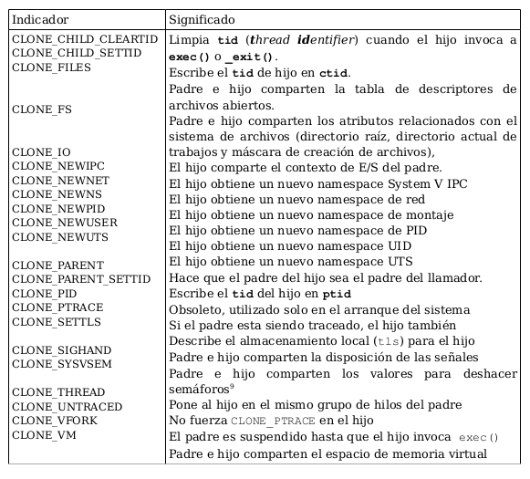

Veamos un ejemplo:

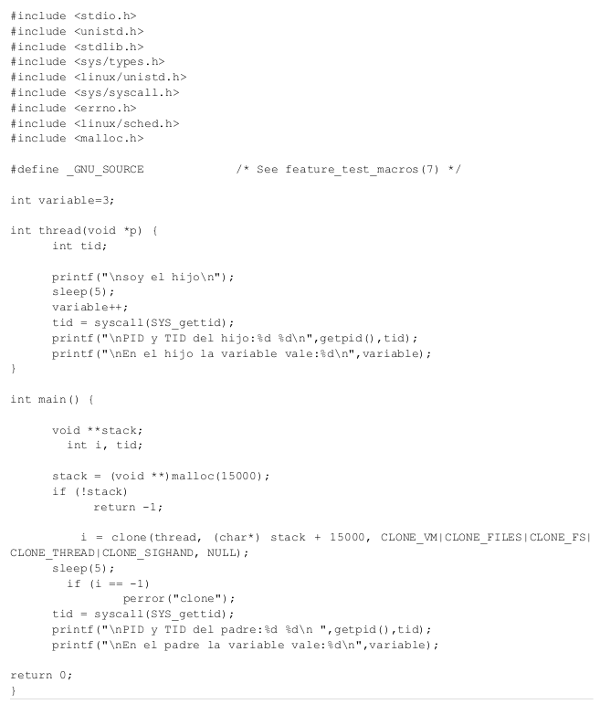

En el programa anterior, hemos utilizado la llamada de Linux que citamos anteriormente, **gettid()**, que devuelve el identificador de una gebra, **tid**.

Si ejecutamos este proceso podemos observar como padre e hijo están en el mismo grupo, puesto que su PID es igual, tal como establece el indicador **CLONE_THREAD**. aDEMÁS, COMO HEMOS ESTABLECIDO, **CLONE_VM**, el espacio de memoria es el mismo, por loq que la variable es la misma en ambos.

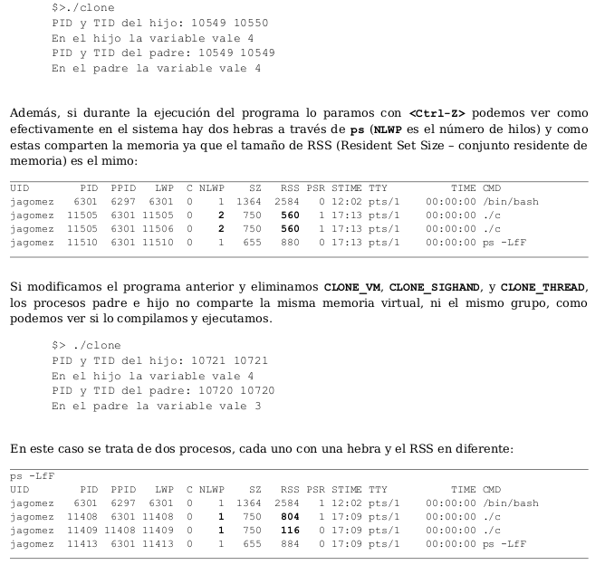


## <u>Sesión 8</u>

### 2. Concepto y tipos de cauce

Un cauce es un mecanismo para la comunicación de información y sincronización de entre procesos. Los datos pueden ser enviados (escritos) por varios procesos al cauce, y, a su vez, recibidos (leidos) por otros procesos.

La sincronización básica que ocurre se debe a que los datos no pueden ser consumidos mientras no sean enviados al cauce. Así pues, un proceso que intenta leer datos de un cauce se bloquea si actualmente no existen dichos datos, es decir, no se ha escrito aún en el cauce por parte de los procesos productores o si los datos ya han sido tomados por los procesos consumidores.

Existen dos tipos de cauce:

- **Cauce sin nombre**:
  - No tienen archivo asociado en el sistema de archivs de disco, solo tiene un archivo temporal cargado en memoria principal.
  - Utilizan la llamada a la orden **pipe** y, automáticamente, devuelve dos descriptores, el de lectura y escritura.
  - Los cauces sin nombre solo pueden ser utilizados como mecanismo de comunicación entre el proceso que crea el cauce sin nombre y los procesos descendentes creados a partir de la creación del cauce.
  - El cauce sin nombre se cierra y elimina automáticamente por el núcleo cuando los contadores asociados a los números de productores y consumidores que los tienen en uso valen simultáneamente 0.
- **Cauce con nombre o archivo FIFO**:
  - Se crea usando las llamadas **mknod** y **mkfifo** en el sistema de archivos en disco como un archivo especial.
  - Los procesos abren y cierran un archivo FIFO usando su nombre mediante las llamadas **open** y **close**.
  - Cualesquiera procesos pueden compartir datos utilizando las ya conocidas llamadas al sistema **read** y **write** sobre el cauce con nombre previamente abierto. Es decir, los cauces con nombre permiten comunicar a procesos que no tienen un antecesor común en la jerarquía de procesos UNIX.
  - El archivo FIFO permanece en el sistema de archivos una vez realizada todas las E/S de los procesos que lo han utilizado como mecanismo de comunicación, hasta que se borre explícitamente usando la llamada a **unlink**.

### 3. Cauces con nombre

#### 3.1. Creación de archivos FIFO

Una vez creado el nombre de cualquier proceso puede abrirlo para lectura y/o escritura, de la misma forma que un archivo regular (El cauce debe estar abierto en ambos extremos para realizar operaciones de escritura-lectura).

Para crear un archivo FIFO se usa:

```c
int mknod (const char *FILENAME, mode_t MODE, dev_t DEV)
```

La llamada al sistema **mknod** crea un archivo de nombre especial <FILENAME>. El parámetro <MODE> especifica los valores que serán almacenados en el campo <st_mode> del i-nodo correspondiente:

- *S_IFCHR*: Dispositivo orientado a caracteres.
- *S_IFBLK*: Dispositivo de bloques.
- *S_IFSOCK*: Dispositivo socket.
- *S_IFIFO*: Dispositivo FIFO.

El argumento <DEV> especifica a qué dispositivo se refiere el archivo especial.

Además, en concreto, para la creación de un archivo FIFO, existe la siguiente orden:

```c
int mkfifo (const char *FILENAME, mode_t MODE)
```

Esta llamada crea un archivo FIFO cuyo nombre es **FILENAME**. El argumento **MODE** se usa para establecer los permisos del archivo.

Los archivos FIFO se eliminan con la llamada al sistema **unlink**.

#### 3.2. Utilización de un cauce FIFO

Las operaciones de E/S sobre un archivo FIFO son esencialmente las mismas que utilizadas con los archivos regulares, salvo que no podemos hacer uso de **lseek**, debido a la filosofía de trabajo FIFO (primero en entrar, primero en salir). Por otro lado, hay que tener en cuenta que la llamada a **read** es bloqueante para los procesos consumidores cuando no hay datos de leer en el cauce, y se debloquea, devolviendo 0, cuanfo toos los procesos que tenían abierto el cauce en modo escritura (productores) lo han cerrado o terminado.

#### Actividad 4.1. Trabajo con cauces con nombre

**<u>Ejercicio 1:</u>** Consulte en el manual las llamadas al sistema para la creación de archivos especiales en general (**mknod**) y la específica para archivos FIFO (**mkfifo**).Pruebe a ejercutar el siguiente código correspondiente a dos programas que modelan el problema del productor/consumidor, los cuales utilizan como mecanismo de comunicación un cauce FIFO. Determine en qué orden y manera se han de ejecutar los dos programas para su correcto funcionamiento y cómo queda reflejado en el sistema que estamos utilizando un cauce FIFO.

```c
//consumidorFIFO.c
//Consumidor que usa mecanismo de comunicacion FIFO.

#include <sys/types.h>
#include <sys/stat.h>
#include <fcntl.h>
#include <unistd.h>
#include <stdio.h>
#include <stdlib.h>
#include <errno.h>
#include <string.h>
#define ARCHIVO_FIFO "ComunicacionFIFO"

int main(void)
{
    int fd;
    char buffer[80];// Almacenamiento del mensaje del cliente.
    int leidos;

    //Crear el cauce con nombre (FIFO) si no existe
    umask(0);
    mknod(ARCHIVO_FIFO,S_IFIFO|0666,0);
    //también vale: mkfifo(ARCHIVO_FIFO,0666);

    //Abrir el cauce para lectura-escritura
    if ( (fd=open(ARCHIVO_FIFO,O_RDWR)) <0) {
        perror("open");
        exit(EXIT_FAILURE);
    }

    //Aceptar datos a consumir hasta que se envíe la cadena fin
    while(1) {
        leidos=read(fd,buffer,80);
        if(strcmp(buffer,"fin")==0) {
        close(fd);
        return EXIT_SUCCESS;
    }
        printf("\nMensaje recibido: %s\n", buffer);
    }

    return EXIT_SUCCESS;
}
```

```c
//productorFIFO.c
//Productor que usa mecanismo de comunicacion FIFO

#include<sys/types.h>
#include<sys/stat.h>
#include<fcntl.h>
#include<unistd.h>
#include<stdio.h>
#include<stdlib.h>
#include<string.h>
#include<errno.h>
#define ARCHIVO_FIFO "ComunicacionFIFO"

int main(int argc, char *argv[])
{
    int fd;

    //Comprobar el uso correcto del programa
    if(argc != 2) {
        printf("\nproductorFIFO: faltan argumentos (mensaje)");
        printf("\nPruebe: productorFIFO <mensaje>, donde <mensaje> es una cadena de 			caracteres.\n");
        exit(EXIT_FAILURE);
    }

    //Intentar abrir para escritura el cauce FIFO
        if( (fd=open(ARCHIVO_FIFO,O_WRONLY)) <0) {
        perror("\nError en open");
        exit(EXIT_FAILURE);
    }

    //Escribir en el cauce FIFO el mensaje introducido como argumento
    if( (write(fd,argv[1],strlen(argv[1])+1)) != strlen(argv[1])+1) {
        perror("\nError al escribir en el FIFO");
        exit(EXIT_FAILURE);
    }

    close(fd);
    return EXIT_SUCCESS;
}
```

**Veamos pues la solución:**

Notemos que primero se ejecuta el consumidor, entre otras razones, porque es el encargado de crear el archivo FIFO.

El programa funciona de la siguiente manera:

Una vez iniciado el proceso consumidor, pasamos a ejecutar el productor pasándole como parámetro entre comillas el string a escribir. La llamada al read en el consumidor es bloqueante, luego el consumidor esperará ahí hasta recibir un mensaje por parte del productor, mediante el archivo FIFO. Este bucle se ejecutará hasta que le pasemos la cadena "fin".


**Código:** https://github.com/danieeeld2/DGIIM/blob/master/Segundo/1%20Cuatrimestre/SO/Pr%C3%A1cticas/C/5.1.consumidor.c

https://github.com/danieeeld2/DGIIM/blob/master/Segundo/1%20Cuatrimestre/SO/Pr%C3%A1cticas/C/5.1.productor.c

### 4. Cauces sin nombre

#### 4.1. Esquema de funcionamiento

Al ejecutar la llamada al sistema **pipe** para crear un cauce sin nombre, el núcleo automáticamente instala dos descriptores, el de envío de datos (**write**) al cauce y el que se usa para obtener daros (**read**).

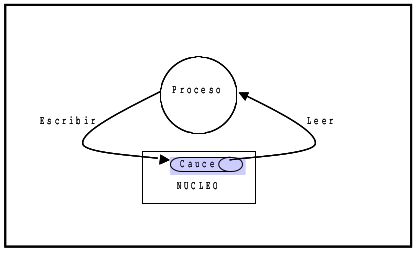

El esquema anterior muestra como e crean los constructores, pero carece de utilidad práctica, ya que los mecanismos de comunicación tienen sentido entre dos o más procesos, por lo que podemos ampliar el esquema de la siguiente manera:

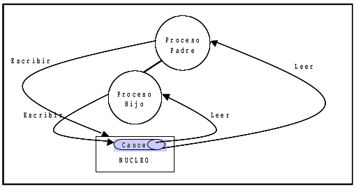

En este momento, se debe tomar la decisión sobre en qué dirección queremos que viajen los datos. Los dos procesos deben adecuarse a la decisión y cerrar los correspondientes extremos no necesarios.

#### 4.2. Creación de cauces

Para la creación de un cauce sin nombre usaremos la llamada **pipe**, la cual toma como argumento de un vector dos valores enteros **int fd[2]**. Si la llamada tiene éxito, el vector contendrá dos nuevos descriptores de archivo. Por defecto, se suele tomar **fd[0]** como descriptor de lectura y **fd[1]** como el de escritura.

El descriptor de archivo 0 (**STDIN_FILENO**) de cualquier proceso UNIX direcciona la entrada estándar (**stdin**) que se asigna por defecto al teclado y, el descriptor de archivos 1 (**STDOUT_FILENO**) direcciona la salida estándar (**stdout**) asignada, por defecto, a la consola.

Si deseamos conseguir redireccionar la entrada o salida estándar al descriptor de lectura o escritura, podemos usar las llamadas al sistema **close**, **dup**, **dup2**.

La llamada **dup** se encarga de duplicar el descriptor indicado como parámetro de entrada. La llamada **dup2** hace lo mismo, peroevita posibles condiciones de carrera

#### 4.3. Notas finales sobre cauces con y sin nombre

- La llamada al sistema **pipe** debe realizarse antes que la llamada al **fork**. En caso contrario, el proceso hijo no heredará los descriptores del cauce.
- Un cauce sin nombre o un archivo FIFO tienen que estar abiertos, simultáneamente, por ambos extremos para permitir la lectura/escritura. Puede ocurrir:
  - El primer proceso que abre el cauce es el proceso lector. Entonces la llamada **open** bloquea a dicho proceso hasta que algún otro escriba en el cauce.

#### Actividad: Trabajo con cauces sin nombre

**<u>Ejercicio 2</u>**: Consulte en el manual en línea la llamada al sistema **pipe** para la creación de cauces sin nombre. Pruebe a ejecutar el siguiente programa que utiliza un cauce sin nombre y describa la función que realiza. 

```c
#include<sys/types.h>
#include<fcntl.h>
#include<unistd.h>
#include<stdio.h>
#include<stdlib.h>
#include<errno.h>
#include<string.h>

int main(int argc, char *argv[])
{
int fd[2], numBytes;
pid_t PID;
char mensaje[]= "\nEl primer mensaje transmitido por un cauce!!\n";
char buffer[80];

pipe(fd); // Llamada al sistema para crear un cauce sin nombre

if ( (PID= fork())<0) {
	perror("fork");
	exit(EXIT_FAILURE);
}
if (PID == 0) {
	//Cierre del descriptor de lectura en el proceso hijo
	close(fd[0]);
	// Enviar el mensaje a traves del cauce usando el descriptor de escritura
	write(fd[1],mensaje,strlen(mensaje)+1);
	exit(EXIT_SUCCESS);
}
else { // Estoy en el proceso padre porque PID != 0
	//Cerrar el descriptor de escritura en el proceso padre
	close(fd[1]);
	//Leer datos desde el cauce.
	numBytes= read(fd[0],buffer,sizeof(buffer));
	printf("\nEl numero de bytes recibidos es: %d",numBytes);
	printf("\nLa cadena enviada a traves del cauce es: %s", buffer);
}

return EXIT_SUCCESS;
}
```

**Solución:** 

```c
/*	PIPE(2)                    Linux Programmer's Manual                   PIPE(2)

	NAME
	       pipe, pipe2 - create pipe

	SYNOPSIS
	       #include <unistd.h>

	   pipe()  creates  a pipe, a unidirectional data channel that can be used
	   for interprocess communication.  The array pipefd is used to return two
	   file  descriptors  referring to the ends of the pipe.  pipefd[0] refers
	   to the read end of the pipe.  pipefd[1] refers to the write end of  the
	   pipe.   Data  written  to  the write end of the pipe is buffered by the
	   kernel until it is read from the read end of the pipe.  For further de‐
	   tails, see pipe(7).

   RETURN VALUE
       On success, zero is returned.  On error, -1 is returned, errno  is  set
       appropriately, and pipefd is left unchanged.

       On Linux (and other systems), pipe() does not modify pipefd on failure.
       A requirement standardizing this behavior was  added  in  POSIX.1-2016.
       The  Linux-specific pipe2() system call likewise does not modify pipefd
       on failure.


*/

/*	En este programa creamos un cauce sin nombre mediante la llamada al sistema pipe. A 
	continuación, creamos el proceso hijo, mediante la llamada a fork para que herede el 
	contexto del padre. 

	En nuestro caso se van a pasar datos del hijo al padre, es decir, el hijo es el
	productor y el padre el consumidor. Por tanto, se cierra el descriptor de escritura
	del padre y el de lectura del hijo. 
*/
```

```bash
$ gcc ejercicio.c
$ ./a.out

El numero de bytes recibidos es: 47
La cadena enviada a traves del cauce es: 
El primer mensaje transmitido por un cauce!!
```

**Código:** https://github.com/danieeeld2/DGIIM/blob/master/Segundo/1%20Cuatrimestre/SO/Pr%C3%A1cticas/C/5.2.c

**<u>Ejercicio 3</u>**: Redirigiendo las entradas y salidas estándares de los procesos a los cauces podemos escribir un programa en lenguaje C que permita comunicar órdenes existentes sin necesidad de reprogramarlas, tal como hace la shel. En particular, ejecute el siguiente programa que ilustra la comunicación entre proceso padre e hijo a través de un cauce sin nombre redirigiendo la entrada estándar y la salida estándar del padre y el hijo, respectivamente.

```c
#include<sys/types.h>
#include<fcntl.h>
#include<unistd.h>
#include<stdio.h>
#include<stdlib.h>
#include<errno.h>

int main(int argc, char *argv[]) 
{
int fd[2];
pid_t PID;

pipe(fd); // Llamada al sistema para crear un pipe

if ( (PID= fork())<0) {
	perror("fork");
	exit(EXIT_FAILURE);
}
if(PID == 0) { // ls
	//Establecer la direccion del flujo de datos en el cauce cerrando
	// el descriptor de lectura de cauce en el proceso hijo
	close(fd[0]);

	//Redirigir la salida estandar para enviar datos al cauce
	//--------------------------------------------------------
	//Cerrar la salida estandar del proceso hijo
	close(STDOUT_FILENO);

	//Duplicar el descriptor de escritura en cauce en el descriptor
	//correspondiente a la salida estandar (stdout)
	dup(fd[1]);
	execlp("ls","ls",NULL);
}
else { // sort. Estoy en el proceso padre porque PID != 0

	//Establecer la dirección del flujo de datos en el cauce cerrando
	// el descriptor de escritura en el cauce del proceso padre.
	close(fd[1]);

	//Redirigir la entrada estándar para tomar los datos del cauce.
	//Cerrar la entrada estándar del proceso padre
	close	(STDIN_FILENO);

	//Duplicar el descriptor de lectura de cauce en el descriptor
	//correspondiente a la entrada estándar (stdin)
	dup(fd[0]);
	execlp("sort","sort",NULL);
}

return EXIT_SUCCESS;
}
```

**Solución:**

```c
/*	Comenzamos creando un cauce sin nombre, mediante la llamada al sistema pipe.
	A continuación, creamos el proceso hijo, mediante la llamada a fork, parq ue herede
	el contexto del padre.

	En nuestro caso, el programa simulará la orden de terminal ls | sort. Para ello,
	el hijo se encargará de ejecutar la orden ls. Como solo nos interesa la salida, cerramos
	su descriptor de entrada. Además, nos interesa que la salida de la orden
	no salga por la salida estándar, por lo que cerramos la misma y, con la orden dup, duplicamos
	el descriptor de escritura. De esta forma, ahora la salida "estándar" será el cauce (fichero)
	temporal creado por la orden pipe.

	Por otro lado, el padre hace básicamente lo mismo. Es importante saber que la orden
	dup es bloqueante, sino podría ocurrir que el padre ejecutase la orden sort, antes de que el
	hijo ejecutara ls.

	NAME
       dup, dup2, dup3 - duplicate a file descriptor

	SYNOPSIS
       #include <unistd.h>

       int dup(int oldfd);
       int dup2(int oldfd, int newfd);

	DESCRIPTION
       The  dup() system call creates a copy of the file descriptor oldfd, us‐
       ing the lowest-numbered unused file descriptor for the new descriptor.

       After a successful return, the old and new file descriptors may be used
       interchangeably.   They  refer  to  the same open file description (see
       open(2)) and thus share file offset and file status flags; for example,
       if the file offset is modified by using lseek(2) on one of the file de‐
       scriptors, the offset is also changed for the other.
*/
```

**Código:** https://github.com/danieeeld2/DGIIM/blob/master/Segundo/1%20Cuatrimestre/SO/Pr%C3%A1cticas/C/5.3.c

**<u>Ejercicio 4</u>**: Compare el siguiente programa con el anterior y ejecútelo. Describa la principal diferencia, si existe, tanto de su código como en el resultado de la ejecución.

```c
#include<sys/types.h>
#include<fcntl.h>
#include<unistd.h>
#include<stdio.h>
#include<stdlib.h>
#include<errno.h>

int main(int argc, char *argv[])
{
int fd[2];
pid_t PID;

pipe(fd); // Llamada al sistema para crear un pipe

if ( (PID= fork())<0) {
	perror("\nError en fork");
	exit(EXIT_FAILURE);
}
if (PID == 0) { // ls
	//Cerrar el descriptor de lectura de cauce en el proceso hijo
	close(fd[0]);

	//Duplicar el descriptor de escritura en cauce en el descriptor
	//correspondiente a la salida estandr (stdout), cerrado previamente en
	//la misma operacion
	dup2(fd[1],STDOUT_FILENO);
	execlp("ls","ls",NULL);
}
else { // sort. Proceso padre porque PID != 0.
	//Cerrar el descriptor de escritura en cauce situado en el proceso padre
	close(fd[1]);

	//Duplicar el descriptor de lectura de cauce en el descriptor
	//correspondiente a la entrada estándar (stdin), cerrado previamente en
	//la misma operación
	dup2(fd[0],STDIN_FILENO);
	execlp("sort","sort",NULL);
}

return EXIT_SUCCESS;
}
```

**Solución**: 

```c
/*	Este programa hace exáctamente lo mismo que el anterior, pero combina
	la llamada a close y dup en una sola orden, que es dup2, que, además,
	garantiza que no existan errores de carrera.

	dup2()
       The dup2() system call performs the same task as dup(), but instead  of
       using  the lowest-numbered unused file descriptor, it uses the file de‐
       scriptor number specified in newfd.  If the file descriptor  newfd  was
       previously open, it is silently closed before being reused.
*/
```

**Código:**

**<u>Ejercicio 5</u>**: 

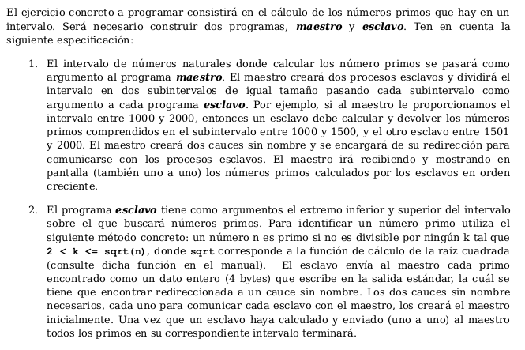

```c
#include <sys/types.h>
#include <fcntl.h>
#include <unistd.h>
#include <stdio.h>
#include <stdlib.h>
#include <string.h>
#include <errno.h>

int main(int argc, char *argv[]){
	// [minA, maxA], [minB, maxB]
	int minA, minB;
	int maxA, maxB;
	int fdE1[2], fdE2[2], fdM[2];
	pid_t PID1, PID2;
	int valor;

	if (argc != 3){
		printf("Sintaxis de ejecución: ./maestro <a> <b>\n");
		exit(-1);
	}

	minA = strtol(argv[1], NULL, 10);	// Convierte string a int
	maxB = strtol(argv[2], NULL, 10);	// Convierte string a int

	// Creación de los cauces sin nombre
	pipe(fdE1);
	pipe(fdE2);
	pipe(fdM);

	if((PID1 = fork()) == 0){
		// hijo 1 == esclavo 1
		// Cerramos los descrpitores del esclavo 2, ya que no se comunican entre ellos
		close(fdE2[0]);
		close(fdE2[1]);

		// Cerramos el resto de descriptores que no necesitemos
		close(fdE1[1]);
		close(fdM[0]);

		// Esclavo 1 --> Maestro
		// Usamos la llamada a dup2 para cerrar la E/S estándar y que se utilice el cauce
		dup2(fdE1[0], STDIN_FILENO);
		dup2(fdM[1], STDOUT_FILENO);

		execl("./esclavo", "esclavo", NULL);
	} else if((PID2 = fork()) == 0){
		// hijo 2 == esclavo 2
		// Cerramos los descrpitores del esclavo 1, ya que no se comunican entre ellos
		close(fdE1[0]);
		close(fdE1[1]);

		// Cerramos el resto de descriptores que no necesitemos
		close(fdE2[1]);
		close(fdM[0]);

		// Esclavo 1 --> Maestro
		// Usamos la llamada a dup2 para cerrar la E/S estándar y que se utilice el cauce
		dup2(fdE2[0], STDIN_FILENO);
		dup2(fdM[1], STDOUT_FILENO);

		execl("./esclavo", "esclavo", NULL);

	} else{
		// Padre
		close(fdE1[0]);
		close(fdE2[0]);

		// Calculamos el intervalo 
		maxA = (minA + maxB)/2;
		minB = maxA+1;

		// Escritura en el intervalo [minA, maxA] en el hijo 1 (esclavo1)
		write(fdE1[1], &minA, sizeof(int));
		write(fdE1[1], &maxA, sizeof(int));

		// Escritura en el intervalo [minB, maxB] en el hijo 2 (esclavo2)
		write(fdE2[1], &minB, sizeof(int));
		write(fdE2[1], &maxB, sizeof(int));

		while((read(fdM[0], &valor, sizeof(int))) != 0){
			printf("%d\n", valor);
		}
	}

	return EXIT_SUCCESS;

}
```

**Script:**

```c
#include <sys/types.h>
#include <fcntl.h>
#include <unistd.h>
#include <stdio.h>
#include <stdlib.h>
#include <string.h>
#include <errno.h>


int esPrimo(int num);

int main(int argc, char *argv[]){
	int min, max;
	int i;

	read(STDIN_FILENO, &min, sizeof(int));
	read(STDIN_FILENO, &max, sizeof(int));
	// Recordemos que con dup2 hemos hecho que el maestro escriba en
	// la entrada estándar

	for(i = min; i <= max; i++){
		if(esPrimo(i)){
			write(STDOUT_FILENO, &i, sizeof(int));
		}
	}

	return EXIT_SUCCESS;
}

int esPrimo(int num){
	int i;
	int bandera = 1;

	if(num == 0 || num == 1 || num == 4)
		return bandera;
	for(i=2; i<num/2; i++)
		if(num%i == 0)
			bandera = 0;

	return bandera;
}
```

**Código:** https://github.com/danieeeld2/DGIIM/blob/master/Segundo/1%20Cuatrimestre/SO/Pr%C3%A1cticas/C/5.5.c

https://github.com/danieeeld2/DGIIM/blob/master/Segundo/1%20Cuatrimestre/SO/Pr%C3%A1cticas/C/5.5.esclavo.c


## <u>Sesión 9</u>

### 2. Señales

Las señales constituyen un mecanismo básico de sincronización que utiliza el núcleo de Linux para indicar a los procesos la ocurrencia de determinados eventos síncronos/asíncronos con su ejecución. Además de las señales por parte del núcleo, los procesos pueden enviarse señales para la notificación de cierto evento y para determinar que acción realizarán como respuesta a la recepción de una señal determinada.

Un manejador de señal es una función definida en el programa que se invoca cuando se entrega una señal al proceso. Su invocación puede interrumpir el flujo de control del proceso en cualquier instante.

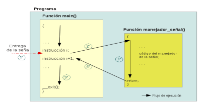

Se dice que una señal es **depositada** cuando el proceso inicia una acción en base a ella, y se dice que una señal está **pendiente** si ha sido generada, pero todavía no ha sido depositada. Además un proceso puede bloquear la recepción de una o varias señales a la vez.

Las señales bloqueadas de un proceso se almacenan en un conjunto de señales llamada **máscara de bloqueo de señales**. No se debe confundir una señal **bloqueada** con una señal **ignorada**, ya que una señal ignorada es desechada por el proceso, mientras que la bloqueada permanecerá pendiente y será depositada cuando el proceso la desbloquee.

La lista de señales y su tratamiento por defecto se puede consultar con **man 7 signal**.

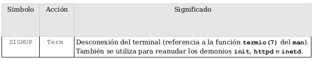

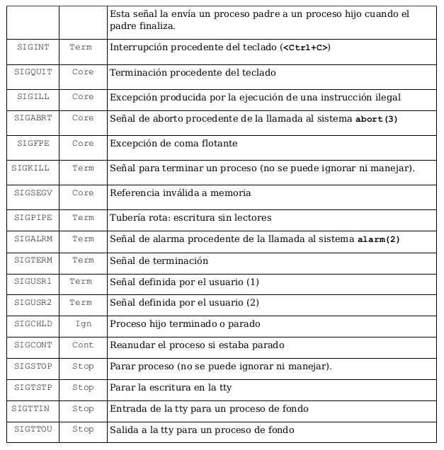

- **Term:** Termina el proceso.
- **Ign:** Ignora la señal.
- **Core:** Termina el proceso y realiza un volcado de memoria.
- **Stop:** Detiene el proceso
- **Cont:** Que el proceso continue su ejecución si está parado.

Las llamadas al sistema que podemos utilizar en Linux para trabajar con señales principalmente:

- **kill:** Envia una señal a un proceso o conjunto de procesos.
- **sigaction:** Establece la acción que realizará un proceso como respuesta a la recepción de una señal. Las únicas señales que no pueden cambiar su acción por defecto son: **SIGKILL** y **SIGSTOP**.
- **sigprocmask:** Cambia la lista de señales bloqueadas.
- **sigpending:** Examen de las señales pendientes.
- **sigsuspend:** Reemplaza temporalmente la máscara de señal para el proceso con la dada por el argumento *mask* y luego suspende el proceso hasta que se recibe una señal.

#### 2.1. La llamada kill

La llamada **kill** se puede utilizar para enviar cualquier señal a un proceso o grupo de procesos.

**Sipnosis**

```c
#include<sys/types.h>
#include<signal.h>

int kill(pid_t pid, int sig);
```

**Argumentos**

- Si **pid** es positivo, se envia la señal **sig** al proceso con identificador **pid**, devolviendo 0 en caso de éxito y un valor negativo en caso de error.
- Si **pid** es 0, entonces **sig** se envía a cada proceso en el grupo de proceso actual.
- Si **pid** es igual a -1, entonces se envía la señal **sig** a cada proceso, excepto al primero, desde los números más altos en la tablla de procesos hasta los más bajos.
- Si **pid** es menor que -1, entonces se envía **sig** a cada proceso del grupo de procesos **-pid**
- Si **sig** es 0, no se envía ninguna señal, pero se hace la comprobación de errores.

#### 2.2. La llamada sigaction

Se emplea para cambiar la acción tomada por un proceso cuando recibe una determinada señal.

**Sinopsis**

```c
int sigaction(int signum, const struct sigaction *act, struct sigaction *oldact)
```

**Argumentos**

- **signum** especifica la señal.
- Si **act** no es **NULL**, la nueva acción para la señal signum se instala como **act**.
- Si **oldact** no es **NULL**, la acción anterior se guarda en oldact

**Valor de retorno**

- 0 en caso de éxito y -1 en caso de error.

**Estructuras de datos**

```c
struct sigaction{
	void (*sa_handler)(int);
    void (*sa_sigaction)(int, siginfo_t*, void *);
    sigset_t sa_mask;
    int sa_flags;
    void (*sa_restorer)(void);
}
```

- **sa_handler**: Acción que va asociada a la señal *signum*, pudiendo ser:

  - **SIG_DEL**: Acción predeterminada
  - **SIG_IGN**: Ignora la señal
  - o un puntero a una función manejadora para la señal

- **sa_mask**: Establece una máscara de señales que debería bloquearse durante la ejecución del manejador de señal. Se usan las siguientes funciones:

  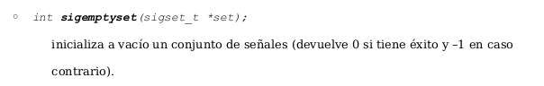

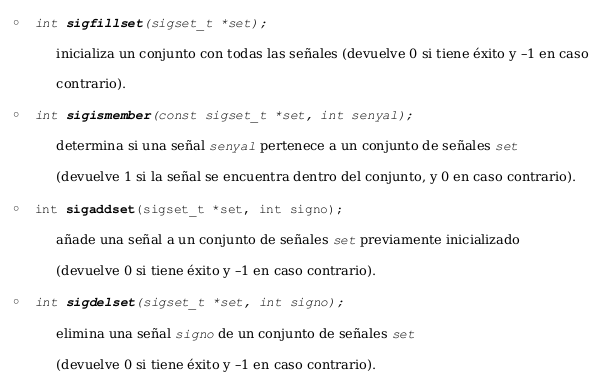

- **sa_flags**: Especifica un conjunto de opciones que modifican el comportamiento del proceso de manejo de señales. Se forma por la aplicación del operador de bits OR a cero o más de las siguientes constantes:

  

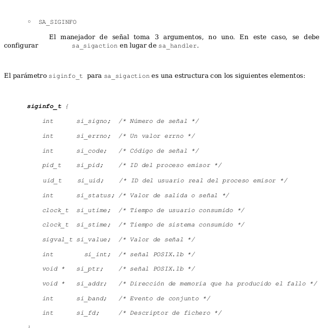

Los siguientes ejemplos ilustran el uso de la llamada al sistema **sigaction** para establecer un manejador para la señal **SIGINT** que se genera cuando se pulsa **<ctrl+c>**.

```c
#include <stdio.h>
#include <signal.h>

int main()
{
	struct sigaction sa;
	sa.sa_handler = SIG_IGN; // ignora la señal
	sigemptyset(&sa.sa_mask); 

	//Reiniciar las funciones que hayan sido interrumpidas por un manejador 
	sa.sa_flags = SA_RESTART; 

	if (sigaction(SIGINT, &sa, NULL) == -1){ 
		printf("error en el manejador");}
		while(1);
	}
}
```

```c
#include <stdio.h>
#include <signal.h>

static int s_recibida=0;
static void handler (int signum){
	printf("\n Nueva accion del manejador \n");
	s_recibida++;
}

int main(){
	struct sigaction sa;
	sa.sa_handler = handler; // ignora la se–al
	sigemptyset(&sa.sa_mask); 

	//Reiniciar las funciones que hayan sido interrumpidas por un manejador 
	sa.sa_flags = SA_RESTART; 

	if (sigaction(SIGINT, &sa, NULL) == -1){ 
		printf("error en el manejador");}
		while(s_recibida<3);
	}
}
```

#### Actividad: Trabajo con las llamadas al sistema sigaction y kill

A continuación se muestra el código fuente de dos programas. El programa **envioSignal** permite el envío de una señal a un proceso identificado por medio de su **PID**. El prorama **reciboSignal** se ejecuta en background y permite la recepción de señales.

**<u>Ejercicio 1</u>**: Compila y ejecuta los siguientes programas y trata de entender su funcionamiento.

```c
/*
 envioSignal.c
 Trabajo con llamadas al sistema del Subsistema de Procesos conforme a POSIX 2.10
 Utilización de la llamada kill para enviar una señal:
 0: SIGTERM
 1: SIGUSR1
 2: SIGUSR2
  a un proceso cuyo identificador de proceso es PID.
 SINTAXIS: envioSignal [012] <PID> 
*/


#include <sys/types.h> //POSIX Standard: 2.6 Primitive System Data Types 
#include<limits.h> //Incluye <bits/posix1_lim.h> POSIX Standard: 2.9.2 //Minimum    //Values Added to <limits.h> y <bits/posix2_lim.h>
#include <unistd.h> //POSIX Standard: 2.10 Symbolic Constants         <unistd.h>
#include <sys/stat.h>
#include <stdio.h>
#include <stdlib.h>
#include <signal.h>
#include <errno.h>
int main(int argc, char *argv[])
 {
          long int pid;
          int signal;
          if(argc<3) {
          printf("\nSintaxis de ejecucion: envioSignal [012] <PID>\n\n");
          exit(EXIT_FAILURE);
           }
         pid= strtol(argv[2],NULL,10);
         if(pid == LONG_MIN || pid == LONG_MAX) 
           {
         if(pid == LONG_MIN)
         printf("\nError por desbordamiento inferior LONG_MIN %ld",pid);
         else
            printf("\nError por desbordamiento superior LONG_MAX %ld",pid);
            perror("\nError en strtol");
            exit(EXIT_FAILURE);
           }
        signal=atoi(argv[1]);
        switch(signal) {
            case 0: //SIGTERM
            kill(pid,SIGTERM); break;
            case 1: //SIGUSR1
            kill(pid,SIGUSR1); break;
            case 2: //SIGUSR2
            kill(pid,SIGUSR2); break;
            default : // not in [012]
            printf("\n No puedo enviar ese tipo de senal"); 
              }
}
```

```c
/*
 reciboSignal.c
 Trabajo con llamadas al sistema del Subsistema de Procesos conforme a POSIX 2.10
 Utilización de la llamada sigaction para cambiar el comportamiento del proceso       
 frente a la recepción de una señal.
*/

#include <sys/types.h>
#include <unistd.h>
#include <stdio.h>
#include <signal.h>
#include <errno.h>
#include <stdlib.h>

static void sig_USR_hdlr(int sigNum)
  {

    if(sigNum == SIGUSR1)
    printf("\nRecibida la senal SIGUSR1\n\n");
    else if(sigNum == SIGUSR2)
    printf("\nRecibida la senal SIGUSR2\n\n"); 
   }

int main(int argc, char *argv[])
   {
    struct sigaction sig_USR_nact;
    if(setvbuf(stdout,NULL,_IONBF,0)) 
       {    perror("\nError en setvbuf");
       }

//Inicializar la estructura sig_USR_na para especificar la nueva acción para la señal.

sig_USR_nact.sa_handler= sig_USR_hdlr;


//'sigemptyset' inicia el conjunto de señales dado al conjunto vacio. 

sigemptyset (&sig_USR_nact.sa_mask);
sig_USR_nact.sa_flags = 0;

//Establecer mi manejador particular de se–al para SIGUSR1
if( sigaction(SIGUSR1,&sig_USR_nact,NULL) <0) 
    {
	perror("\nError al intentar establecer el manejador de senal para SIGUSR1");
	exit(EXIT_FAILURE);
    }
//Establecer mi manejador particular de señal para SIGUSR2
if( sigaction(SIGUSR2,&sig_USR_nact,NULL) <0) 
    {
	perror("\nError al intentar establecer el manejador de senal para SIGUSR2");
	exit(EXIT_FAILURE);
    }
for(;;)
   {
   }
}
```

Vamos con el primero de ellos:

```c
/*  El programa comienza comprobando que se reciben 3 argumentos. En caso
    de no recibirlos, devuelve un mensaje de error con el uso apropiado del programa.
    A continuación, almacena el segundo argumento en l variable pid, para pasar 
    a comprobar si este valor se deborda inferior o superiormente. En dicho caso, 
    devuelve un mensaje de error y finaliza el programa.

    En caso de que strtol haya funcionado, se continua almacenando el segundo argumento 
    en signal. A continuación, un bucle comprueba cual ha sido la señal recibida, y, en 
    funció de la misma, llama a la orden kill, la cual, permite enviar una
    señal a un proceso. En caso de que la señal pasada como parámetro no esté entre esos valores,
    muestra un mensaje por pantalla diciendo que no se pudo enviar la señal

    NAME
       kill - send a signal to a process

    SYNOPSIS
       kill [options] <pid> [...]

    DESCRIPTION
       The  default  signal  for kill is TERM.  Use -l or -L to list available
       signals.  Particularly useful signals include  HUP,  INT,  KILL,  STOP,
       CONT,  and  0.   Alternate  signals may be specified in three ways: -9,
       -SIGKILL or -KILL.  Negative PID values may be  used  to  choose  whole
       process  groups; see the PGID column in ps command output.  A PID of -1
       is special; it indicates all processes except the kill  process  itself
       and init.

    SIGTERM --> Señal de terminación
    SIGUSR1 --> Señal definida por el usuario (1)
    SIGUSR2 --> Señal definida por el usuario (2)
*/
```

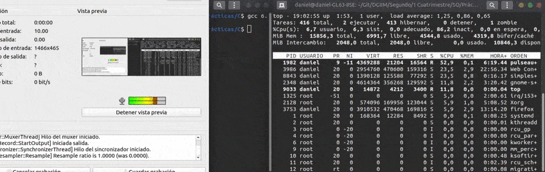

Vamos ahora con el segundo:

```c
/*  El programa comienza creando una struct signation, para pasar a desactivar el buffer
    de la salida estándar. A continuación,pasa a inicializar la estructura sig_USR_na 
    para especificar la nueva acción para la señal. Después, llama a 'sigemptyset', el cual,
    inicia el conjunto de señales dado al conjunto vacio y, por último, inicializa los flags a 0.

    Por último, llama a sigaction, el cual, permite cambiar la acción tomada
    por un proceso cuando recibe una señal. En ambos casos, comprueba si el manejador 
    falla, en cuyo caso, muestra un mensaje de error por pantalla y finaliza el
    programa

    struct sigaction{
        void (*sa_handler)(int);
        void (*sa_sigaction)(int, siginfo_t*, void *);
        sigset_tsa_mask;
        int sa_flags;
        void (*sa_restorer)(void);
    }

    NAME
       sigaction, rt_sigaction - examine and change a signal action

    SYNOPSIS
       #include <signal.h>

       int sigaction(int signum, const struct sigaction *act,
                     struct sigaction *oldact);


       The  sigaction()  system  call  is used to change the action taken by a
       process on receipt of a specific signal.  (See signal(7) for  an  over‐
       view of signals.)

       signum  specifies the signal and can be any valid signal except SIGKILL
       and SIGSTOP.

       If act is non-NULL, the new action for signal signum is installed  from
       act.  If oldact is non-NULL, the previous action is saved in oldact.

  */
```

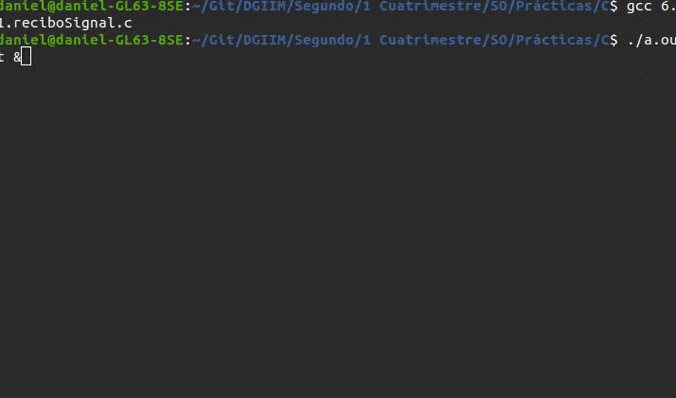

**Código:** https://github.com/danieeeld2/DGIIM/blob/master/Segundo/1%20Cuatrimestre/SO/Pr%C3%A1cticas/C/6.1.envioSignal.c

https://github.com/danieeeld2/DGIIM/blob/master/Segundo/1%20Cuatrimestre/SO/Pr%C3%A1cticas/C/6.1.reciboSignal.c

**<u>Ejercicio 2</u>**: Escribe un programa en C llamado **contador**, tal que cada vez que reciba una señal que se pueda manejar, muestre por pantalla la señal y el número de veces que se ha recibido este tipo de señal, y un mensaje inicial indicando la señales que no puede manejar. En el cuadro siguiente se muestra un ejemplo de ejecución del programa.

```bash
kawtar@kawtar-VirtualBox:~$ ./contador &
    [2] 1899
kawtar@kawtar-VirtualBox:~$
    No puedo manejar la señal 9
    No puedo manejar la señal 19
    Esperando el envío de señales...
    kill -SIGINT 1899
kawtar@kawtar-VirtualBox:~$ La señal 2 se ha recibido 1 veces
    kill -SIGINT 1899
    La señal 2 se ha recibido 2 veces
    kill -15 1899
kawtar@kawtar-VirtualBox:~$ La señal 15 se ha recibido 1 veces
    kill -111 1899
    bash: kill: 111: especificación de señal inválida
kawtar@kawtar-VirtualBox:~$ kill -15 1899 // el programa no puede capturar la
    señal 15
    [2]+ Detenido	./contador
kawtar@kawtar-VirtualBox:~$ kill -cont 1899
    La señal 18 se ha recibido 1 veces
kawtar@kawtar-VirtualBox:~$ kill -KILL 1899
    [2]+	Terminado (killed)	./contador
```

Para este ejercicio aprovecharé el ejercicio anterior:

```c
#include <sys/types.h>
#include <unistd.h>
#include <stdio.h>
#include <signal.h>
#include <errno.h>
#include <stdlib.h>

static int seniales[31];

void sig_USR_hdlr(int i) {
    seniales[i]++;
    printf("La señal %i ha sido recibida %i veces\n", i, seniales[i]);
}

int main(int argc, char *argv[])
   {
    struct sigaction sig_USR_nact;
    if(setvbuf(stdout,NULL,_IONBF,0)) 
       {    perror("\nError en setvbuf");
       }

//Inicializar la estructura sig_USR_na para especificar la nueva acción para la señal.

sig_USR_nact.sa_handler= sig_USR_hdlr;

//'sigemptyset' inicia el conjunto de señales dado al conjunto vacio. 

sigemptyset (&sig_USR_nact.sa_mask);
sig_USR_nact.sa_flags = 0;

for ( int i = 0; i < 31; i++ )
	seniales[i] = 0;


for ( int i = 1; i < 31 && i != SIGSTOP && i != SIGKILL; i++ ) {
    if (sigaction(i, &sig_USR_nact, NULL) == -1) {
    	printf("No se pudo manejar %i\n", i);
    }
}

while(1);
}
```


**Código**: https://github.com/danieeeld2/DGIIM/blob/master/Segundo/1%20Cuatrimestre/SO/Pr%C3%A1cticas/C/6.2.c

#### 2.3. La llamada *sigprocmask*

Esta llamada se empleapara examinar y cambiar la máscara de señales.

**Sinopsis**

```c
int sigprocmask(int how, const sigset_t *Set, sigset_t *oldest)
```

**Argumentos**

- El argumento **how** indica el tipo de cambio. Los valores que se puede tomar son los siguientes:
  - **SIG_BLOCK**: El conjunto de señales bloqueadas es la unión del conjunto actual y el argumento set.
  - **SIG_UNBLOCK**: Las señales que hay en set se eliminan del conjunto actual de señales bloqueadas. Es posible intentar el desbloqueo de una señal que no esté bloqueada.
  - **SIG_SETMASK**: El conjunto de señales bloqueadas se pone según el argumento set.
- **set** representa el puntero al nuevo conjunto de señales enmascaradas. Si **set** es diferente de NULL, apunta a un conjunto de señales, en caso contrario sigprocmask se utiliza para consulta.
- **oldset**: Representa el conjunto anterior de señales enmascaradas. Si **oldset** no es NULL, el valor anterior de la máscara de señal se guarda en **oldset**. En caso contrario, se retorna la máscara anterior.

**Valor de retorno**

- o en caso de éxito y -1 en caso de error

#### 2.4. La llamada sigpending

La llamada **sigpending** permite examinar el conjunto de señales bloqueadas y/o pendientes de entrega. La máscara de señal de las señales oendientes se guarda en **set**.

**Sinopsis**

```c
int sigpending(sigset_t *set)
```

**Argumento**

- **mask** representa el puntero al nuevo conjunto de señales enmascaradas

**Valor de retorno**

- -1 si sigsuspend es interrumpida por una señal capturada.

**Ejemplo de uso**: En el siguiente ejemplo se suspende la ejecución del proceso actual hasta que recibe una señal distinta de **SIGUSR1**.

```c
#include <stdio.h>
#include <signal.h>

int main(){
    sigset_t new_mask;

    /* inicializar la nueva mascara de señales */
    sigemptyset(&new_mask);

    sigaddset(&new_mask, SIGUSR1);

    /*esperar a cualquier señal excepto SIGUSR1 */
    sigsuspend(&new_mask);
}
```

#### Notas

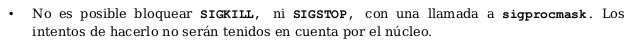

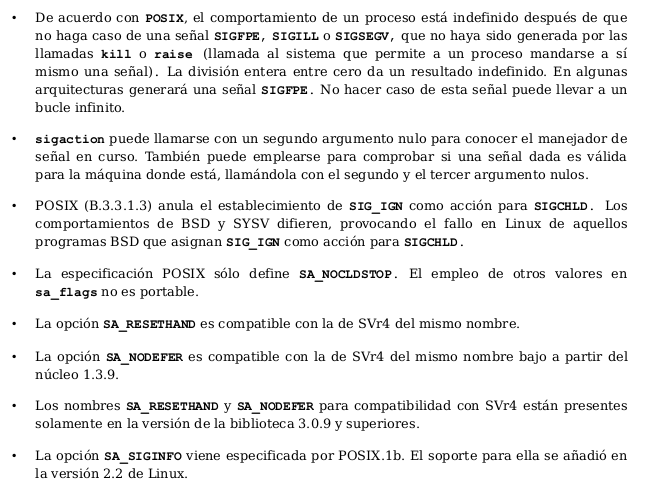

#### Actividad: Trabajo con la llamada al sistema sigsuspend  y sigprocmask

**<u>Ejercicio 3</u>**: Escribe un programa que suspensa la ejecución del proceso actual hasta que se reciba la señal SIGUSR1. Consulta en el manual en línea sigmptyset para conocer las distintas operaciones que permitan configurar el conjunto de señales de un proceso.

```c
#include <stdio.h>
#include <signal.h>

int main() {
    sigset_t new_mask;
    
    // vaciamos la máscara
    sigemptyset(&new_mask);
    
    // rellenamos la máscara con todas las señales
    sigfillset(&new_mask);
    
    // eliminamos SIGUSR1
    sigaddset(&new_mask, SIGUSR1);
    
    // cuando suspendamos el programa no reaccionará a ninguna señal excepto SIGUSR1
    sigsuspend(&new_mask);
}
```

**Código:** https://github.com/danieeeld2/DGIIM/blob/master/Segundo/1%20Cuatrimestre/SO/Pr%C3%A1cticas/C/6.3.c

**<u>Ejercicio 4</u>**: Compila y ejecuta el siguiente programa y trata de entender su funcionamiento.

```c
#include <signal.h>
#include <stdio.h>
#include <string.h>
#include <unistd.h>
#include <stdlib.h>

static int signal_recibida = 0;

static void manejador (int sig)
{
          signal_recibida = 1;
}

int main (int argc, char *argv[])
{
    sigset_t conjunto_mascaras;
    sigset_t conj_mascaras_original;
    struct sigaction act;
//Iniciamos a 0 todos los elementos de la estructura act 
    memset (&act, 0, sizeof(act));

    act.sa_handler = manejador;

    if (sigaction(SIGTERM, &act, 0)) {
        perror ("sigaction");
        exit(EXIT_FAILURE);
    }
    
    //Iniciamos un nuevo conjunto de mascaras
    sigemptyset (&conjunto_mascaras);
    //A–adimos SIGTERM al conjunto de mascaras
    sigaddset (&conjunto_mascaras, SIGTERM);
    
    //Bloqueamos SIGTERM
    if (sigprocmask(SIG_BLOCK, &conjunto_mascaras, &conj_mascaras_original) < 0) {
       perror ("primer sigprocmask");
       exit(EXIT_FAILURE);
    }

    sleep (10);

    //Restauramos la señal – desbloqueamos SIGTERM
    if (sigprocmask(SIG_SETMASK, &conj_mascaras_original, NULL) < 0) {
       perror ("segundo sigprocmask");
       exit(EXIT_FAILURE);
       }

    sleep (1);

   if (signal_recibida)
       printf ("\nSenal recibida\n");
   exit(EXIT_SUCCESS);
}
```

