# Resumen Prácticas SQL

###### Daniel Alconchel Vázquez

------

Antes de nada, para salir de **SQLPlus** se recomienda ejecutar **COMMIT**, que guarda los cambios realizados en la sesión y, a continuación, **EXIT** para salir.

Todo lo relacionado al inicio de sesión viene explicado en el guión de prácticas de la asignatura con mucho detalle, este es solo un resumen y anotaciones sobre los ejercicios.

### Ejecutar Comandos de SQL

#### Desde la línea de comandos

```sql
SQL> CREATE TABLE prueba1 (
	cad char(3),
	n int,
	x float);
```

Si todo ha ido bien, devolverá un mensaje de **TABLA CREADA**, en caso contrario, dará un error, que es recomendable leer.

#### Desde un fichero

La alternativa más útil para trabajar con SQLPlus es editar y lanzar ficheros de comandos sql, los cuales, se pueden crear con cualquier editor (basta con añadir la extensión **.sql**). Se puede usar un editor externo, o teclear **edit nombre-fichero**, el cual, crea un fichero con la extensión adecuada (si este no está ya creado) y permite su edición.

Para ejecutar un fichero basta con:

```sql
start camino\nombre_del_fichero ó @camino\nombre_del_fichero
```

**<u>Ejercicio 1.1:</u>** Editar un fichero en el directorio de trabajo, que contenga las instrucciones

```sql
CREATE TABLE prueba2(
	cad1 char(8),
	num int);
```

Para poder consultar si, efectivamente, se ha creado la tabla, basta con ejecutar el comando

```sql
describe nombre_tabla
```

### Lenguaje de definición de datos en Oracle

#### Creación de tablas

Como ya hemos visto, para la creación de tablas se usa el comando **CREATE TABLE**.

```sql
CREATE TABLE nombre-tabla(
    nombre-atributo1 tipo-atributo1 [NOT NULL] [DEFAULT expr],
    nombre-atributo2 tipo-atributo2 [NOT NULL] [DEFAULT expr],...
    [PRIMARY KEY(nombre-atributo1, nombre-atributo2...),]
    [UNIQUE (nombre-atributo1, nombre-atributo2...),]
    [FOREIGN KEY(nombre-atributo1, nombre-atributo2...)
    REFERENCES nombre-tabla(nombre-atributo, ...),]
    [CHECK(condicion)]
);
```

Cabe destacar que cuando la clave primaria, candidata o externa está formada por un solo atributo, se puede recurrir a la siguiente sintaxis:

```sql
CREATE TABLE nombre-tabla1(
    nombre-atributo1 tipo-atributo1 PRIMARY KEY,
    nombre-atributo2 tipo-atributo2 UNIQUE,
    nombre-atributo3 [tipo-atributo3]
    REFERENCES nombre-tabla2(nombre-atributo3));
```

La cláusula de **tipo-atributo3** puede omitirse, ya que será del mismo tipo al atributo al que referencia.

Un ejemplo sería:

```sql
CREATE TABLE plantilla(
	dni varchar2(9),
	nombre varchar2(15),
	estadocivil varchar2(10)
		CHECK (estadocivil IN ('soltero', 'casado', 'divorciado', 'viudo')),
	fechalta date,
	PRIMARY KEY(dni));
```

Como podemos observar, podemos delimitar el rango de valores para el atributo estadocivil mediante **CHECK**.

Además de definir reglas de integridad específicas sobre determinados campos, se pueden definir reglas de integridad generales. Por ejemplo, supongamos que queramos almacenar la relación entre jefes y subordinados, a partir de la tabla plantilla anterior. Podemos usar la siguiente estructura:

```sql
CREATE TABLE serjefe(
	dnijefe REFERENCES plantilla(dni),
	dnitrabajador REFERENCES plantilla(dni),
	PRIMARY KEY (dnitrabajador));
```

#### Tipos de Datos y Operadores

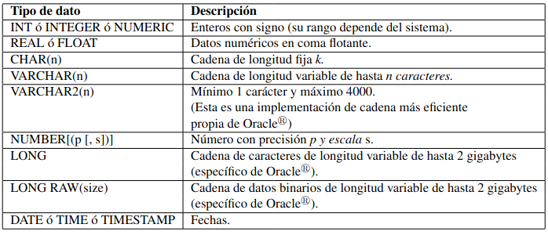

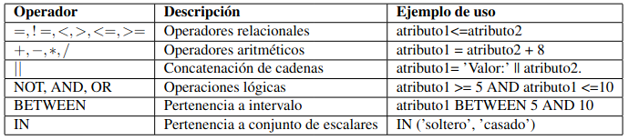

#### Eliminación de tablas

```sql
DROP TABLE nombre-tabla
```

#### Modificación de esquema de una tabla

Para una tabla existente, podemos modificar su estructura (añadir una nueva columna, modificar su definición, restricciones de los atributos...) mediante

```sql
ALTER TABLE nombre-tabla modificador
```

El tipo de alteración de la tabla dependerá del modificador que incluyamos. Por ejemplo, podemos:

- Añadir un atributo nuevo a la table con:

  ```sql
  ADD (atributo [tipo] [DEFAULT expresion] [restriccion_atributo]);
  ```

- Añadir una restricción a la tabla existente:

  ```sql
  ADD CONSTRAINT nombre_restriccion [[UNIQUE | PRYMARY KEY] (lista_columnas) |
  			FOREING KEY (lista_columnas) REFERENCES tabla(lista_col) |
  			CHECK (condicion)];
  ```

- Eliminar una restricción de una tabla:

  ```sql
  DROP CONSTRAINT nombre_restriccion [CASCADE]
  ```

La palabra reservada **CONSTRAINT** permite dar nombre a restricciones impuestas sobre atributos.

Para observar las tablas creadas por el usuario, ejecutamos el siguiente comando:

```sql
select TABLE_NAME from USER_TABLES;
```

### Mantenimiento de una Base de Datos

#### Inserción de tuplas en las tablas

La forma general es:

```sql
INSERT INTO nombre_tabla [(colomn1, column2,...)]
	VALUES(valor1, valor2,...);
```

También podemos insertar tuplas en una tabla a partir de otra tabla de la base de datos.

```sql
INSERT INTO nombre_tabla [(column1, column2,...)]
	consulta;
```

La palabra **SYSDATE** indica la fecha y hora del sistema.

#### Mostrar el contenido de una tabla

Una vez introducidos los datos en las tablas, podemos ver el contenido de las mismas ejecutando la sentencia de consulta:

```sql
SELECT * FROM nombra-tabla;
```

El símbolo ***** equivale, en álgebra Relacional, a proyectar sobre todos los atributos de la tabla.

#### Modificar el contenido de una tabla

Los datos introducidos anteriormente, se actualizan con la sentencia **UPDATE**:

```sql
UPDATE nombre-tabla
SET nombre_atributo = 'nuevovalor' [, nombre_atributo2 = 'nuevovalor2',...]
[WHERE <condicion>];
```

Esta sentencia modifica los valores de las tuplas que se ajustan al criterio establecido en <condicion>.

#### Borrado de tuplas

La instrucción **DELETE** es la que permite esta opción. Las tuplas que se eliminan son las que hacen cierta la expresión <condicion>:

```sql
DELETE FROM nombre_tabla [WHERE <condicion>];
```

#### Particulariades del tipo de dato DATE

El tipo **DATE** sirve para almacenar relación relativa a fechas, expresado en juliano. Oracle permite sumar y restar valores constantes y otras fechas a los datos de tipo fecha. Para ello, la fecha se representa internamente como un único número (número de dias). Por ejempli, SYSDATE+1 es mañana y SYSDATE+(10/1440) es dentro de diez minutos.

#### Introducción de fechas mediante la función TO_DATE

Con esta función se genera un valor de tipo **date** a partir del valor suministrado por la primera cadena pasada a la función usando como formato la segunda cadena proporcionada.

```sql
INSERT INTO nombre-tabla
VALUES (..., TO_DATE('22/10/2005','dd/mm/yyyy'));
```

#### Mostrar fechas mediante la función TO_CHAR

Para la recuperación de datos de tipo fecha en *un formato concreto*, la función que debe usarse es **TO_CHAR**, que transforma el valor de una fecha (en su formato interno) al de una cadena de caracteres según un formato especificado.

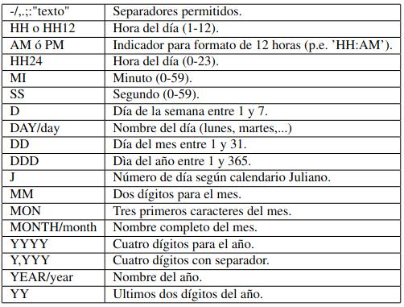

```sql
SELECT TO_CHAR (atributotipofecha, 'dd-mon-yyyy') FROM tabla
```

### Realización de consultas de una bae de datos

La sentencia **SELECT** permite consultar las tablas seleccionando datos en tuplas y columnas de una o varias tablas.

```sql
SELECT [ DISTINCT | ALL]
	expresion [alias_columna_expresion]
	{,expresion [alias_columna_expresion]}
FROM [esquema.]tabla|vista [alias_tabla_vista]
[WHERE <condicion>]
[GROUP BY expresion {,expresion}]
[HAVING <condicion>]
[{UNION | UNION ALL | INTERSECT | MINUS} <SELECT instruccion>]
[ORDER BY {expresion} [ASC | DESC]]
```

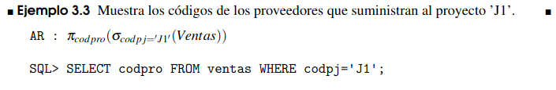

#### Operadores adicionales específicos de SQL

##### El operador like y los caracteres comodín _ y %

El operador like se emplea para comparar cadenas de caracteres mediante patrones. Cuando se emplea el carácter %, este se sustituye por cualquier cadena de 0 o más caracteres.

```sql
SELECT table_name
	FROM ALL_TABLES
	WHERE TABLE_NAME like '%ventas';
```

##### Uso de operadores aritméticos y funciones numéricas

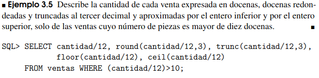

##### Comparación con el valor nulo

```sql
IS [NOT] NULL
```

#### Operadores AR sobre conjuntos en SQL

```sql
<SELECT instruction>
	UNION | UNION ALL | INTERSECT | MINUS
<SELECT instruction>
```

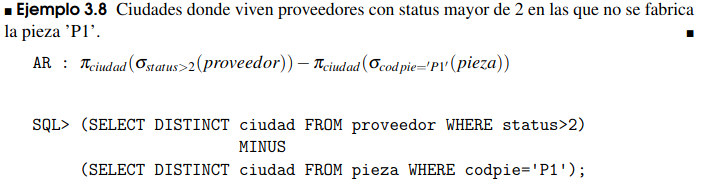

#### Producto Cartesiano

En la cláusula FROM de una sentencia de consulta puede aparecer una lista de tablas en lufar de una sola. En este caso, el sistema realiza el producto cartesiano de todas las tablas (o subconsultas) incluidas en dicha lista, y selecciona las que sean ciertas para la condición de WHERE.

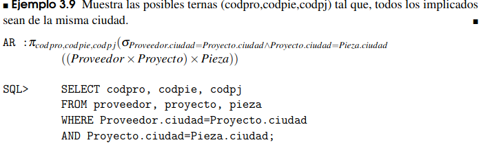

#### Renombramiento o alias en SQL

El empleo de un alias puede ser útil para abreviar texto cuando es necesario prefijar atributos para eliminar ambiguedades, sin embargo, es estrictamente necesario cuando se hace un producto cartesiano de una tabla consigo misma.

```sql
SELECT codpro, codpie, codpj
FROM proveedor S, proyecto Y, pieza P
WHERE S.ciudad=Y.ciudad and Y.ciudad=P.ciudad;
```

#### La equi-reunión y la reunión natural AR en SQL

Se utiliza la cláusula **NATURAL JOIN** dentro de la cláusula FROM entres las tablas participantes.

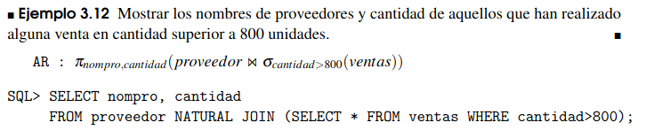

#### Ordenaión de resultados

```sql
SELECT [DISTINCT | ALL] expresion [alias_columna_expresion]
	{,expresion [alias_columna_expresion]}
FROM [esquema.]tabla|vista [alias_tabla_vista]
[WHERE <condicion>]
ORDER BY expresion [ASC | DESC]{,expresion [ASC | DESC]}
```

#### Subconsultas en SQL

Existen en SQL distintos operadores que permiten operar sobre el resultado de una consulta.

```sql
SELECT <expresion>
FROM tabla
WHERE <expresion> OPERADOR <SELECT instruccion>
```

Donde **OPERADOR** es cualquiera de los siguientes:

##### IN, operador de pertenencia

Consiste en obtener mediante una subconsulta los elementos de dicho conjunto

```sql
SELECT codpie
FROM ventas
WHERE codpro IN
	(SELECT codpro FROM proveedor WHERE ciudad = 'Londres');
```

##### Exits, operador de comprobación de existencia

Este operador devuelve verdadero cuando existe alguna tupla en la relación sobre la que se aplica

```sql
SELECT codpro, nompro
FROM proveedor
WHERE EXISTS (SELECT * FROM ventas
    WHERE ventas.codpro = proveedor.codpro
        AND ventas.codpie='P1');
```

##### Comparadores sobre conjuntos

Cualquiera de los operadores relacionales **< | <= | > | >= | <>** junto con algunos de los cuntificadores **[ALL|ANY]**

```sql
SELECT codpie
FROM pieza
WHERE peso > ANY
	(SELECT peso FROM pieza WHERE nompie LIKE 'Tornillo%');
```

#### La división AR en SQL

Podemos hacerlo de 3 formas distintas:

##### Aproximación mediante AR

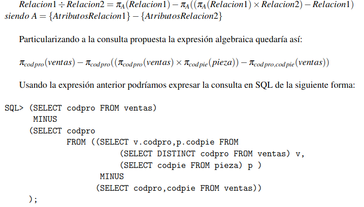

##### Usando Cálculo Relacional

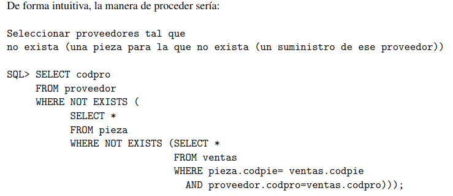

##### Usando NOT EXITS

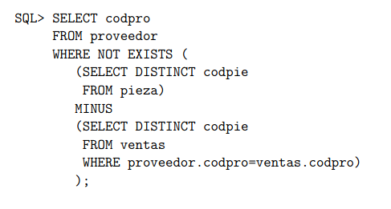

### Funciones de agregación

En ocasiones, puede ser interesante resumir la información relativa a un determinado conjunto de tuplas. Para ello están las funciones:

```sql
SUM(),MIN(),MAX(),AVG(),COUNT(),STDDEV()...,
```

que respectivamente calculan: la suma, el mínimo, el máximo, la media, el cardinal y la desviación típica sobre el conjunto. Cuando se usa la cáusula **DISTINCT**, solo se tendrán en cuenta los valores distintos

```sql
SELECT MAX(atributo),MIN(atributo),SUM(cantidad) FROM nombre_tabla;
```

#### Formando grupos

Todas las funciones de agregación se han aplicado sobre todas las tuplas que devuelve la consulta. Sin embargo, es posiblerealizar un particionado sobre el conjunto de las tuplas usando la claúsula **GROUP BY**. Mediante esta cláusula se indica el atributo o conjunto de atributos por cuyos valores se quiere agrupar las tupplas y proceder así a aplicar las funciones de agregación a cada uno de los grupos.

```sql
SELECT [ DISTINCT | ALL]
    expresion [alias_columna_expresion]
    {,expresion [alias_columna_expresion]}
FROM [esquema.]tabla|vista [alias_tabla_vista]
[WHERE <condicion>]
GROUP BY expresion {,expresion}
```

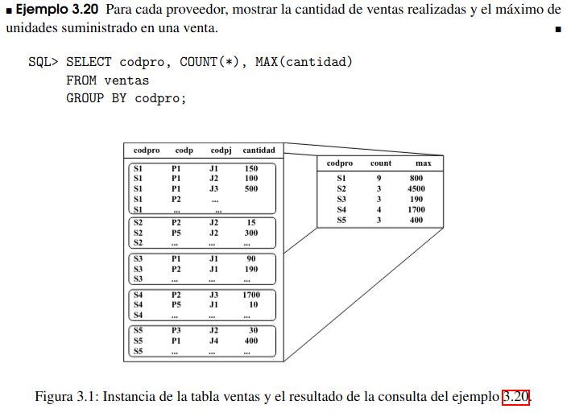

#### Seleccionando grupos

Es posible establecer condiciones sobre los grupos mediante la cláusula **HAVING** junto con una <condicion>

```sql
SELECT [ DISTINCT | ALL]
    expresion [alias_columna_expresion]
    {,expresion [alias_columna_expresion]}
FROM [esquema.]tabla|vista [alias_tabla_vista]
[WHERE <condicion>]
GROUP BY expresion {,expresion}
[HAVING <condicion>]
```

Además, la <condicion> también puede ser una subconsulta, como ya hemos visto en casos anteriores.

#### Consultas con el tipo DATE

Para hacer comparaciones entre fechas debemos hacerla en su formato interno, usando la función **TO_DATE**

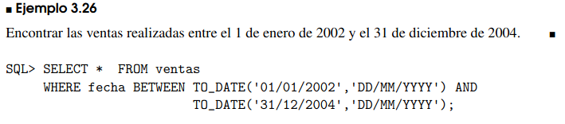
