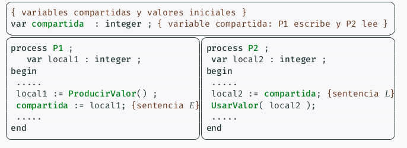
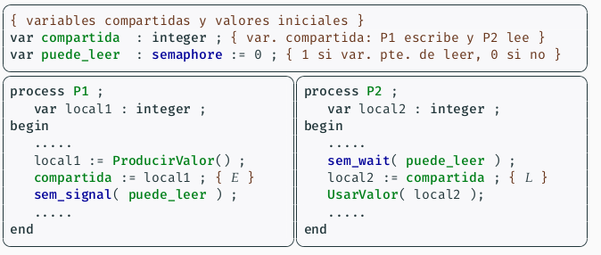

## SCD: Resumen Prácticas

###### Daniel Alconchel Vázquez

------

### <u>Seminario 1</u>

#### Creación de hebras

El tipo de datos (o clase) **std::thread** permite definir objetos del tipo hebra. Un objeto de este tipo puede contener información sobre una hebra en ejecución.

- En la declaración de la variable, se indica el nombre de la función que ejecutará la hebra.

- En tiempo de ejecución, se comienza la ejecución de la función por parte de la nueva hebra

  ```c++
  #include <iostream>
  #include <thread>
  using namespace std;
  
  void funcion_hebra1(){...}
  void funcion_hebra2(){...}
  
  int main(){
      thread 	hebra1(funcion_hebra1),
      		hebra2(funcion_hebra2);
      
      // Tambien se permite
      thread hebra1, hebra2;
      hebra1 = thread(funcion_hebra1);
      hebra2 = thread(funcion_hebra2);
  }
  ```

Una hebra cualquiera que está ejecutando **f** finaliza cuando:

- La hebra llega al final de la **f**.
- La hebra ejecuta un return de **f**.
- Se destruye la variable asociada (situación de herror).
- Se lanza una excepción.

Todas las hebras del programa en ejecución finalizan cuando:

- Cualquiera de ellas llama a **exit(), abort() o terminate()**.
- La hebra principal termina de ejecutar el main.

##### <u>Compilar con la línea de órdenes</u>

Si queremos compilar y enlazar con **g++** se ejecutará el siguiente comando:

```bash
g++ -std=c++11 -pthread -o ejecutable f1.cpp ... fn.cpp
```

#### Sincronización asociada a una unión

En el programa visto anteriormente, se produce un error debido a una finalización incorrecta (la hebra principal acaba el main mientras las otras están ejecutándose).

Para evitar este tipo de errores, veremos la <u>operación unión</u>. Esta operación permite que una hebra *A* espere a que otra hebra *B* termine.


Usando el ejemplo anterior:

```c++
...
int main(){
    thread 	hebra1(funcion_hebra1),
    		hebra2(funcion_hebra2);
    hebra1.join();
    hebra2.join();
}
```

Esta operación solo puede invocarse sobre una hebra activa, es decir, que se encuentra en uno de estos dos casos:

- La hebra a comenzado a ejecutarse y no ha terminado todavía.
- La hebra se ha ejecutado y ha terminado, pero no se ha invocado ningún join previo sobre ella.

El método **joinable** devuelve un valor lógico que indica si una hebra está activa o no.

#### Paso de parámetros a hebras

Se pueden usar funciones con parámetros. En este caso, al iiciar la hebra se deben de especificar los valores de los parámteros, igual que una llamada normal.

- Si la función devuelve un valor de un tipo distinto a  **void**, dicho valor es ignorado cuando se hace join. Para poder obtener un valor resultado, hay varias opciones:
  - Uso de variables globales compartidas.
  - Uso de parámetros de salida.
  - Uso de la sentencia return, lanzando la hebra con **async**.

```c++
void funcion_hebra1(int a, float x){...}
...
thread hebra1(funcion_hebra1, 3+2, 45.678);
```

Supongamos que una hebra *A* quiere leer un valor resultado, calculado por una hebra *B* que ejecuta una función **f**, entonces podemos proceder de las siguientes formas:

- Mediante una **variable global v**, la función **f** (hebra *B*) escribe el valor resultado en **v** y la hebra *A* lo lee tras el join. No es recomendable, ya que constituye un efecto lateral.

- Mediante un **parámetro de salida** en **f** (puntero o referencia). La función **f** escribe en ese parámetro y la hebra *A* lo lee tras el join. También es un efecto lateral.

- Mediante un **return** la función **f** devuelve el valor resultado. Basta con que la hebra *A* inicia *B* mediante **async**. La llamada a esta función devuelve una variable de tipo **future**, liagada a la hebra que se pone en marcha. Este tipo incorpora un método **get** que espera a que la hebra termine y devuelve el resultado.

  ```c++
  ...
  int main(){
  	future<long> futuro = async(launch::async, fucnion, parámetros);
  	...
  	cout << futuro.get;
  }
  ```

#### Vectores de hebras y futuros

En muchos casos, un problema se puede resolver con un proceso en el que varias hebras distintas ejecutan la misma función con distintos datos de entrada. En este caso supongamos que queremos usar **n** hebras idénticas para calcular concurrenteme el factorial de los números entre 1 y n. Podemos usar un **vector de thread** para eso:

```c++
...
const int n = 8;
void factorial(int i){...}
...
int main(){
	thread hebras[n];
	for(int i=0; i<n; i++)
		hebras[i] = thread(factorial, i);
	for(int i=0; i<n; i++)
		hebras[i].join();
}
```

```c++
...
const int n = 8;
void factorial(int i){...}
...
int main(){
    future<long> futuros[n];
    for(int i=0; i<n; i++)
        futuros[i] = async(launch::async,factorial,i);
    for(int i=0; i<n; i++)
        cout << futuros[i].get() << endl;
```

#### Medición de tiempos

En C++11 es posible medir la duración del intervalo de tiempo real empleado en cualquier parte de la ejecución de un programa.

Las mediciones se basan en dos tipos de datos (**std::chrono**):

- **Instantes en el tiempo**: tipo **time_point**.
- **Duraciones de intervalos de tiempo**: tipo **duration**.

Se definen tres clases para tres relojes distintos:

- **Reloj del sistema (system_clock)**: Tiempo indicado por la fecha y hora del sistema.
- **Reloj monótico (steady_clock)**: Mide tiempo real desde un instante en el pasado. Es el que usaremos para medir tiempos.
- **Reloj de alta precisión (high_precision_clock)**: Reloj de máxima precisión en el sistema.

Usamos **now** para medir lo que tardan las instrucciones.

```c++
#include <iostream>
#include <chrono>
using namespace std;
using namespace srd::chrono;

int main(){
	time_point<steady_clock> instante_inicio = steady_clock::now();
	...
	time_point<steady_clock> instante_final = steady_clock::now();
	duration<float,micro> duracion = instante_final-instante incial;
	cout <<...<<duracion.count();
}

```

#### Sincronización básica

En esta sección veremos algunas posibilidades para la sincronización de hebras:

- **Tipos atómicos**: Tipo de datos (enteros) cuyas variables se pueden actualizar de *forma atómica*, es decir, en exclusión mutua.
- **Objetos mutex**: Variables (objetos) que incluyen operaciones que permiten la exclusión mutua en un trozo de código que llamaremos sección crítica.

Cuando las operaciones de consulta y actualización de variables compartidas entre hebras produce resultados distintos de los esperados o incorrectos, se produce interfolación.

#### Tipos de datos atómicos

Para cada tipo entero posible (**char, int, long, unsigned...**) existe su correspondiente tipo atómico, llamado **atomic<T>**

```c++
#include <iostream>
#include <thread>
#include <chrono>
#include <atomic>
using namespace std;
using namespace std::chrono;

const long 	n=1000000l;
int 		cont_noatomico;
atomic<int> cont_atomico;

void func_noatomica(){
    for(long i=0;i<n; i++)
        cont_noatomico++;
}
void func_atomica(){
    for(long i=0;i<n; i++)
        cont_atomico++;
}

...
    
int main(){
    cont_noatomico = 0;
    thread 	hebra1 = thread (func_noatomica);
    		hebra2 = thread (func_noatomica);
    hebra1.join();
    hebra2.join();
    
    ...
        
    cont_atomico = 0;
    thread 	hebra1atom = thread (func_atomica);
    		hebra2atom = thread (func_atomica);
    hebra1atom.join();
    hebra2atom.join();
}
```

```bash
valor esperado			:2000000
resultado no atomico	:1202969
resultado atomico		:2000000
```

#### Objetos mutex

En muchos casos, las operaciones complejas sobre estructuras de datos compartidas se deben hacer en exclusión mutua en trozos de código llamados secciones críticas, y en estos casos no se pueden usar simples operaciones atómicas.

- Para ello podemos usar **objetos mutex**, también llamados **cerrojos(locks)**.
- Estas variables per,iten exclusión mutua mediante espera bloqueada.

Las dos operaciones que se pueden hacer sobre un objeto de tipo mutex (**std::mutex**) son **lock** y **unlock**:

- **lock**: Se invoca al inicio de la SC, y la hebra espera si ya hay otra ejecutando la sección. Si ocurre la espera, la hebra no ocupa CPU durante el resto de la misma (queda bloqueada).
- **unlock**: Se invoca al final del SC para indicar que ha terminado de ejecutar la SC, de forma que otra hebra pueda empezar la ejecución de la misma.

Entre estas dos operaciones, decimos que la hebra tiene adquirido el mutex.

```c++
#include <iostream>
#include <thread>
#include <mutex>
using namespace std;

mutex mtx;

void funcion(int i){
    int fac = factorial(i+1);
    mtx.lock();
    cout << "hebra " << i << " factorial " << fac<< endl;
    mtx.unlock();
}
```

#### Semáforos

Los **semáforos** constituyen un mecanismo de nivel medio que permite solucionar los problemas derivados de la ejecución concurrente de procesos no independientes. Sus principales características son:

- Permite bloquear los procesos sin mantener ocupada la CPU.
- Resuelve fácilmente el problema de exclusión mutua con esquemas de uso sencillo.

Es una instancia de una estructura de datos (registro) que contiene los siguientes elementos:

- Un conjunto de procesos bloqueados (se dice que están esperando al semáforo).
- Un valor natural (entero no negativo), al que llamaremos valor del semáforo.

Al inicio de un programa que use semáforos, debe poder inicializarse cada uno de ellos:

- El conjunto de procesos asociados (bloqueados) estará vacío.
- Se deberá indicar un valor inicial del semáforo.

Además de la inicialización, solo hay dos operaciones básicas que se pueden realizar sobre una variable de tipo semáforo:

- **sem_wait(s)**: 
  - Si el valor de **s** es 0, espera a que el valor sea mayor que 0 (durante la espera, el proceso se añade a la lista de procesos bloqueados del semáforo).
  - Decrementar el valor de **s** en una unidad.
- **sem_signal(s)**:
  - Incrementar el valor de **s** en una unidad.
  - Si hay procesos esperando en la lista de procesos de **s**, permitir que uno de ellos salga de la espera y continue su ejecución (ese proceso decrementará el valor del semáforo).

Los semáforos cumplen estas propiedades:

- El valor nunca es negativo.
- Solo hay procesos esperando cuando el valor es cero (con un valor mayor, los procesos no esperan al **sem_wait**).
- El valor de un semáforo indica cuantas llamadas a **sem_wait** (sin **sem_signal** entre ellas) podrían ejecutarse en ese momento sub qye ninguna haga esperar.


#### Problema de sincronización

Un problema básico de sincronización ocurre cuando:

- Un proceso **P2** no debe pasar de un punto de su código hasta que otro proceso **P1** no haya llegado a otro punto del suyo. El caso típico es **P1** debe escribir en una variable compartida y **P2** debe leerla luego.

  

Para que este programa funcione correctamente, la sentencia de escritura (que llamamos **E**) debe terminar antes de la sentencia de lectura (**L**).

- La **condición de sincronización** es evitar la interfolación de **L**,**E** y solo permitimos la interfolación de **E,L.**

En adelante, para cualquier sentencia **S** de un programa concurrente y para cualquier estado durante la ejecución del programa, llamaremos **#S** al número de veces que se ha completado la ejecución de **S**, por cualquier proceso, desde en inicio hasta llegar al estado.

- Por tanto, la condición que queremos cumplir es **#L $$\leq$$  #E**, es decir, en cualquier estado: **0 $$\leq$$ #E - #L**

La **solución con semáforos** es usar un semáforo, cuyo valor será **#E - #L**, que es el valor no negativo que queremos mantener a lo largo del tiempo. Para que el semáforo tenga ese valor, se deben usar estas operaciones:

- Inicializar el semáforo a 0 (ya que en estado inicial **#E - #L = 0** ya que **#E=#L=0**).

- Inmediatamente después de **E**, incrementar el valor del semáforo con **sem_signal**, ya que **#E** aparece con signo positivo en la expresión **#E - #L**.

- Inmediatamente, antes de **L**, decrementamos el valor del semáforo con **sem_wait**, ya que **#L** aparece con signo negativo. Se debe hacer antes de **L** para que **sem_wait** espere si es necesario y así evitar que la expresión **#E - #L** tome un valor negativo.

  

