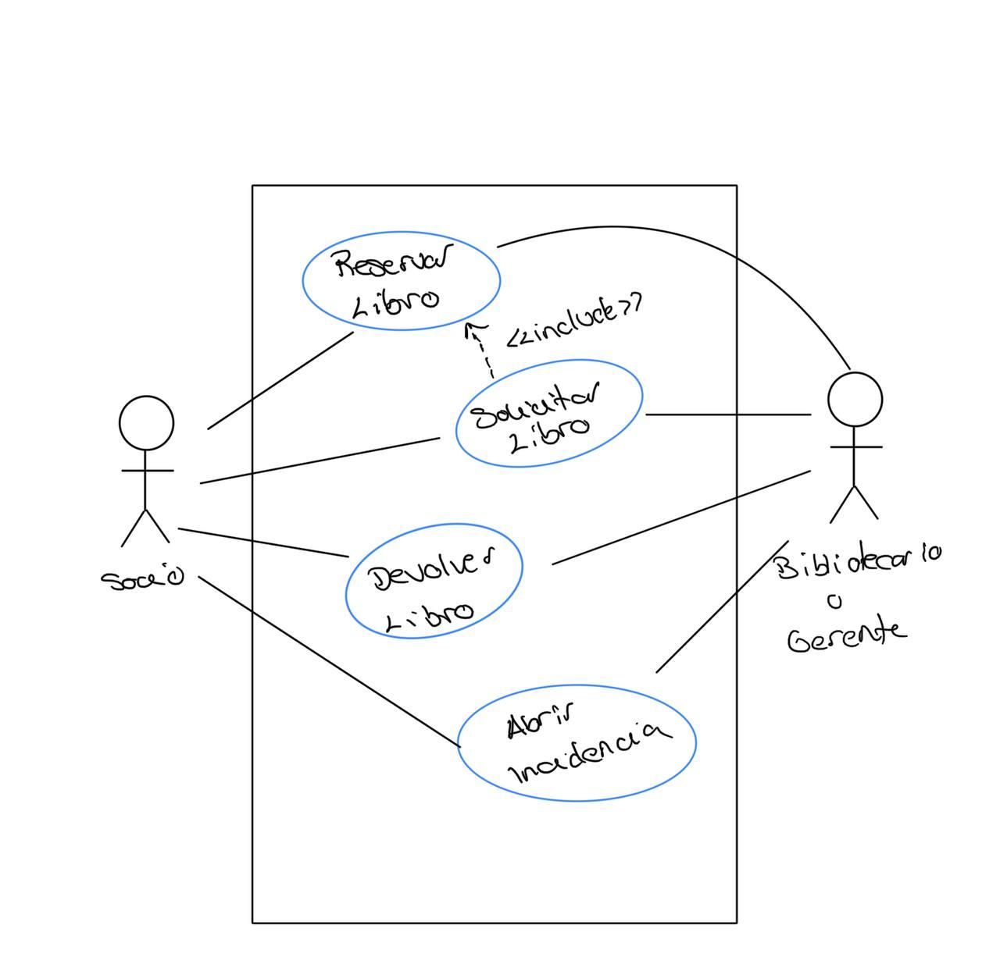

# Ejercicio 2: Modelado De Casos De Uso

###### Daniel Alconchel Vázquez

---

### 1. Relación de Actores y Caso de Uso

En este primer apartado, nos piden elaborar una relación de actores y casos de uso para el software de informatización de una biblioteca. Estos casos pueden variar en función del individuo o entidad que lleve la gestión del software. En este caso, me parece que considerar que sea el bibliotecario o gerente de la biblioteca el que cumpla con dicha función va ser lo más simple.

En una biblioteca se pueden leer libros, tomarlos prestados sin eres socios y, se van comprando nuevos libros para aumentar el catálogo, por lo que yo consideraría los siguientes casos de uso:

##### Gestión de Socios

**Descripción:** Asociado a las acciones con los socios.

**Caso de Uso:** Dar de Alta o Baja a un socio, Modificar y Consultar los datos de los mismos, Identificar a un socio.

**Actores:** Bibliotecario, Socios.

##### Gestión de Proveedores

**Descripción:** Asociado a los individuos que administran nuevos libros y a los propios pedidos.

**Casos de Uso:** Consultar proveedores, Realizar pedido, Consultar pedidio.

**Actores:** Proveedor, Bibliotecario.

##### Gestión de Libros

**Descripción:** Asociado al mantenimiento de los libro disponibles.

**Casos de Uso:** Dar de Alta/Baja un libro, Modificar/Consultar un libro, Listar libros prestados.

**Actores:** Bibliotecario.

##### Gestión de Préstamos

**Descripción:** Asociado al préstamo de los libros.

**Caso de Uso:** Solicitar/Reservar libro, Devolver libro, Abrir Incidencia, Aviso fin de préstamo.

**Actores:** Bibliotecario, Socio.

### 2. Diagrama de casos de uso

Voy a realizar el diagrama de *Gestión de Préstamos*.

### 3. Descripción del actor "Bibliotecario"

  

### 4. Descripción extendida del caso "Pedir Libro"

