# Memoria Práctica 3

###### Daniel Alconchel Vázquez

---

### Ejercicio 1: Zabbix

Desde **Ubuntu Server**, y aprovechando la configuración de *apache, mysql y ssh* de prácticas anteriores; vamos a instalar **Zabbix**. Este programa nos permite monotorizar distintos elementos (routers, VPNs, ...), llamarlos y preguntarles información sobre su 
estado (telemetría: información, temperatura; procesos más complejo: número de instancias de Apache, cuánta memoria usa MySQL, cuántos usuarios...)

Para instalarlo, vamos a seguir los pasos indicados en la [documentación oficial](https://www.zabbix.com/download?zabbix=5.0&os_distribution=ubuntu&os_version=20.04_focal&db=mysql&ws=apache). En nuestro caso, vamos a instalar la *versión 5.0*. Si observamos, vemos que hay bastantes comandos que tenemos que ejecutar como usuario root.

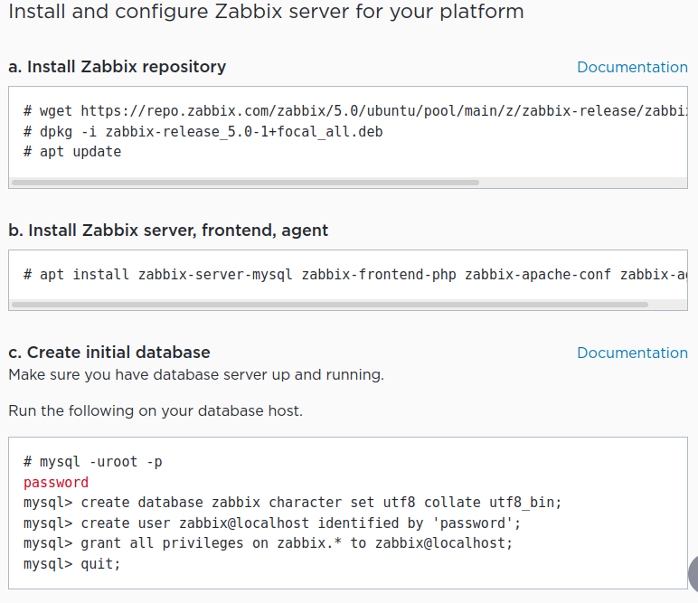

Lo más cómodo, es configurar ssh para que nos podamos conectar como usuario root (ya hemos visto los pasos en prácticas anteriores) y conectarnos desde nuestra máquina *Linux o Windows*. De esta forma, podemos copiar directamente los comandos, sin necesidad de teclearlos a mano.

Una vez ejecutados los pasos indicados en la página antes mencionada, tenemos que abrir en nuestro navegador el frontend. Para ello entramos en la dirección `http://server_ip/zabbix`. En nuestro caso, como estamos trabajando desde *Ubuntu Server*, la ip correspondiente será la `192.168.56.105`.

Tras iniciar el fronted, nos saldrá la siguiente pestaña:

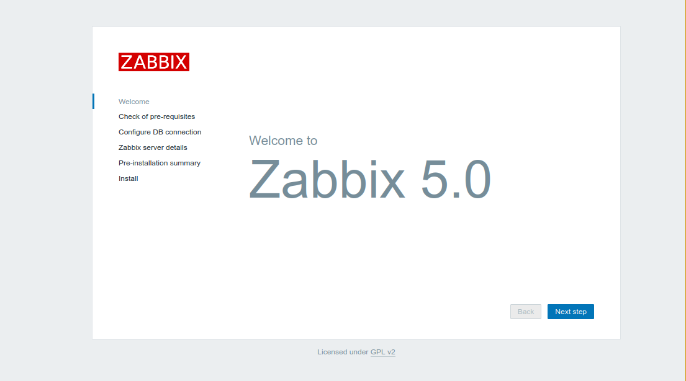

Seguimos los pasos indicados hasta completar la instalación. 

Si echamos nuevamente un vistazo a la [documentación](https://www.zabbix.com/documentation/5.0/en/manual/quickstart/login) veremos que para logearnos simplemente tenemos que introducir `Username: Admin` y `Password: zabbix`. 

Vamos a comenzar monitorizando CentOS, ya es que es un poco más tedioso.

Si seguimos consultando la [documentación](https://www.zabbix.com/documentation/5.0/en/manual/quickstart/host), nuestro siguiente paso es crear un nuevo **host** para monotorizar CentOS. Para ello, vamos a comenzar instalando `zabbix-agent` en CentOS, siguiendo la información proporcionada en esta [página](https://tecadmin.net/install-zabbix-agent-centos-8/). En nuestro caso, estamos usando **Zabbix 5.0**, por lo que lo unico que cambia es en el paso 2, en vez de añadir el repositorio indicado (que es el Zabbix 4.4), añadimos el del 5.0. Los pasos son los siguientes:

```bash
sudo nano /etc/selinux/config
# Change the following line: SELINUX=disable
sudo dnf install https://repo.zabbix.com/zabbix/5.0/rhel/8/x86_64/zabbix-release-5.0-1.el8.noarch.rpm
sudo dnf install zabbix-agent
```

La configuración también viene explicada en el enlace anterior, pero vamos a detallarla de todas formas:

```bash
sudo nano /etc/zabbix/zabbix_agentd.conf
```

```bash
#Server=[zabbix server ip]
#Hostname=[ Hostname of client system ]

Server=192.168.56.105, 127.0.0.1
ServerActive=192.168.56.105, 127.0.0.1
Hostname=CentOS
```

```bash
# Habilitamos los puertos de zabbix
sudo firewall-cmd --permanent --add-port=10050/tcp
sudo firewall-cmd --reload


# Empezamos el servicio
sudo systemctl enable zabbix-agent
sudo systemctl start zabbix-agent
service zabbix-agent start
```

Volviendo a [documentación](https://www.zabbix.com/documentation/5.0/en/manual/quickstart/host), seguimos los pasos para crear un host:

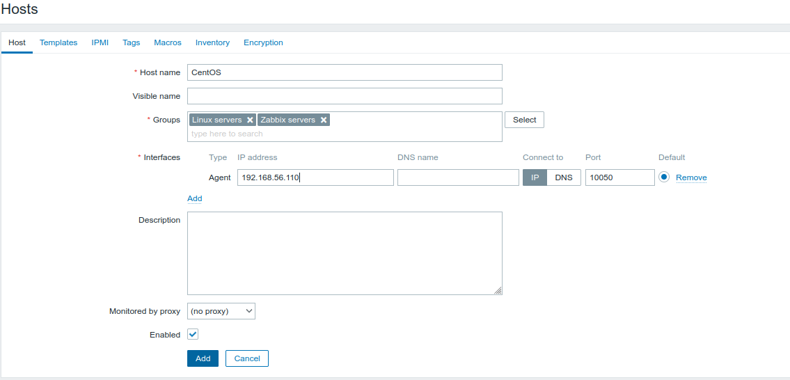

El siguiente paso es crear un nuevo item. Para ello observemos, como hasta ahora, la [documentación oficial](https://www.zabbix.com/documentation/5.0/en/manual/quickstart/item). Añadimos los items tal y como nos indican:

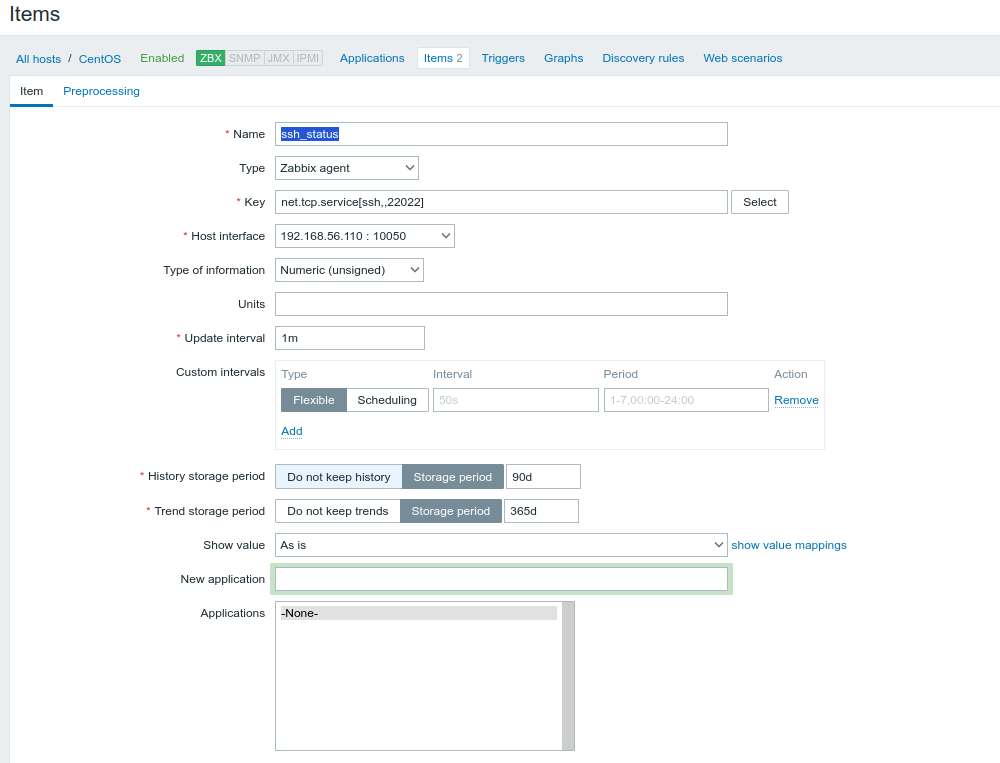

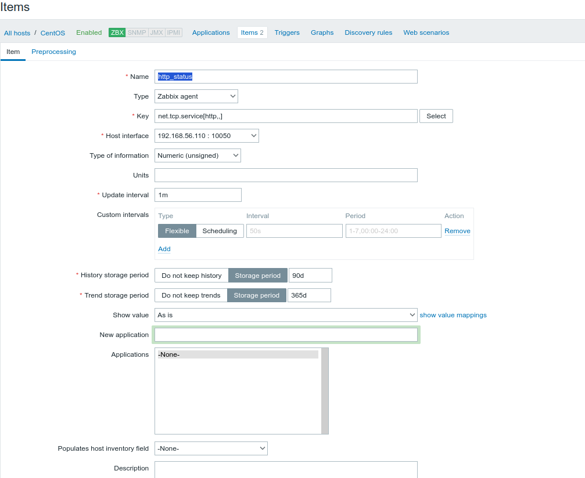

Para elegir el parámetro **key**, es recomendable leer la documentación de [key agent](https://www.zabbix.com/documentation/5.0/en/manual/config/items/itemtypes/zabbix_agent). En la [documentación oficial](https://www.zabbix.com/documentation/5.0/en/manual/quickstart/item) también encontramos como monotorizar estos agentes recién añadidos.

Si vamos a **Monitoring > Latest Data** y seleccionamos el **ssh_status**, podemos ver la gráfica que monitoriza el servicio. Si probamosa apagar el servicio y lo reiniciamos, veremos lo siguiente:

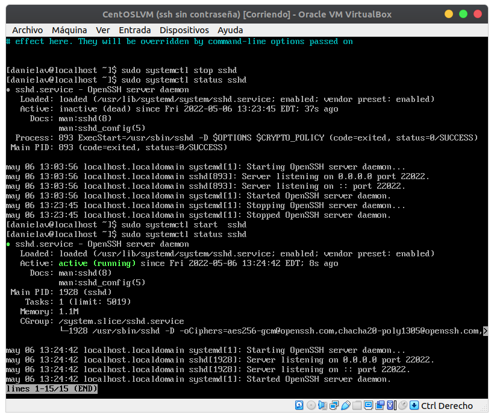

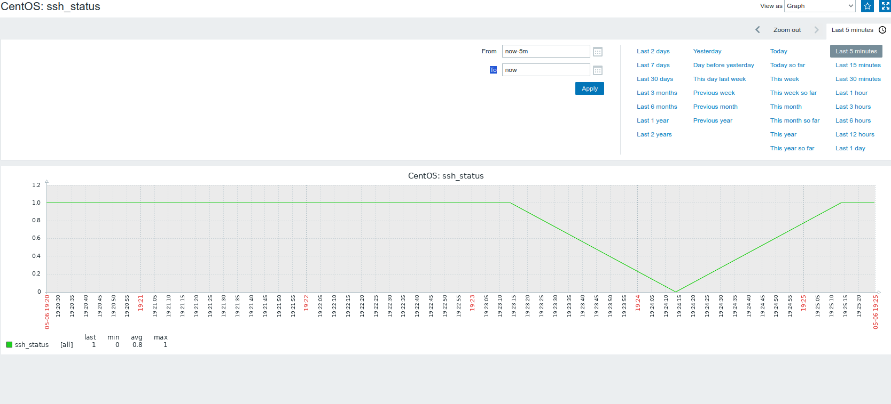

Análogamente con `httpd`:

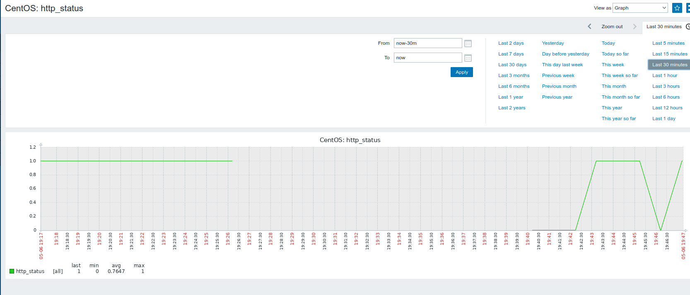

Se puede observar como apagué la máquina de CentOS unos instantes y se corta la monitorización.

Vamos ahora con la monitorización de Ubuntu. Para ello, vamos al apartado de **Configuración > Hosts** nuevamente. Vemos que existe un host llamado **Zabbix Server.** Ahí, añadimos los items tal y como lo hicimos para CentOS (No añado capturas ya que es análogo).

Si vamos a **Monitoring > Latest Data** y seleccionamos el **ssh_status**, pero, esta vez, el de **Zabbix server**, vemos que ocurre exáctamente lo mismo:

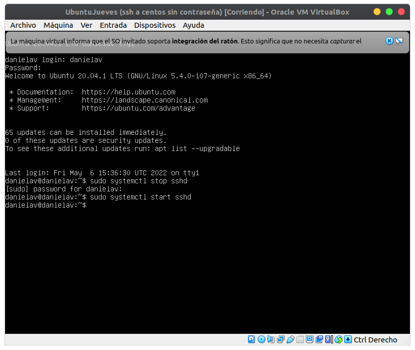

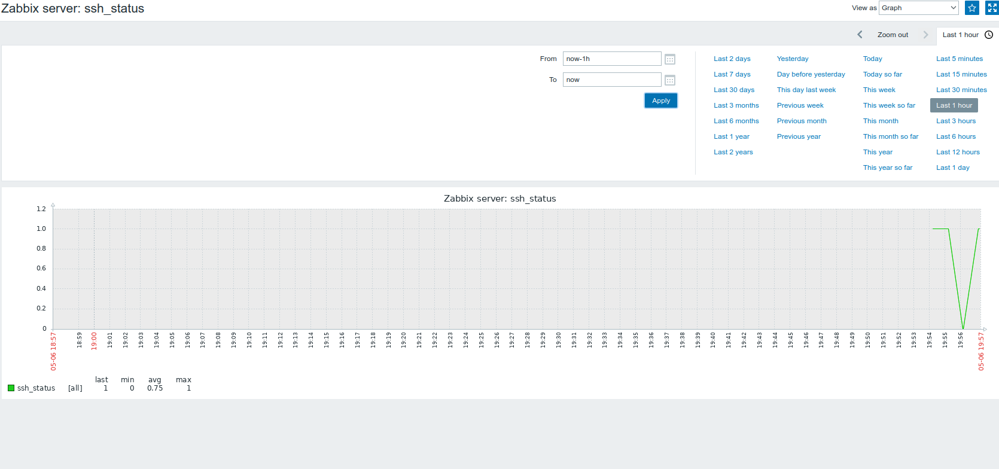

Pero, si ahora lo hacemos con el servicio `http`, para lo que ejecutamos `sudo systemctl stop apache2`, vemos que, evidentemente, el frontend no recarga, ya que hemos parado el servicio de apache:

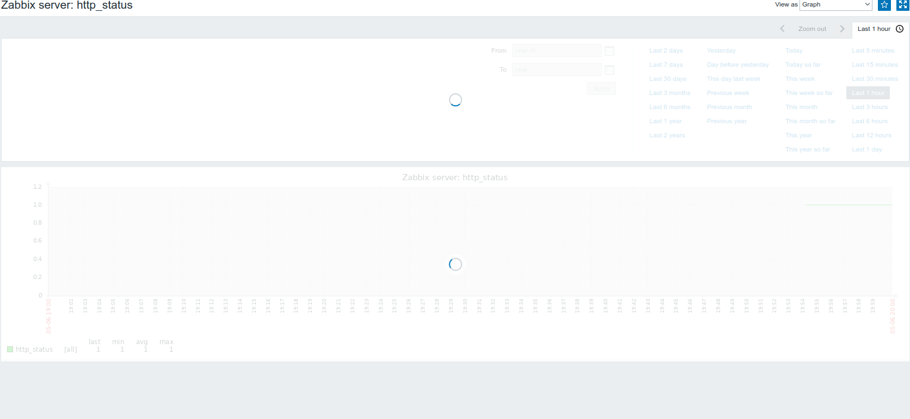

Al reiniciar el servicio, ya procesa el pico:

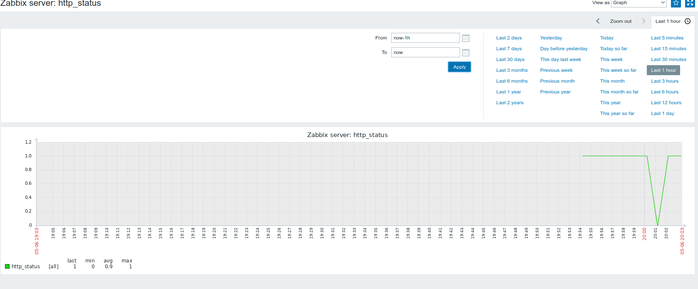

### Ejercicio 2: Ansible

Ahora vamos a instalar un programa para poder, por ejemplo, ejecutar la script de la última práctica en múltiples ordenadores.

```python
import re
f = open('/proc/mdstat')
for line in f:
    b = re.findall('\[[U]*[_]+[U]*\]',line)
    if(b!=[]):
        print("--ERROR en RAID--")
print("--OK Script--")
```

*Esta script la teníamos en Ubuntu*.

Para ello vamos a instalar **Ansible** `sudo apt install ansible`. Vamos a su fichero de configuración, `sudo nano /etc/ansible/hosts`. En este fichero, añadimos las IP de nuestros ordenadores, que en este caso son la de Ubuntu y la de CentOS.

Con las dos máquinas encendidas, y comprobando que tenemos conexión ssh de una a otra realizamos:

```bash
ansible all -m ping -u danielav
# Manda un ping por ssh a todas las máquinas que hayamos especificado
```

Va a dar error, porque como se conecta por ssh, por defecto busca el puerto 22, por lo que vamos a configurar el fichero de configuración e indicarle que busque el puerto 22022.

```bash
sudo nano /etc/ansible/ansible.cfg
# Buscamos la línea remote_port, la descomentamos e indicamos el puerto 22022
```

Si volvemos a intentarlo va a funcionar en CentOS, pero no en Ubuntu. Esto se debe a que en CentOS se conecta automáticamente por keygen (consecuencia de las prácticas anteriores), pero en Ubuntu requiere la clave, por lo que vamos a especificarle la conexión con su propia clave pública:

```bash
ssh-copy-id danielav@192.168.56.105 -p 22022
```

Si no nos dejase, deberíamos ir al fichero de configuración de ssh y activar que puedas conectarte por contraseña: 

```bash
sudo nano /etc/ssh/sshd_config
# Descomentamos PasswordAuthentication y ponemos yes y reiniciamos el sistema
sudo systemctl restart sshd
# Si sale que esta masked puede que se halla jodido y hay que reinstalarlo
sudo apt install openssh-server
```

`ansible all -a "python3 /home/danielav/mon-raid.py" -u danielav` En una funciona y la otra no, porque en CentOS no esta el fichero, por lo que lo copiamos en CentOS con `scp -P 22022 /home/danielav/mon-raid.py danielav@192.168.56.110:/home/danielav/mon-raid.py`

Si todo ha funcionado correctamente, debe salir esto:


