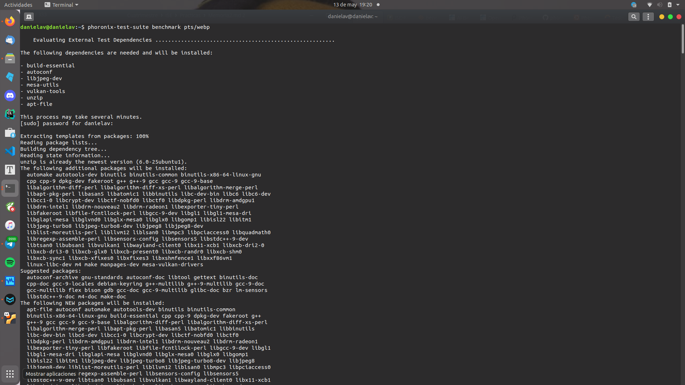
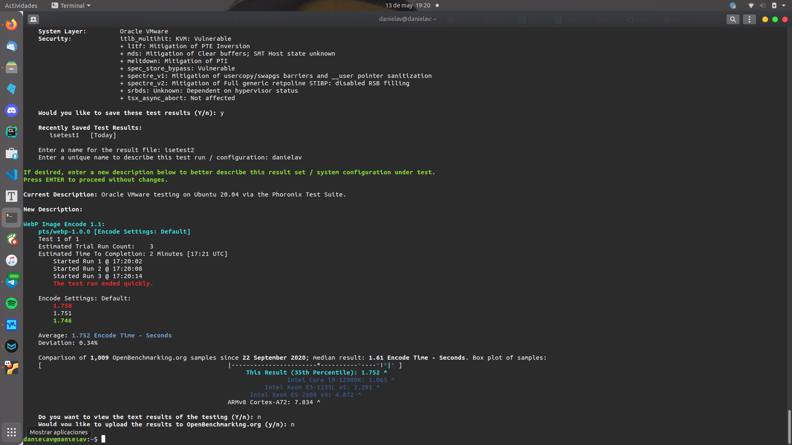
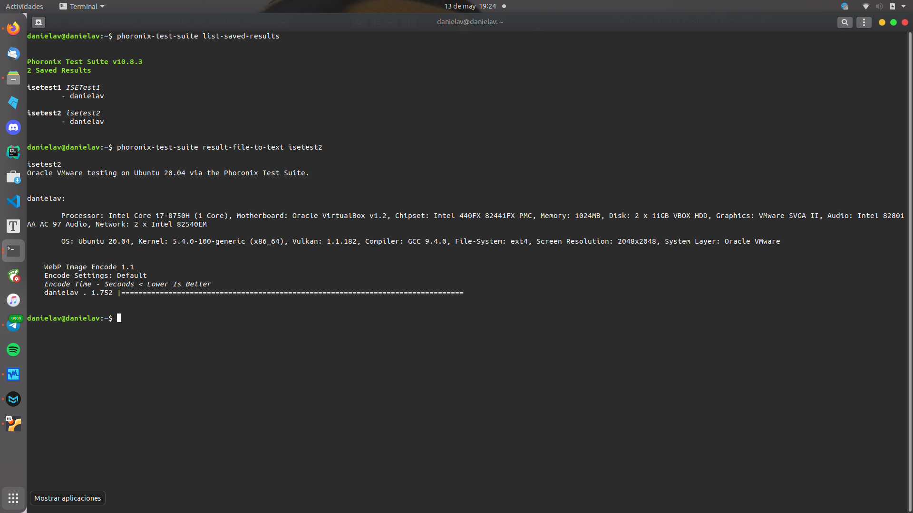
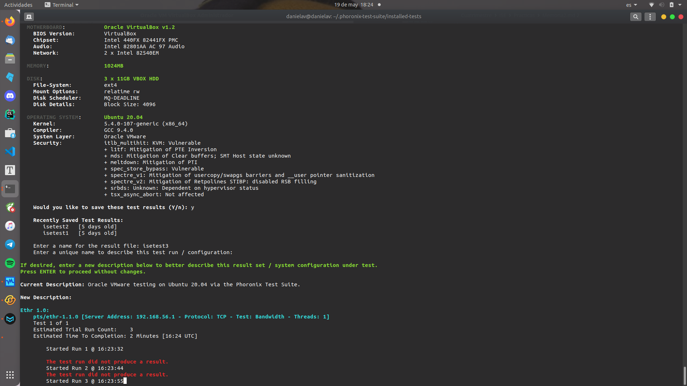
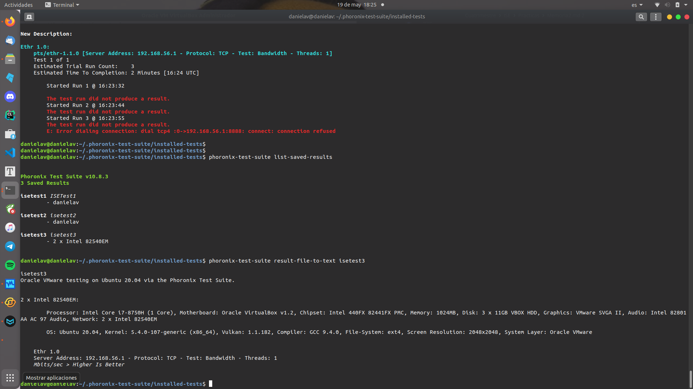

# ISE Práctica 4

###### Daniel Alconchel Vázquez

---

## Ejercicio 1: Phoronix

Si nos vamos a la página que se nos indica en el guión, [Phoronix](https://openbenchmarking.org/), nos aparece, nada más cargar la página, las opciones **Learn About OpenBenchmarking** y **Learn About the Phoronix Test Suite**. 

Podemos ver que tenemos dos opciones:

- Descarga de *Tests Individuales*

- Descarga de *Suites*: Programa Open-Source que contiene una gran cantidad de test y se encarga  del proceso de descarga, instalación, dependencias, ejecución, etc... de los mismos.

Vamos a comenzar con **Ubuntu Server**

La documentación que viene en la [página]([Phoronix Test Suite - Download](http://www.phoronix-test-suite.com/?k=downloads)), te indica como instalarlo a través de paquetes o docker. Para instalarlo manualmente desde terminal, he mirado la siguiente [web](https://ubunlog.com/phoronix-test-suite-una-herramienta-para-benchmark-multiplataforma/).

*Para copiar los comandos siguientes, he usado ssh e instalaremos la última versión estable, que es la 10.8:*

```bash
wget http://phoronix-test-suite.com/releases/repo/pts.debian/files/phoronix-test-suite_10.8.3_all.deb
sudo dpkg -i phoronix-test-suite_10.8.3_all.deb
sudo apt -f install
```

Si ejecutamos el comando

```bash
phoronix-test-suite
```

podremos ver todas las opciones que incluye. Algunos comandos interesantes son:

```bash
# Información del equipo
phoronix-test-suite system-info
# Información de los sensores
phoronix-test-suite system-sensors
# Lista de suites disponibles
phoronix-test-suite list-available-suites
```

*Este último comando puede dar error, ya que la información viene comprimida, por lo que necesitaremos `unzip` instalado. Para ello `sudo apt install unzip`.*

Si volvemos a ejecutar el último comando,  esta vez si nos listará los test-suites disponibles. Vemos que hay distintos tipos. En concreto, los de *gráficos* no funcionarán, ya que hace falta entorno de ventanas. Por lo que optaremos por test de *procesadores y memoria.*

Para ver la información de un test, ejecutamos:

```bash
phoronix-test-suite info <pts/nombre>
```


*Todos estos procesos no ocupan memoria, ya que son simples consultas*. 

He decidio ejecutar el test `pts/webp`.Para ejecutar los test tenemos dos opciones:

```bash
# Bajar y ejecutar el test (todo en un solo comando)
phoronix-test-suite benchmark pts/webp
# Bajar y ejecutar el test (por separado)
phoronix-test-suite install pts/webp    
phoronix-test-suite run pts/webp
```





Para ver los resultados almacenados, podemos ejecutar (*Hay una salida de un test previo fallido*):

```bash
phoronix-test-suite list-saved-results
phoronix-test-suite result-file-to-text isetest2
```



Vamos a elegir otro test más. En mi caso, he escogido `pts/ethr`. Nuevamente, ejecutamos:

```bash
phoronix-test-suite benchmark pts/ethr
```



```bash
phoronix-test-suite list-saved-results
phoronix-test-suite result-file-to-text isetest3
```




