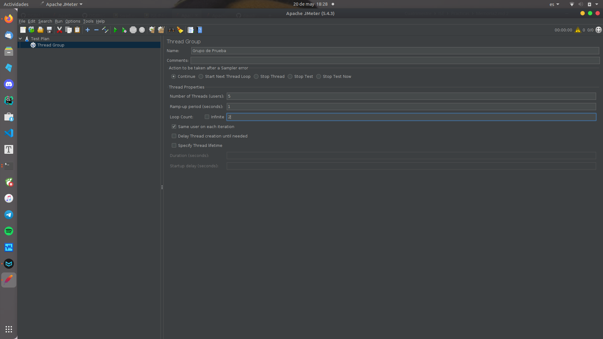
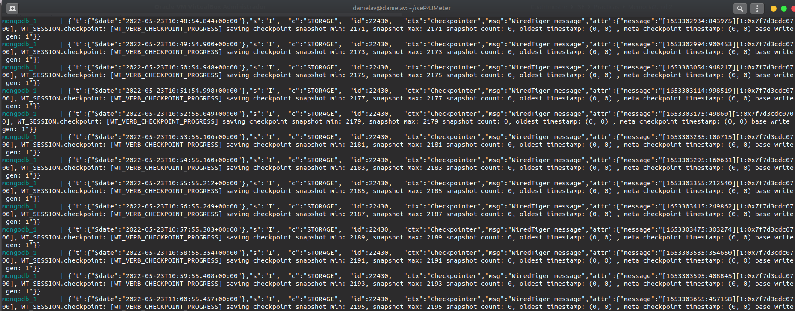

# ISE Práctica 4

###### Daniel Alconchel Vázquez

---

## Ejercicio 1: Phoronix

Si nos vamos a la página que se nos indica en el guión, [Phoronix](https://openbenchmarking.org/), nos aparece, nada más cargar la página, las opciones **Learn About OpenBenchmarking** y **Learn About the Phoronix Test Suite**. 

Podemos ver que tenemos dos opciones:

- Descarga de *Tests Individuales*

- Descarga de *Suites*: Programa Open-Source que contiene una gran cantidad de test y se encarga  del proceso de descarga, instalación, dependencias, ejecución, etc... de los mismos.

Vamos a comenzar con **Ubuntu Server**

La documentación que viene en la [página]([Phoronix Test Suite - Download](http://www.phoronix-test-suite.com/?k=downloads)), te indica como instalarlo a través de paquetes o docker. Para instalarlo manualmente desde terminal, he mirado la siguiente [web](https://ubunlog.com/phoronix-test-suite-una-herramienta-para-benchmark-multiplataforma/).

*Para copiar los comandos siguientes, he usado ssh e instalaremos la última versión estable, que es la 10.8:*

```bash
wget http://phoronix-test-suite.com/releases/repo/pts.debian/files/phoronix-test-suite_10.8.3_all.deb
sudo dpkg -i phoronix-test-suite_10.8.3_all.deb
sudo apt -f install
```

Si ejecutamos el comando

```bash
phoronix-test-suite
```

podremos ver todas las opciones que incluye. Algunos comandos interesantes son:

```bash
# Información del equipo
phoronix-test-suite system-info
# Información de los sensores
phoronix-test-suite system-sensors
# Lista de suites disponibles
phoronix-test-suite list-available-suites
```

*Este último comando puede dar error, ya que la información viene comprimida, por lo que necesitaremos `unzip` instalado. Para ello `sudo apt install unzip`.*

Si volvemos a ejecutar el último comando,  esta vez si nos listará los test-suites disponibles. Vemos que hay distintos tipos. En concreto, los de *gráficos* no funcionarán, ya que hace falta entorno de ventanas. Por lo que optaremos por test de *procesadores y memoria.*

Para ver la información de un test, ejecutamos:

```bash
phoronix-test-suite info <pts/nombre>
```


*Todos estos procesos no ocupan memoria, ya que son simples consultas*. 

He decidido ejecutar el test `pts/php`.Para ejecutar los test tenemos dos opciones:

```bash
# Bajar y ejecutar el test (todo en un solo comando)
phoronix-test-suite benchmark pts/php
# Bajar y ejecutar el test (por separado)
phoronix-test-suite install pts/php    
phoronix-test-suite run pts/php
```


Para ver los resultados almacenados, podemos ejecutar:

```bash
phoronix-test-suite list-saved-results
phoronix-test-suite result-file-to-text isetest
```


Vamos a elegir otro test más. En mi caso, he escogido `pts/idle`. Nuevamente, ejecutamos:

```bash
phoronix-test-suite benchmark pts/idle
```


```bash
phoronix-test-suite list-saved-results
phoronix-test-suite result-file-to-text isetest2
```


Vamos ahora con **CentOS**

Nuevamente, vamos a instalar phoronix en *CentOS*. Para ello, he consultado esta [página](https://arstech.net/phoronix-test-suite/). Como vemos, el proceso es bastante similar al de **Ubuntu** y, para realizarlo, voy a usar ssh para que sea más fácil copiar los comandos:

```bash
# Notemos que necesitamos instalado algunas dependencias previas
# Recuerda levantar las interfaces de red
sudo yum install wget php-cli php-xml bzip2
sudo wget https://phoronix-test-suite.com/releases/phoronix-test-suite-8.4.1.tar.gz
sudo tar xvfz phoronix-test-suite-8.4.1.tar.gz
cd phoronix-test-suite
sudo ./install-sh
```

Para ver los test disponibles:

```bash
/usr/bin/phoronix-test-suite list-available-suites
```

Al hacerlo, me sale el siguiente error:


Luego, vamos a instalar dicha extensión requerida. Para ello, ejecutamos `sudo yum install php-json`.  Ahora, al ejecutar el comando anterior, si nos dará una salida válida:


Los comandos son análogos, pero llamamos al programa mediante `/usr/bin/phoronix-test-suite`:

```bash
/usr/bin/phoronix-test-suite list-tests
/usr/bin/phoronix-test-suite benchmark pts/php
/usr/bin/phoronix-test-suite list-saved-results
/usr/bin/phoronix-test-suite result-file-to-text practicasise
```


```bash
/usr/bin/phoronix-test-suite benchmark pts/idle
/usr/bin/phoronix-test-suite list-saved-results
/usr/bin/phoronix-test-suite show-result isetest
```


#### Comparación

En caso del primer test, ambos realizan 3 pruebas y muestran la media de los tiempos obtenidos en cada una. Podemos ver que el rendimiento de UbuntuServer ha sido algo superior al de CentOS.

Por otro lado, el segundo test solo suspende el sistema para hacer mediciones de sensores, baterías, etc..., y, podemos ver que ambos los superan sin problemas.

## Ejercicio 2: JMeter

Vamos a comenzar instalando **JMeter** en nuestro ordenador. Para ello, basta con ir a la  web oficial al apartado de descargas: https://jmeter.apache.org/download_jmeter.cgi

Descargamos los binarios y los descomprimimos. Para ejecutar el porgrama, basta con abrir una terminal en la carpeta donde hemos instalado el programa, acceder a la carpeta `bin` y ejecutar `jmeter`


Si consultamos la [documentación](https://jmeter.apache.org/usermanual/build-web-test-plan.html), podemos ver como crear un test básico para la web. Vamos a realizar dicho tutorial antes de pasar a docker (*No explicaré los pasos, solo capturas de los mismos, ya que viene explicado detalladamente en la documentación*). 




Vamos ahora con la instalación de **docker** y **docker-compose** en **Ubuntu Server**. Para ello vamos  seguir los pasos indicados en el guión de la asignatura (*los comandos son directamente copiados del guión)*:

Añadimos la llave GPG para validar el repositorio:

```bash
curl -fsSL https://download.docker.com/linux/ubuntu/gpg | sudo apt-key add -
```

Añadimos el respositorio:

```bash
sudo add-apt-repository "deb [arch=amd64] https://download.docker.com/linux/ubuntu $(lsb_release -cs) stable"
```

Actualizamos lista de repositorios:

```bash
sudo apt update
```

Buscamos el repositorio de docker y lo instalamos:

```bash
apt search docker-ce
sudo apt install docker-ce
# Comprobamos que el servicio está instalado y activo
sudo systemctl status docker
```


Ahora, añadimos el usuario al grupo docker

```bash
sudo usermod -aG docker danielav
# Ahora tenemos que volver a loguearnos o llamar a bash
# Una vez hecho esto, podemos probar los comandos 
docker info; docker run hello-world
```


Vamos ahora con la instalación de **docker-compose:**

```bash
sudo apt install docker-compose
# Probar
docker-compose
docker-compose --version
```


Por último, vamos a desplegar la aplicación en nuestro Ubuntu Server, para lo que debemos primero clonar el repositorio de [David Palomar](https://github.com/davidPalomar-ugr/iseP4JMeter). Para ello:

```bash
git clone https://github.com/davidPalomar-ugr/iseP4JMeter.git
cd iseP4JMeter
docker-compose up
# Si quieres dejar docker como un demonio usa la opción -d
```


Tras cargar, se nos debe quedar así:



Si leemos la documentación que nos ha dejado David en el git, vemos que tenemos que abrir el puerto 3000. Para ello:

```bash
sudo ufw allow 3000/tcp
```

Ahora podemos acceder a la dirección http://192.168.56.105:3000/


Volvemos a **JMeter** y vamos a crear el test con las condiciones que nos pide el enunciado:

- El primer paso será **parametrizar el host y el puerto**, tal y como nos indica el primer punto del enunciado. Para ello, teniendo en cuenta que al iniciar la app aparece un test ya creado sin ninguna especifiación (llamado TestPlan), lo hacemos desde *Add y rellenando los campos* tal y como muestro a continuación:
  
  

- Lo siguiente que nos piden es crear dos grupos de hebras distintos para simular el acceso de los alumnos y los administradores. Para ello, *Edit>Add>Threads>Thread Group*. Esta ventana ya la hemos utilizado anteriormente, si hemos hecho el tutorial que viene en la documentación.
  
  Modificamos el nombre, el número de threads (usuarios), el período de subida (*ramp-up period*, que es el tiempo que tarda en alcanzar el número máximo de peticiones) y el número de iteraciones del bucle. Nos debe quedar tal que así:
  
  
  
  

- Tal y como dice el enunciado el login de los alumnos y administradores, así como sus consultas, son peticiones **http**, por lo que procedemos a **crear los valores por defecto de dichas peticiones**. Para ello, desde la ventana inicial del test, *Edit>Add>Config Element>HTTP Request Default*. Lo colocamos arriba de los dos grupos de hebras, ya que es algo común a ambas.Esta ventana también la hemos manejado anteriormente en el tutorial. Dentro de los valores por defecto, modificamos el campo de puerto al parámetro  `${PORT}` y la ip a `${HOST}`, los cuales hemos definido al principio de estasección. Al final nos debe quedar tal que así:
  
  
  
  Ahora, **simularemos las peticiones HTTP de acceso de los alumnos**. Para esto, creamos una petición http desde los alumnos haciendo *Edit>Add>Sampler>HTTP Request*. Si leemos la descripción de la [API](https://github.com/davidPalomar-ugr/iseP4JMeter), vemos que los alumnos realizan una petición **POST** a la dirección **/api/v1/auth/login**, por lo que especificaremos exactamente esta petición. Además, tenemos que pasarle los valores de usuario y contraseña codificados. Al final, debe quedar algo de esta forma:
  
  
  
  *Los valores de host y puerto ya los hemos especificado em la petición http por defecto*

- Si vemos la descripción de la API, vemos que la petición POST requiere de dos parámetros, login y password, luego, previamente de que se ejecuten estas peticiones, necesitamos que se haya leido estas variables del archivo `alumnos.csv`
  
  
  
  Para ello, hacemos click derecho sobre *Login Alumnos>Add>Config Element>CSV Data Set* y lo ponemos sobre *Login Alumnos*.
  
  Vamos a requerir tener el archivo descargado, por lo que lo tomamos de github. Una vez descargado, indicamos la ruta del archivo y modificamos los parámetros siguientes parámetros:
  
  
  
  *Con esta configuración, indicamos que la primera línea tiene el nombre de las variables login y password*

- Si la petición POST que hemos realizado se ejecuta correctamente, la API nos devolverá el **token JWT** del usuario que hizo la petición. En este token viene la respuesta de la petición, por lo que tenemos que comprobar mediante expresiones regulares si el token es correcto.
  
  Además, si consultamos nuestra API, veremos que necesitamos almacenarlo para realizar peticiones de tipo **GET**.
  
  *Si se quiere consultar más información de los JWT ver [aqui](https://jwt.io/introduction).* 
  
  Para almacenarlo, desde *Login Alumnos>Edit>Add>Post Processor>Regular Expresion Extractor.* Tendremos que modificar *Name of created vairable, Regular Expression y Template*, que hacer referencia al nombre de la variable, a la expresión regular que extraemos y lo que guardamos en la variable respectivamente. Al final nos quedará tal que así:
  
  

- Vamos ahora con la **pausa aleatoria Gaussiana**. Para ello, haciendo click derecho en *Alumnos>Add>Timer>Gaussian Random Timer*. Podemos modificar los parámetros para simular el comportamiento real de los usuarios mediante pausas aleatorias. Al final, deberíamos tener algo así:
  
  
  
  *He corregido los nombres para dejarlos como los indicados en la imagen de git*

- Tras habernos autenticado con la petición http de login alumno, ahora realizaremos una petición tipo get. Con esta petición, podemos recuperar datos del alumno. Para ello, click derecho sobre *Alumnos>Add>Sampler>HTTP Request* y esta vez elegimos una petición **GET**
  
  
  
  *Notemos que la ruta depende del usuario que se ha logeado. He estado consultando y al final he llegado a esta [información](https://stackoverflow.com/questions/14593183/url-encode-variable-in-jmeter).*

- Por último en cuanto a los alumnos, como es necesario autenticarse para realizar una petición del tipo GET, creamos un **Gestor de Cabeceras HTTP** que usa el **JWT** conseguido previamente (mas información [aquí]([https://www.federico-toledo.com/jmeter-http-authorization-manager/)).
  
  Para ello, hacemos click derecho en *Alumnos>Add>Config Element>HTTP Header Manager* y lo colocamos debajo de la petición *GET* y añadimos el parámetro que aparece en la imagen:
  
  
  
  *Para más información de Bearer Authentication ver [aqui](https://swagger.io/docs/specification/authentication/bearer-authentication/)*

Ahora que hemos acabado con los alumnos, vamos con los administradores.

- Antes que nada, vamos a realizar la **autorización para acceder a la API**. Para ello, añadimos un gestor de autorización http haciendo click derecho en *ETSII Alumnos API>Add>Config Element>HTTP Authorization Manager* y lo colocamos debajo de *Acces to ETSII API*. Debe quedar tal que así:
  
  

- Ahora sí, volvemos con los administradores. Estoes serán parecidos a los alumnos. Empezamos con el **ingreso de las credenciales de los administradores.** Esto lo haremos igual que con los alumnos. Comenzamos haciendo click derecho sobre *Administradores>Add>Config Element>CSV Data Set Config* y los configuramos análogamente que para los alumnos, pero esta vez con el fichero `administradores.csv`, el cual debemos descargar de git. Al final debe quedar así:
  
  

- A continuación, hacemos el **login de los administradores**. Para ello, hacemos click derecho sobre *Administradores>Add>Sampler>HTTP Request* y lo hacemos análogamente al de alumnos:
  
  

- Hecho esto, tenemos que **obtener y almacenar el JWT** que recibe tras el login. Para ello, click derecho en *Login Administradores>Add>Post Processor>Regular Expression Extractor*. Nuevamente, lo hacemos análogo al de alumnos, por lo que debe quedar algo así:
  
  

- A continuación, hacemos el **Acceso de los Administradores**, para obtener los datos de diversos alumnos. Esto lo hacemos mediante un muestrador de acceso a log, que se añade haciendo click derecho sobre *Administradores>Add>Sampler>Access Log Sampler*. Tenemos que indicarle un Archivo de Log, el cual descargamos de git y tiene el nombre `apiAlumnos.log`. Al final debe quedarnos algo así:
  
  

- Al igual que los alumnos, tenemos que añadir un **gestor de cabecera que usará el JWT**. Para añadirlo, hacemos click derecho en *Administradores>Add>Config Element>HTTP Header Manager* y lo hacemos análogo al de alumnos:
  
  

- Por último con los administradores, añadimos el **Gaussian Random TImer**, es decir, la espera aleatoria. Para ello, click derecho en *Administradores>Add>Timer>Gaussian Random Timer* y lo dejamos como los alumnos:
  
  

Ya por último, añadimos lo necesario para poder visualizar los resultados. Esto lo hacemos haciendo click derecho en *ETSII Alumnos API>Add>Listener>...*

En mi caso he añadido *View Results Tree, Aggregate Report y Summart Report*.

*Para mas información de los listeners ver [aquí](https://jmeter.apache.org/usermanual/listeners.html).*

Al final, la configuración final nos queda así:


Vamos a probar a ejecutar el test y visualizar los resultados. Para ello, en la barra superior, hacemos click en *Run>Start*:


Con esto damos por finalizado el ejercicio. 

## Ejercicio Opcional 1

Nos piden lanzar un contenedor con la imagen de phoronix y ejecutar un test de los seleccionados anteriormente. Si miramos la documentación de la web proporcionada en el guión: https://www.phoronix.com/scan.php?page=article&item=docker-phoronix-pts&num=1 , vemos que para instalar y ejecutar la imagen de phoronix hacemos:

```bash
sudo docker run -it phoronix/pts
```


Una vez ejecutado el contenedor, probamos a ejecutar el test `php` tal y comos hemos hecho en la primera parte de la memoria:


Vemos que los resultados no varían demasiado, ya que lo estamos ejecutando desde la máquina virtual. Si lo ejecutamos desde el anfitrión:


Vemos que los resultados son mejores (además de obtener más información) ya que usa mas recursos del ordenador. Para más información del test en cuestión, consultar [aquí](https://openbenchmarking.org/test/pts/php).
