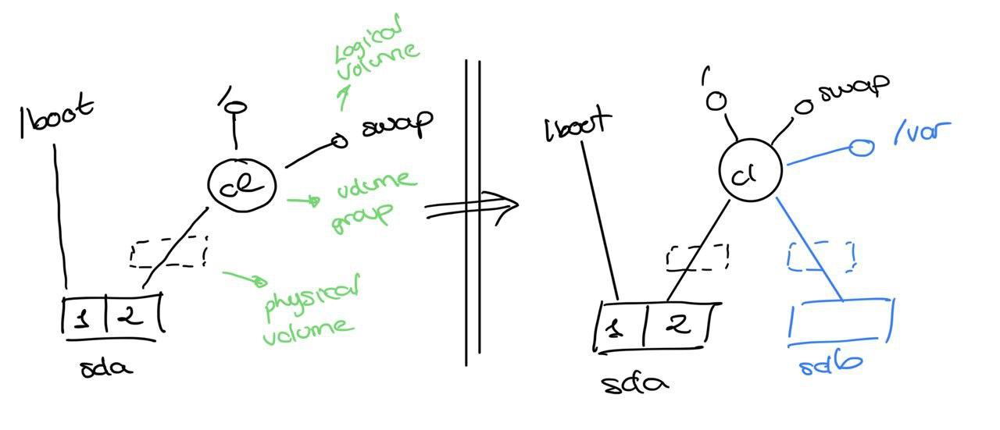

# Práctica 1

#### Lección 2

Instalamos **CentOS** para esta práctica.

Se nos pide ampliar el espacio de **/var**, asignandole un **LV** propio. Para ello, incluiremos un nuevo disco y configuraremos **LVM**.

Al iniciar el sistema por primera vez tendremos la siguiente configuración y queremos pasar a la de al lado:



Luego, el primer paso es añadir el disco. Para comprobar que todo ha ido correctamente, realizamos 

```bash
lsblk
```

Todos los comandos que se usarán a partir de ahora se pueden ver desde **lvm**

```bash
lvm
```

El siguiente paso es, tal y como muestra el diagrama, **crear un nuevo Physical Volume en sdb**. Para ello, usaremos el siguiente comando:

```bash
pvcreate /dev/sdb
```

El siguiente paso, tal y como se indica en el diagrama, es conectarlo al **Volume Group cl**. Podemos ver que todo vaya correctamente con **pvs o pvdisplay**.

Ahora, vamos a **conectar el Physical Volume al Volume Group cl**, para lo que tenemos que extender dicho Volume Group:

```bash
vgextend cl /dev/sdb
```

Podemos comprobar el proceso con **vgs o vgdisplay**.

El siguiente paso, observando el esquema, es **crear en nuevo Logical Volume**, que en nuestro caso llamaremos /newvar:

```bash
lvcreate -n newvar -L 1G cl
```

Podemos comprobar el proceso con **lvdisplay**.


Una vez hecho esto, nuestro objetivo es copiar lo que tenga /var en /newvar y, despues, montar /newvar en /var.

Para **poder montar /newvar, necesita tener un fylesystem**:

```bash
mkfs -t ext4 /dev/mapper/cl-newvar
```

Una vez hecho esto, vamos a montarlo temporalmente en otra ubicación, para poder copiar el contenido de var en newvar:

```bash
mkdir /mnt/newvar
mount /dev/mapper/cl-newvar /mnt/newvar
```

Ahora tenemos que copiar, para poder hacerlo con seguridad, vamos a poner el sistema en modo mantenimiento. Para ello tenemos que hacer **reboot** y entrar como root

```bash
systemctl isolate rescue
```

De esta forma ya podemos **copiar el contenido de var**. Para que copie todo el contexto de forma correcta, usaremos la opción **-a** 

```bash
cp -a /var/. /mnt/newvar
```

Ahora, vamos a editar **fstab** para que newvar se monte automáticamente en var al iniciar el sistema:

```bash
vi /etc/fstab
    /dev/mapper/cl-newvar /var ext4 defaults 0 0
mv /var /var_OLD
mkdir /var
umount -l /dev/mapper/cl-newvar
mount -a
# Puede ser que tengamos que restaurar el contexto de var
restorecon /var
```

Para ver que todo esta correcto:

```bash
lsblk
ls -lZ /
```

#### Lección 3

Esta práctica es parecida a la anterior, pero nos piden cifrar newvar y hacer un RAID1, por lo que tenemos la siguiente situación:


Notemos que resulta interesante crear un nuevo Volume Group, porque de esta forma nos garantizamos que la información de /var se esté escribiendo en el RAID1. Si decidiésemos extender cl, al igual que hicimos en la práctica pasada, puede que se estuvieran guardando datos en sda.

Lo primero, evidentemente, es añadir los nuevos dos discos. Una vez hecho esto, pasaremos a **crear el RAID1**, para ello:

```bash
mdadm --create /dev/md0 --level=1 --raid-devices=2 /dev/sdb /dev/sdc
```

Una vez hecho esto, procedemos como la semana pasada **creando en Physical Volume y conectándolo al Volume Group (que esta vez hay que crear en vez de extenderlo)**:

```bash
pvcreate /dev/md0
vgcreate vg0 /dev/md0
# Para comprobar que todo va correctamente
pvs 
vgs
```

Continuamos **creando el Logical Volume**:

```bash
lvcreate -n nwevar -L 1G vg0
```

Ahora **vamos a cifrarlo:**

```bash
cryptsetup luskFormat /dev/vg0/newvar
# Para abrirlo tenemos que indicar donde lo vamos a descifrar
cryptsetup luskOpen /dev/vg0/newvar vg0-newvar_crypt
```

A partir de aquí, todo el proceso de copiar el contenido de /var, montaje,... es exactamente igual al de la semana pasada:

```bash
mkfs -t ext4 /dev/mapper/vg0-newvar_crypt
mkdir /mnt/newvar
mount /dev/mapper/vg0-newvar_crypt /mnt/newvar
# Reboot y entrar como root
systemctl rescue isolate
cp -a /var/. /mnt/newvar
vi /etc/fstab
    /dev/mapper/vg0-newvar_crypt /var ext4 defaults 0 0
mv /var /var_OLD
mkdir /var
umount -l /mnt/newvar
mount -a
restorecon /var
```

Ahora, lo único nuevo es **configurar la opción de desencriptar newvar al iniciar el sistema**. Para ello tenemos que editar el archivo **/etc/crypttab**. El formato es un tanto tedioso, ya que hay que indicar el punto de descifrado y el UUID del filesystem cifrado. Para obtener el UUID de forma sencilla podemos ejecutar el siguiente comando:

```bash
blkid | grep crypto >> /etc/crypttab
vi /etc/crypttab
    vg0-newvar_crypt UUID=feedfegfe-dw.... none
```
