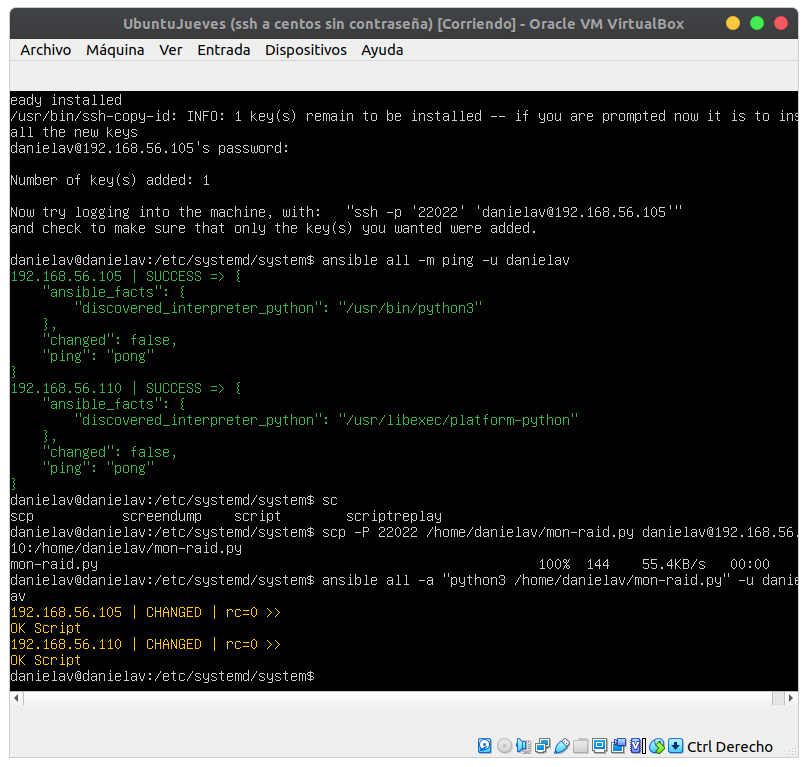

# Práctica 3 de ISE

###### Daniel Alconchel Vázquez

---

Antes de arrancar nuestra máquina Ubuntu, **marcamos los discos como conectable en caliente y, después iniciamos.**

Vemos con `lsblk` que tenemos nuestro **RAID1** montado. Podemos ver más información en `cat /proc/mdstat` y vemos que los dos tienen una *U* de *Up*.

Hacemos una instantánea antes y quitamos un disco en caliente (con la máquina encendida) y aceptamos. Va a salir un error por pantalla. Si consultamos de nuevo `cat /proc/mdstat` vemos que uno está caido (Como estaba encendido, el RAID sigue funcionando con un disco, pero si lo hubieramos hecho apagado, como el disco está cifrado, nos manda a `initramfs`).

A continuación, volvemos a conectar un nuevo disco. Si realizamos el comando `dmesg` para ver los últimos errores.

Si hacemos `lsblk` podremos ver que tenemos el nuevo disco, pero aun no está funcionando, por lo que vamos a creale las particiones manualmente (ya que no podemos hacerlo desde el instalador como la práctica 1).

```bash
sudo fdisk /dev/sdb
# Comenzamos a crear las particiones
# Escribimos n para nueva partición
n
# Empezamos por la partición 1
1
# Como empieza al principio le damos a enter
ENTER
# Ahora especificamos cuanto ocupa
4096 # 1M
# Creamos una nueva
n
2
4097
618496
# Creamos la tercera
n
3
ENTER
ENTER

# Para acabar de crearlos
w
```

Ahora, tenemos que añadir el disco al **RAID**

```bash
sudo mdadm --add /dev/md0 /dev/sdb2
sudo mdadm --add /dev/md1 /dev/sdb3

# Para ver el proceso en directo
watch -n 1 cat /proc/mdstat
```

---

Vamos a crear ahora una script que se ejecute como servicio para comprobar los errores de los discos de los RAID. Para ello, creamos el script de Python:

```bash
sudo nano mon-raid.py
# Copiamos la siguiente script:
```

```python
import re
f = open('/proc/mdstat')
for line in f:
    b = re.findall('\[[U]*[_]+[U]*\]',line)
    if(b!=[]):
        print("--ERROR en RAID--")
print("--OK Script--")
```

Para probarlo, lo ejecutamos como archivo de python `python3 mon-raid.py`.

Ahora, vamos a crear un servicio que lo ejecute automáticamente. Para ello, vamos a la carpeta `cd /etc/systemd/system/`. Ahora creamos el servicio:

```bash
sudo nano mon_raid.service
# Copiamos el siguiente código:
```

```bash
[Unit]
Description=Monitor RAID status
[Service]
Type=simple
ExecStart=/usr/bin/python3 /home/danielav/mon-raid.py
```

```bash
sudo nano mon_raid.timer
# Copiamos el siguiente código:
```

```bash
[Unit]
Description=Monitor RAID status
[Timer]
OnCalendar=minutely
[Install]
WantedBy=timers.target
```

Para arrancarlos hacemos:

```bash
sudo systemctl start mon_raid.service mon_raid.timer
# Vemos sus estados
sudo systemctl status mon_raid.service
sudo systemctl status mon_raid.timer
# Si sale que no están activos hacemos:
sudo systemctl enable mon_raid.service mon_raid.timer
# Volvemos a comprobar:
sudo systemctl status mon_raid.service
sudo systemctl status mon_raid.timer
```

Para ver si se está ejecutando usamos el comando:

```bash
journalctl -u mon_raid 
```

---

Ahora vamos a instalar un programa para poder, por ejemplo, ejecutar la script anterior en múltiples ordenadores

Para ello vamos a instalar **Ansible** `sudo apt install ansible`. Vamos a su fichero de configuración, `sudo nano /etc/ansible/hosts`. En este fichero, añadimos las IP de nuestros ordenadores, que en este caso son la de Ubuntu y la de CentOS.

Con las dos máquinas encendidas, y comprobando que tenemos conexión ssh de una a otra realizamos:

```bash
ansible all -m ping -u danielav
# Manda un ping por ssh a todas las máquinas que hayamos especificado
```

Va a dar error, porque como se conecta por ssh, por defecto busca el puerto 22, por lo que vamos a configurar el fichero de configuración e indicarle que busque el puerto 22022.

```bash
sudo nano /etc/ansible/ansible.cfg
# Buscamos la línea remote_port, la descomentamos e indicamos el puerto 22022
```

Si volvemos a intentarlo va a funcionar en CentOS, pero no en Ubuntu. Esto se debe a que en CentOS se conecta automáticamentepor keygen, pero en Ubuntu requiere la clave, por lo que vamos a especificarle la conexión con su propia clave pública:

```bash
ssh-copy-id danielav@192.168.56.105 -p 22022
```

Si no te deja, vete al fichero de configuración de ssh y activa que puedas conectarte por contraseña 

```bash
sudo nano /etc/ssh/sshd_config
# Descomentamos PasswordAuthentication y ponemos yes y reiniciamos el sistema
sudo systemctl restart sshd
# Si sale que esta masked puede que se halla jodido y hay que reinstalarlo
sudo apt install openssh-server
```

`ansible all -a "python3 /home/danielav/mon-raid.py" -u danielav` En una funciona y la otra no, porque en CentOS no esta el fichero, por lo que lo copiamos en CentOS con `scp -P 22022 /home/danielav/mon-raid.py danielav@192.168.56.110:/home/danielav/mon-raid.py`

Os tiene que salir esto:




